# Metode, metodologi, dan PICOC

## Metode menjalankan kegiatan, metodologi menjelaskan logikanya

Metode adalah prosedur untuk kegiatan tertentu, seperti observasi, wawancara, eksperimen, simulasi, atau analisis data. Metodologi menghubungkan pertanyaan penelitian dengan pemilihan metode, asumsi, urutan pekerjaan, dan cara menjaga validitas. Menyebut daftar metode saja belum menjelaskan mengapa bukti yang dihasilkan dapat menjawab pertanyaan.

{#fig-methodology}

| Aspek | Metode | Metodologi |
|---|---|---|
| Fungsi | Melaksanakan kegiatan | Menjustifikasi keseluruhan pendekatan |
| Pertanyaan | Bagaimana data diperoleh atau dianalisis? | Mengapa pendekatan ini memadai? |
| Cakupan | Prosedur tertentu | Hubungan masalah, bukti, dan kesimpulan |
| Contoh | Wawancara, uji beban, simulasi | DRM dan DSRM |
| Penjelasan minimum | Langkah dan parameter | Alasan pilihan, asumsi, validitas |

Pada penelitian layanan pangan, wawancara dapat menjelaskan pengalaman pedagang. Catatan transaksi menunjukkan pola penggunaan. Eksperimen atau rancangan kuasieksperimen dapat membantu menilai perubahan akibat intervensi. Metodologi menjelaskan bagaimana ketiga jenis bukti itu digabungkan dan bagaimana peneliti menangani kemungkinan penjelasan lain.

## PICOC sebagai kerangka pertanyaan

PICOC membantu memperjelas Population, Intervention, Comparison, Outcome, dan Context. Pedoman Kitchenham dan Charters membahas penggunaannya untuk pertanyaan kajian sistematis di rekayasa perangkat lunak, dengan merujuk Petticrew dan Roberts [@kitchenham2007].

| Unsur | Pertanyaan | Contoh pangan kampus |
|---|---|---|
| P, Population | Siapa atau apa? | Pedagang kantin kampus |
| I, Intervention | Pendekatan apa? | Prapesan dengan rekomendasi produksi |
| C, Comparison | Dibandingkan dengan apa? | Produksi berdasarkan perkiraan biasa |
| O, Outcome | Hasil apa? | Limbah dan cakupan permintaan |
| C, Context | Dalam kondisi apa? | Hari kuliah dan kapasitas dapur tertentu |

PICOC membantu menentukan ruang lingkup. Ia belum memilih ukuran sampel, desain eksperimen, atau teknik analisis. Unsur pembanding digunakan ketika sesuai dengan pertanyaan; penelitian eksploratif dapat menjelaskan bahwa pembanding belum ditetapkan. Pembanding yang dipakai perlu didefinisikan cukup jelas [@kitchenham2007].

## Dari topik menuju pertanyaan

Topik seperti “AI untuk kantin” belum menunjukkan hubungan yang hendak diteliti. Pertanyaan yang lebih terarah adalah: pada pedagang kantin kampus selama hari kuliah, apakah prapesan dengan rekomendasi produksi mengurangi limbah tanpa menurunkan cakupan permintaan dibandingkan perkiraan produksi biasa?

| Bentuk rumusan | Masalahnya | Perbaikan |
|---|---|---|
| Apakah AI bermanfaat? | Objek dan manfaat terlalu luas | Nyatakan pengguna, kegiatan, hasil |
| Apakah sistem akurat? | Ukuran serta pembanding belum jelas | Nyatakan galat, data, baseline |
| Bagaimana membuat aplikasi? | Tujuan pembangunan saja | Tambahkan gap dan pertanyaan pengetahuan |
| Apakah pengguna puas? | Belum menjelaskan kemampuan atau dampak | Hubungkan kepuasan dengan hasil yang relevan |

Pertanyaan tidak harus menjadi satu kalimat yang sangat panjang. Peneliti dapat menyatakan pertanyaan utama yang ringkas, lalu melengkapinya dengan tabel PICOC. Tabel menjaga agar konteks tidak hilang ketika pertanyaan dikutip di bagian metode dan hasil.

## PICOC dalam pencarian dan pengujian

Untuk kajian literatur, unsur pertanyaan membantu menurunkan kata kunci serta kriteria pemilihan studi. Strategi pencarian perlu diuji terhadap artikel relevan yang sudah diketahui. Semua unsur PICOC tidak selalu harus digabungkan dengan AND karena pencarian yang terlalu sempit dapat kehilangan studi penting. Rencana pencarian, seleksi, penilaian kualitas, ekstraksi, dan sintesis tetap perlu dijelaskan [@kitchenham2007].

Sebagai rancangan pedagogis, tabel berikut menghubungkan PICOC dengan keputusan pengujian. Hubungan ini membantu peneliti mengubah pertanyaan menjadi rencana kerja.

| Unsur | Keputusan operasional | Risiko jika diabaikan |
|---|---|---|
| Population | Unit analisis dan cara memilih peserta | Klaim untuk populasi yang tidak diteliti |
| Intervention | Perlakuan dan intensitas penggunaan | Intervensi tidak dapat direplikasi |
| Comparison | Baseline dengan kesempatan setara | Pengaruh pelatihan tercampur |
| Outcome | Ukuran, waktu, dan instrumen | Hasil dipilih sesudah melihat data |
| Context | Beban, fasilitas, aturan, dan kondisi | Temuan dipindahkan ke konteks yang berbeda |

## Justifikasi yang dapat ditelaah

Contoh kalimat metodologi: penelitian menggunakan DSRM untuk mengembangkan artefak rekomendasi produksi, PICOC untuk memperjelas pertanyaan evaluasi, simulasi untuk membandingkan kebijakan pada kondisi terkendali, dan pilot untuk menilai penggunaan nyata. Kalimat berikutnya perlu menjelaskan asumsi simulator, pemilihan pilot, serta batas kesimpulan.

Justifikasi yang baik dapat ditelusuri. Jika sasaran penelitian adalah kemampuan manusia, data waktu proses saja tidak memadai. Jika pertanyaannya menyangkut kestabilan sistem, survei kepuasan saja belum menguji perilaku saat gangguan. Pemilihan metode mengikuti apa yang hendak diketahui.

## Latihan

Susun tabel PICOC untuk tutor AI yang membantu mahasiswa memahami pemrograman. Nyatakan satu ukuran hasil misi dan satu ukuran pertumbuhan kemampuan. Pilih baseline yang memungkinkan kesempatan belajar dibandingkan secara adil. Jelaskan satu faktor konteks yang dapat mengubah hasil.
