# DRM dan DSRM dalam penelitian rekayasa

## Dua penekanan dalam penelitian melalui desain

DRM dari Blessing dan Chakrabarti menata penelitian untuk memahami desain serta mengembangkan dukungan perbaikannya [@blessing2009]. DSRM dari Peffers dan rekan menata penciptaan, demonstrasi, evaluasi, dan komunikasi artefak pemecahan masalah dalam sistem informasi [@peffers2007]. Keduanya menghubungkan tindakan merancang dengan bukti ilmiah.

{#fig-comparison-method}

## Empat tahap DRM

| Tahap | Tujuan | Keluaran yang perlu terlihat |
|---|---|---|
| Research Clarification | Memperjelas fokus dan kriteria | Masalah, tujuan, ukuran keberhasilan |
| Descriptive Study I | Memahami proses dan faktor berpengaruh | Penjelasan keadaan awal |
| Prescriptive Study | Mengembangkan dukungan desain | Metode, pedoman, alat, atau konsep |
| Descriptive Study II | Mengevaluasi dukungan | Bukti penerapan dan perbaikan |

RC memperjelas penelitian yang layak secara akademik serta praktis [@blessingrc]. DS-I menyediakan pemahaman tentang faktor keberhasilan [@blessingds1]. PS dapat menghasilkan pengetahuan, checklist, metode, atau alat bantu [@blessingps]. DS-II mengevaluasi dukungan tersebut [@blessingds2]. Kedalaman setiap tahap dapat berbeda sesuai fokus proyek; DRM memungkinkan iterasi [@blessing2002].

{#fig-drm}

Contoh rancangan DRM pada pangan kampus: peneliti mengamati bagaimana pedagang merencanakan produksi, mengenali informasi yang hilang, mengembangkan metode perencanaan, lalu menilai apakah metode itu dapat diterapkan dan memperbaiki hasil. Fokus ilmiahnya dapat berada pada faktor yang menjelaskan keputusan produksi, bukan hanya pada aplikasi yang dibuat.

| Pertanyaan contoh | Tahap dominan | Bukti contoh |
|---|---|---|
| Apa ukuran keberhasilan perencanaan? | RC | Kebutuhan dan alasan kriteria |
| Mengapa perkiraan sering meleset? | DS-I | Observasi, data, wawancara |
| Dukungan apa yang mengatasi faktor tersebut? | PS | Logika dan rancangan metode |
| Apakah metode membantu keputusan nyata? | DS-II | Pengujian penerapan dan dampak |

## Enam kegiatan DSRM

| Kegiatan | Isi ringkas |
|---|---|
| Identifikasi masalah dan motivasi | Masalah serta pentingnya penyelesaian |
| Penentuan sasaran solusi | Kondisi keberhasilan yang diinginkan |
| Desain dan pengembangan | Penciptaan artefak |
| Demonstrasi | Penggunaan artefak untuk masalah |
| Evaluasi | Penilaian terhadap sasaran |
| Komunikasi | Penyampaian hasil dan kontribusi |

Enam kegiatan ini mengikuti model Peffers dan rekan [@peffers2007]. DSR adalah pendekatan penelitian yang lebih luas; DSRM Peffers merupakan metodologi tertentu. Dalam design science, pengetahuan tentang masalah dan solusi dapat diperoleh melalui pembangunan serta penggunaan artefak [@hevner2004].

{#fig-dsrm}

Pada contoh pangan, demonstrasi dapat menunjukkan rekomendasi produksi untuk satu skenario. Evaluasi perlu menjelaskan seberapa baik rekomendasi memenuhi sasaran, dengan pembanding dan kondisi yang dinyatakan. Keduanya dapat memakai data yang berkaitan, tetapi pertanyaan buktinya berbeda.

## Pemilihan berdasarkan pertanyaan

| Pertimbangan | DRM | DSRM |
|---|---|---|
| Penekanan | Pemahaman dan perbaikan desain | Artefak dan kegunaan solusi |
| Keadaan awal | Tahap DS-I tersendiri | Identifikasi masalah dan sasaran |
| Solusi | Dukungan desain | Artefak pemecahan masalah |
| Evaluasi | Penerapan serta perbaikan | Demonstrasi dan evaluasi |

Pemilihan bukan kompetisi nama metodologi. Peneliti perlu menunjukkan pekerjaan apa yang dilakukan, mengapa dibutuhkan, dan bukti apa yang dikumpulkan. Buku ini menggunakan perbandingan tersebut sebagai panduan penalaran; penyesuaian ke suatu tesis tetap harus mempertimbangkan pertanyaan dan sumber datanya.

## Integrasi dengan TISE

Salah satu pilihan integrasi adalah memakai DRM untuk memahami faktor perancangan ekosistem, lalu memakai DSRM untuk mengembangkan alat bantu tertentu. Pilihan lain adalah memakai DSRM sebagai kerangka keseluruhan, dengan studi keadaan awal yang mendalam. Q-Cycle dapat membantu menata kebutuhan, fungsi, arsitektur, dan bukti di dalam pekerjaan itu.

| Kerangka | Peran yang dapat diberikan | Batas integrasi |
|---|---|---|
| PICOC | Memperjelas pertanyaan | Belum menentukan seluruh metode |
| DRM atau DSRM | Menata logika penelitian | Perlu justifikasi pemilihan |
| Q-Cycle | Menelusuri keputusan rekayasa | Bukan pasangan satu-satu tahap metodologi |
| EASTF | Menyatakan lapisan kontribusi | Bukan urutan aktivitas wajib |

Hubungan dalam tabel adalah sintesis buku ini. Sebuah laporan sebaiknya memilih kerangka utama dan menjelaskan fungsi kerangka pendukung. Penumpukan istilah tanpa peran yang jelas menyulitkan pembaca menilai metode.

## Latihan

Untuk riset metode perencanaan produksi pedagang, tentukan penekanan DRM atau DSRM. Tuliskan tiga bukti yang akan dikumpulkan. Jelaskan kontribusi yang dapat tetap bernilai meskipun artefak belum siap dirilis, serta klaim operasional yang belum boleh dibuat.
