# TISE dan tiga sumber kecerdasan

## Rekayasa ekosistem berorientasi misi

TISE berarti Triune-Intelligence Smart Engineering. Dalam dokumen penulis, TISE merekayasa ekosistem sosio-teknis agar manusia dan organisasi otonom dapat menjalankan misi yang melayani kebutuhan publik. Fondasinya memadukan kecerdasan manusia, kolektif, dan artifisial, dengan keberlanjutan sebagai batas kelayakan [@langi2026tise].

Ekosistem terdiri dari pihak yang saling bergantung tetapi tidak mempunyai tujuan yang identik. Mahasiswa ingin makanan terjangkau, pedagang ingin pendapatan layak, pemasok ingin kepastian pembelian, dan kampus ingin layanan yang aman. Rekayasa perlu membuat hubungan tersebut terlihat agar optimasi satu pihak dapat dinilai bersama dampaknya pada pihak lain.

## Arsitektur triune intelligence

{#fig-triune}

| Sumber | Kemampuan utama | Alokasi tanggung jawab |
|---|---|---|
| Manusia atau alamiah | Tujuan, pengalaman, penilaian, kreativitas | Menilai keadaan dan memegang tanggung jawab sesuai peran |
| Kolektif atau kultural | Pengetahuan tersebar, norma, koordinasi, legitimasi | Menetapkan proses bersama dan mekanisme koreksi |
| Artifisial | Analitik, prediksi, simulasi, pencarian alternatif | Memberikan dukungan yang dapat diperiksa |

Tiga sumber itu diwujudkan sebagai pembagian kerja. Sebuah rekomendasi produksi dari AI perlu dapat dijelaskan kepada pedagang, dikoreksi berdasarkan keadaan dapur, dan diterapkan sesuai aturan layanan. Proses kolektif menentukan standar, pembagian kewenangan, dan penyelesaian konflik. Manusia mempertanggungjawabkan keputusan sesuai otoritasnya [@langi2026transcript].

## Tujuan, kemampuan, dan otoritas

Kecerdasan tidak sama dengan kewenangan. Sistem dapat sangat baik memprediksi permintaan tetapi tidak mempunyai legitimasi untuk mengubah harga sepihak. Arsitektur keputusan perlu memisahkan masukan, rekomendasi, persetujuan, tindakan, dan audit. Pemisahan tersebut membantu pelaku memahami apa yang dapat mereka ubah.

| Keputusan contoh | Masukan AI | Penilaian manusia | Proses kolektif |
|---|---|---|---|
| Jumlah produksi | Perkiraan dan rentang galat | Ketersediaan bahan dan tenaga | Aturan kapasitas serta layanan |
| Harga dan subsidi | Simulasi biaya dan akses | Pengalaman pengguna dan pedagang | Kesepakatan kewenangan |
| Perubahan layanan | Perbandingan skenario | Risiko penggunaan nyata | Persetujuan dan pengawasan |
| Peluncuran ekosistem baru | Hasil uji virtual | Kesiapan pelaku | Tata kelola dan penerimaan |

AI dapat memperbesar kecepatan penelusuran alternatif. Kecerdasan kolektif memperluas basis pengetahuan. Kecerdasan manusia memberi penilaian yang terkait pengalaman hidup serta tanggung jawab. Mutu keseluruhan bergantung pada hubungan ketiganya dan kemampuan saling mengoreksi.

## Keberlanjutan sebagai batas kelayakan

{#fig-sustainability}

| Batas | Pertanyaan untuk rancangan | Contoh bukti |
|---|---|---|
| Finansial | Dapatkah pelaku melanjutkan operasi? | Arus kas dan biaya |
| Operasional | Apakah kapasitas dan tenaga cukup? | Uji beban, jadwal, ketersediaan |
| Sosial | Siapa kehilangan akses atau menanggung beban? | Data distribusi dan pengalaman |
| Lingkungan | Apa konsekuensi sumber daya dan limbah? | Pengukuran penggunaan dan sisa |
| Kapabilitas manusia | Apakah pengguna masih dapat memahami dan mengoreksi? | Uji penjelasan, koreksi, transfer |

Dalam TISE, batas tersebut menentukan tindakan yang layak. Keberhasilan perlu dinilai sepanjang waktu. Solusi yang meningkatkan keluaran hari ini tetapi mengurangi kemampuan melayani misi berikutnya menghadapi masalah keberlanjutan.

## Pertanyaan penelitian tentang triune intelligence

Peneliti dapat menanyakan pembagian fungsi apa yang memberi hasil terbaik pada suatu konteks, bagaimana pengguna menilai rekomendasi, atau bagaimana mekanisme koreksi memengaruhi keputusan. Setiap pertanyaan perlu menyebut unit analisis dan outcome. Jumlah pengguna AI tidak dengan sendirinya mengukur pemberdayaan. Kecepatan keputusan tidak dengan sendirinya menunjukkan legitimasi.

Sebagai contoh rancangan, bandingkan rekomendasi otomatis dengan rekomendasi yang dapat dijelaskan dan dikoreksi. Ukur hasil misi, kemampuan pengguna menjelaskan alasan, serta kejadian koreksi. Hipotesis tentang manfaat pembagian peran harus diuji; dokumen konseptual tidak menggantikan pengukuran.

## Latihan

Pilih satu keputusan dalam layanan publik. Tentukan kontribusi manusia, kolektif, dan AI, termasuk siapa yang menyetujui tindakan. Gambarkan jalur koreksi ketika rekomendasi salah. Jelaskan bagaimana bukti akan menunjukkan bahwa pengguna tetap mempunyai kendali.
