# Misi, PSKVE, RMOV, dan PUDAL

## Rantai sumber daya dan nilai

RMOV menghubungkan Resource, Mission, Output, dan Value. Sumber daya digunakan untuk menjalankan misi, misi menghasilkan keluaran, dan keluaran memperoleh nilai dalam kehidupan para pihak. Nilai dapat berupa uang, akses, kesehatan, pengetahuan, kepercayaan, atau kondisi lingkungan [@langi2026tise].

{#fig-rmov}

| Unsur | Pangan kampus | Kesalahan penafsiran |
|---|---|---|
| Resource | Bahan, kapasitas dapur, tenaga, informasi | Menghitung uang saja |
| Mission | Menyediakan makanan sehat dan terjangkau | Menyebut fitur sebagai misi |
| Output | Porsi makanan serta layanan pengambilan | Menganggap keluaran pasti bermanfaat |
| Value | Akses pangan, pendapatan, pengetahuan | Menyamakan nilai dengan harga |

Keluaran dan nilai perlu dibedakan. Seratus porsi merupakan keluaran. Manfaatnya bergantung pada siapa yang dapat mengaksesnya, mutu makanan, waktu tersedia, biaya, dan dampaknya pada pelaku lain. Pengukuran nilai mengikuti misi yang dinyatakan.

## Empat peran fungsional

{#fig-roles}

| Peran | Kontribusi | Pertanyaan kendali |
|---|---|---|
| SOURCE | Sumber daya, talenta, keluaran | Apakah pasokan dan kapasitas cukup? |
| USER | Penggunaan dan penerimaan hasil | Apakah manfaat mencapai pihak sasaran? |
| OPERATOR | Koordinasi serta pelaksanaan | Apakah proses dapat dijalankan? |
| REGULATOR | Batas, aturan, kewenangan | Apakah keputusan memenuhi syarat? |

Satu pihak dapat memegang beberapa peran. Pembagian fungsi tetap perlu terlihat agar konflik kepentingan serta kewenangan dapat diperiksa. Identifikasi peran juga membantu menentukan data: sumber memberi data kapasitas, pengguna memberi pengalaman, operator memberi catatan proses, dan regulator memberi kriteria penerimaan.

## Lima dimensi PSKVE

{#fig-pskve}

| Dimensi | Makna dalam dokumen TISE | Contoh perhatian |
|---|---|---|
| Products | Produk fisik atau digital | Mutu serta ketersediaan |
| Services | Layanan yang menyertai penggunaan | Akses, ketepatan, keandalan |
| Knowledge | Aliran pengetahuan dan pembelajaran | Pemahaman, transfer, koreksi |
| Values | Nilai, komitmen, kepercayaan | Martabat, keadilan, tanggung jawab |
| Environment | Lingkungan fisik, digital, sosial, kelembagaan | Sumber daya dan kondisi interaksi |

PSKVE membuat pertukaran nonfinansial terlihat. Sebuah sistem dapat menghasilkan pendapatan sambil menghambat aliran pengetahuan atau mengurangi kepercayaan. Karena itu, evaluasi perlu memilih indikator yang relevan untuk tiap dimensi, dengan alasan yang jelas. Tidak semua dimensi harus diringkas menjadi satu skor.

## Kendali dan pembelajaran PUDAL

PUDAL adalah Perceive, Understand, Decide, Act, Learn. Siklus ini mengamati kondisi, memahami perubahan, menyusun keputusan, melakukan tindakan yang disetujui, dan mempelajari hasil. Dalam dokumen TISE, PUDAL menjaga adaptasi operasi [@langi2026transcript].

{#fig-pudal}

| Langkah | Pertanyaan | Keluaran yang dapat dicatat |
|---|---|---|
| Perceive | Apa yang berubah? | Data dan kejadian |
| Understand | Apa artinya terhadap misi? | Diagnosis beserta ketidakpastian |
| Decide | Pilihan apa yang layak? | Alternatif dan alasan |
| Act | Siapa melakukan apa? | Tindakan serta persetujuan |
| Learn | Apa yang berhasil dan perlu diperbaiki? | Pembaruan model atau praktik |

## Dua bagian arsitektur

{#fig-dual-engine}

Proses inti PSKVE mengubah sumber daya menjadi keluaran dan nilai. PUDAL mengamati keadaan dan membantu penyesuaian. Pengguna berpartisipasi dengan memberi koreksi serta pengalaman. Arsitektur perlu menyatakan informasi yang menghubungkan kedua bagian dan kewenangan untuk melakukan perubahan.

Dalam pangan kampus, proses inti meliputi pasokan, produksi, penjualan, dan pengelolaan sisa. Kendali meliputi perkiraan permintaan, pemeriksaan kapasitas, keputusan produksi, serta evaluasi hasil. Model yang hanya menggambarkan pembayaran belum menjelaskan keseluruhan mekanisme.

## Latihan

Pilih layanan yang Anda kenal. Isi RMOV untuk dua pelaku, identifikasi empat peran, dan tuliskan satu ukuran untuk tiap dimensi PSKVE. Kemudian susun catatan PUDAL untuk satu gangguan: data apa yang diamati, diagnosis apa yang dibuat, siapa menyetujui tindakan, dan apa yang dipelajari?
