# Q-Cycle dan ketertelusuran bukti

## Empat ruang pertanyaan rekayasa

Q-Cycle dalam dokumen TISE menghubungkan Q1 masalah dan misi, Q2 fungsi dan perilaku, Q3 arsitektur, serta Q4 konstruksi dan bukti. Hasil realisasi kembali memperbaiki perumusan masalah. Q-Cycle merupakan siklus penalaran yang dapat diulang [@langi2026tise].

{#fig-qcycle}

| Ruang | Pertanyaan | Keluaran | Pemeriksaan |
|---|---|---|---|
| Q1 | Perubahan apa dibutuhkan? | Misi, kebutuhan, batas, ukuran | Tujuan belum terkunci pada teknologi |
| Q2 | Fungsi apa memungkinkan perubahan? | Aliran, perilaku, persyaratan | Fungsi terkait kebutuhan |
| Q3 | Bagaimana fungsi dialokasikan? | Komponen, antarmuka, peran | Pilihan dan kewenangan jelas |
| Q4 | Bagaimana diwujudkan dan dibuktikan? | Artefak, uji, operasi, bukti | Klaim kembali ke Q1 |

## Q1: masalah sebagai perubahan keadaan

Rumusan “buat aplikasi pemesanan” telah memilih bentuk solusi. Rumusan kebutuhan dapat menyatakan bahwa mahasiswa kesulitan memperoleh makanan sehat tepat waktu, sementara pedagang menghadapi ketidakpastian produksi. Q1 menjelaskan keadaan awal, keadaan yang diinginkan, pihak yang terdampak, dan batas perubahan.

| Elemen Q1 | Isi contoh | Bukti awal yang dibutuhkan |
|---|---|---|
| Keadaan awal | Waktu tunggu dan sisa produksi | Observasi serta catatan |
| Keadaan tujuan | Akses membaik dengan limbah terkendali | Kriteria yang disepakati |
| Pihak | Mahasiswa, pedagang, pemasok, kampus | Pemetaan peran dan pengalaman |
| Batas | Kapasitas, biaya, mutu, kewenangan | Data dan aturan |
| Ukuran | Cakupan, limbah, pendapatan, kemampuan | Instrumen dan waktu pengukuran |

Q1 yang baik memungkinkan beberapa solusi. Ia juga membatasi ambisi. Jika penelitian hanya dilakukan pada satu kantin, ruang klaim perlu menyatakan konteks tersebut dan menjelaskan alasan memperluas atau membatasi generalisasi.

## Q2: fungsi dan kendali

{#fig-function-control}

Fungsi menyatakan apa yang perlu dilakukan. Memperkirakan permintaan merupakan fungsi; model statistik tertentu merupakan pilihan implementasi. Memisahkan fungsi dari teknologi membantu menilai alternatif tanpa kehilangan kebutuhan awal.

| Kebutuhan | Fungsi inti | Fungsi kendali |
|---|---|---|
| Makanan tersedia | Produksi dan distribusi | Pantau permintaan serta kapasitas |
| Sisa terkendali | Alokasi jumlah produksi | Perbarui rencana dari hasil |
| Keputusan dapat dikoreksi | Sajikan rekomendasi | Catat alasan dan koreksi |
| Manusia semakin mampu | Berikan penjelasan | Nilai transfer dan sesuaikan bantuan |

Analisis fungsional juga menjelaskan keadaan dan kondisi transisi. Sistem dapat berada pada keadaan normal, beban puncak, pasokan terbatas, atau operasi darurat. Fungsi yang diperlukan saat gangguan dapat berbeda dari fungsi pada demonstrasi normal.

## Q3: arsitektur dan alasan alokasi

Arsitektur mengalokasikan fungsi kepada manusia, organisasi, perangkat, perangkat lunak, AI, dan aturan. Pemilihan perlu mempertimbangkan kemampuan, risiko, ketergantungan, serta kewenangan. Sebuah fungsi tidak selalu tepat ditempatkan pada AI hanya karena dapat diotomasi.

| Fungsi | Alokasi contoh | Alasan | Antarmuka |
|---|---|---|---|
| Perkiraan permintaan | Modul analitik | Mengolah data berulang | Data transaksi dan keluaran prediksi |
| Penilaian kelayakan produksi | Pedagang | Mengetahui kondisi dapur | Rekomendasi dan koreksi |
| Aturan layanan | Kampus dan perwakilan pelaku | Legitimasi bersama | Standar serta persetujuan |
| Catatan perubahan | Operator | Ketertelusuran | Log keputusan dan hasil |

## Q4: realisasi dan bukti

Q4 mencakup konstruksi, integrasi, pengujian, operasi, pemeliharaan, dan evaluasi sesuai lingkup pekerjaan. Dalam pengembangan virtual, Q4 dapat menghasilkan prototipe digital twin. Dalam pilot, Q4 menghasilkan artefak yang berinteraksi dengan pengguna nyata. Keduanya menghasilkan jenis bukti berbeda.

{#fig-trace}

| ID kebutuhan | Fungsi | Elemen arsitektur | Uji | Batas bukti |
|---|---|---|---|---|
| N1 akses pangan | Sesuaikan produksi | Modul dan pedagang | Cakupan permintaan | Kondisi serta periode uji |
| N2 limbah | Kendali jumlah | Kebijakan produksi | Rasio sisa | Definisi sisa dan pengukuran |
| N3 kemampuan | Jelaskan rekomendasi | Antarmuka dan aktivitas refleksi | Uji transfer | Peserta serta tugas baru |

## Q-Cycle dan PUDAL

{#fig-loops}

Perbedaan skala waktu membantu tim memilih tindakan. Penyesuaian jumlah produksi dapat dilakukan di dalam arsitektur yang ada. Perubahan model kewenangan atau pembagian peran memerlukan keputusan desain yang lebih mendasar. Catatan operasi perlu menunjukkan alasan perubahan agar adaptasi dapat ditelaah.

## Latihan

Buat matriks ketertelusuran untuk tiga kebutuhan. Pastikan satu kebutuhan menyangkut kemampuan manusia. Tentukan satu gangguan yang dapat ditangani PUDAL dan satu masalah yang memerlukan Q-Cycle baru. Jelaskan bukti yang membedakan keduanya.
