# EASTF sebagai lapisan research question

## Objek dan kontribusi pada lima lapisan

EASTF mengikuti susunan yang dirumuskan dalam percakapan: Ecosystem, Application, System, Technology, Fundamental Research [@percakapan2026]. Penjelasan di bab ini merupakan sintesis pedagogis. EASTF membantu menjawab di mana pertanyaan dan kontribusi berada serta bagaimana bukti dihubungkan antarlapisan.

{#fig-eastf}

| Lapisan | Unit perhatian | Research question khas | Kontribusi yang mungkin |
|---|---|---|---|
| E, Ekosistem | Hubungan pelaku, misi, sumber daya, aturan | Bagaimana misi saling mendukung secara berkelanjutan? | Pengetahuan tentang koordinasi, tata kelola, distribusi |
| A, Aplikasi | Penggunaan pada pekerjaan tertentu | Apakah intervensi membantu pengguna? | Bukti manfaat dan kondisi penerapan |
| S, Sistem | Kesatuan fungsi dan komponen | Arsitektur apa menghasilkan perilaku yang diperlukan? | Pengetahuan integrasi dan kendali |
| T, Teknologi | Mekanisme atau komponen | Bagaimana kemampuan teknis ditingkatkan? | Metode, perangkat, algoritma yang diuji |
| F, Fundamental | Prinsip, hubungan, mekanisme, batas | Mengapa bekerja dan apa batasnya? | Pengetahuan teoretis atau empiris mendasar |

Aplikasi berarti penerapan pada pekerjaan, termasuk layanan atau praktik organisasi. Sistem dapat berupa kesatuan sosio-teknis, dengan manusia dan aturan sebagai bagian arsitektur. Teknologi mencakup mekanisme yang memungkinkan fungsi diwujudkan. Fundamental research tidak terbatas pada pembuktian matematis; mekanisme dasar dapat diselidiki melalui eksperimen yang tepat.

## Pertanyaan pada satu kasus

| Lapisan | Pangan kampus | Outcome contoh |
|---|---|---|
| E | Bagaimana koordinasi menjaga akses dan kelayakan pelaku? | Distribusi manfaat, kapasitas berkelanjutan |
| A | Apakah prapesan memperbaiki layanan? | Waktu tunggu, sisa, akses |
| S | Bagaimana layanan bertahan saat gangguan pasokan? | Degradasi kinerja dan pemulihan |
| T | Metode prediksi mana memberi galat lebih kecil? | Galat pada data serta baseline |
| F | Bagaimana delay informasi memengaruhi kestabilan kendali? | Hubungan teoretis dan batas kestabilan |

Outcome tersebut memerlukan alat ukur berbeda. Penelitian tidak cukup berpindah kata dari “akurasi” menjadi “manfaat”. Ia perlu menjelaskan mekanisme yang menghubungkan kemampuan teknis dengan keputusan, layanan, dan dampak. Hubungan itu dapat gagal ketika pengguna tidak mempunyai sumber daya atau kewenangan untuk bertindak.

## Bukti tidak naik otomatis

Misalkan model prediksi mengurangi galat. Sistem tetap dapat gagal karena data terlambat. Aplikasi tetap dapat kurang bermanfaat karena pedagang tidak dapat mengubah pesanan bahan. Ekosistem tetap dapat menghadapi ketidakadilan ketika biaya perubahan ditanggung satu pihak. Pertanyaan pada tiap lapisan mengidentifikasi penjelasan yang belum diuji.

| Klaim awal | Langkah bukti berikutnya | Kondisi yang perlu dijaga |
|---|---|---|
| Prediksi lebih akurat | Uji dampak pada keputusan | Data dan aturan keputusan |
| Keputusan produksi membaik | Uji layanan nyata | Kapasitas serta kemampuan pelaku |
| Layanan lebih efisien | Uji manfaat pengguna | Akses, biaya, mutu |
| Pengguna memperoleh manfaat | Uji kelayakan ekosistem | Distribusi, waktu, lingkungan |

## EASTF dan Q-Cycle sebagai dua dimensi

EASTF menyatakan lapisan objek. Q-Cycle menyatakan ruang penalaran. Semua lapisan dapat mengalami perumusan masalah, analisis, rancangan, dan pengujian. Dengan demikian, E tidak identik dengan Q1, dan F tidak identik dengan Q4.

| Lapisan | Q1 | Q2 | Q3 | Q4 |
|---|---|---|---|---|
| E | Misi dan ketegangan | Aliran antarpihak | Tata kelola dan pembagian peran | Pilot dan bukti dampak |
| A | Kebutuhan pekerjaan | Fungsi layanan | Rancangan interaksi | Uji penggunaan |
| S | Persyaratan sistem | Perilaku dan kendali | Arsitektur komponen | Integrasi dan validasi |
| T | Gap kemampuan | Mekanisme komponen | Rancangan implementasi | Uji teknis |
| F | Gap pengetahuan | Hubungan atau hipotesis | Model atau rancangan eksperimen | Pembuktian atau uji prinsip |

Baris F menggunakan Q-Cycle sebagai alat penalaran dalam sintesis ini. Pilihan metodologi ilmiah tetap mengikuti jenis pertanyaan. Penelitian fundamental tidak wajib menghasilkan produk operasional.

## Menentukan kontribusi utama

Setiap proyek tidak harus menciptakan pengetahuan baru di semua lapisan. Pilih kontribusi utama, lalu jelaskan ketergantungan terhadap lapisan lain. Misalnya, tesis teknologi dapat menggunakan kebutuhan aplikasi sebagai motivasi dan prinsip yang sudah diketahui sebagai landasan. Disertasi ekosistem dapat memakai perangkat lunak yang tersedia untuk menguji suatu mekanisme tata kelola.

Keluasan lapisan juga tidak identik dengan jenjang akademik. TA, tesis, dan disertasi dibedakan melalui kedalaman, kemandirian, serta kontribusi sesuai aturan program, bukan kewajiban memilih F untuk doktor dan A untuk sarjana.

## Latihan

Tuliskan lima pertanyaan untuk satu topik, masing-masing pada E, A, S, T, dan F. Pilih satu sebagai kontribusi utama. Nyatakan bukti yang sudah tersedia dan jembatan antarlapisan yang belum terbukti. Beri alasan mengapa cakupan penelitian realistis.
