# Tahapan inovasi dan kematangan artefak

## Gagasan, model, digital twin, realisasi

Tahapan inovasi yang dirumuskan dalam percakapan adalah gagasan, model, digital twin, dan realisasi [@percakapan2026]. Tahapan ini menjelaskan bentuk perwujudan dan bertambahnya bukti. Proses dapat kembali ke tahap sebelumnya ketika pengalaman menunjukkan asumsi yang perlu diperbaiki.

{#fig-innovation}

| Tahap | Pekerjaan utama | Hasil | Gerbang keputusan |
|---|---|---|---|
| Gagasan | Mengusulkan perubahan | Konsep dan dugaan manfaat | Masalah serta mekanisme cukup jelas |
| Model | Menyatakan hubungan dan asumsi | Representasi konseptual, logis, matematis | Model konsisten dan sesuai tujuan |
| Prototipe digital twin | Menjalankan representasi virtual | Uji skenario dan interaksi | Batas model serta hasil uji dipahami |
| Realisasi | Mewujudkan pada lingkungan nyata | Artefak, layanan, ekosistem | Bukti memenuhi cakupan penggunaan |

Model bisa bersifat statis atau dinamis. Ia dapat menampilkan struktur, hubungan sebab-akibat yang dihipotesiskan, state, atau aturan keputusan. Kejelasan model membantu menemukan apa yang belum diketahui sebelum biaya realisasi meningkat.

## Digital twin dan hubungan dengan sasaran

Digital twin mendukung representasi, diagnosis, prediksi, optimasi, dan pengendalian sasaran sepanjang siklus hidup [@lin2023]. Keterhubungan serta sinkronisasi dengan sasaran nyata merupakan perhatian penting [@nistdt]. Pada prarealisasi, istilah prototipe digital twin atau model virtual digunakan untuk memperjelas status bukti dan hubungan data.

{#fig-digital-twin}

| Unsur yang perlu dinyatakan | Pertanyaan | Contoh |
|---|---|---|
| Sasaran | Entitas apa direpresentasikan? | Kantin, pelaku, aliran produksi |
| Fidelity | Detail apa cukup untuk tujuan? | Produksi harian atau antrean per menit |
| Data | Dari mana parameter berasal? | Sintetik, historis, pengukuran |
| Validasi | Apa yang dibandingkan? | Prediksi dengan pengamatan |
| Sinkronisasi | Bagaimana keadaan diperbarui? | Batch harian sesuai keputusan |
| Ketidakpastian | Di mana model lemah? | Perubahan perilaku pelaku |

Representasi visual tiga dimensi tidak selalu diperlukan. Model perilaku sederhana dapat lebih berguna untuk pertanyaan tertentu. Sebaliknya, grafik yang menarik belum menunjukkan bahwa model menghasilkan prediksi yang dapat dipercaya.

## Kematangan industri

Konsep, lab demo, testbed, release candidate, dan full release menunjukkan kesiapan penggunaan. Istilah serta gerbangnya bervariasi antarindustri. Tabel berikut adalah kerangka pedagogis dari percakapan, bukan standar sertifikasi universal.

{#fig-maturity}

| Tahap | Cakupan bukti | Keputusan berikutnya |
|---|---|---|
| Konsep | Alasan dan kelayakan awal | Investasi pengembangan |
| Lab demo | Fungsi inti pada kondisi terkendali | Uji integrasi |
| Testbed | Skenario yang mewakili penggunaan | Uji penerimaan |
| Release candidate | Versi calon rilis sesuai kriteria | Rilis pada lingkup ditetapkan |
| Full release | Kesiapan operasi dan dukungan | Pemantauan serta pemeliharaan |

Testbed secara tepat adalah lingkungan atau fasilitas uji. Istilah “tahap testbed” menyatakan bahwa artefak telah diuji di sana. Rilis juga tidak berarti pekerjaan selesai. Pengalaman operasi dapat mengubah persyaratan, model, atau arsitektur.

## Empat dimensi dalam satu proyek

| Dimensi | Contoh posisi | Bukti yang diperiksa |
|---|---|---|
| EASTF | S, sistem koordinasi | Kontribusi integrasi |
| Q-Cycle | Q3 dan Q4 | Alasan arsitektur dan hasil uji |
| Tahap inovasi | Prototipe digital twin | Perilaku virtual dengan asumsi |
| Kematangan | Lab demo | Fungsi pada kondisi terkendali |

Kematangan tidak selalu meningkat bersama kuatnya pengetahuan ilmiah. Rancangan model dapat menghasilkan bukti teoretis yang kuat, sementara prototipe masih terbatas. Produk matang dapat memakai prinsip yang sudah dikenal. Laporan perlu menyatakan kedua jenis pencapaian.

## Gerbang yang dapat ditelaah

Sebelum maju ke tahap berikutnya, tim meninjau klaim, bukti, ketidakpastian, serta biaya pembelajaran yang masih diperlukan. Kriteria gerbang sebaiknya dirumuskan sebelum pengujian. “Tidak ada masalah yang terlihat” kurang jelas dibandingkan persyaratan tertentu pada beban dan kondisi yang dinyatakan.

| Gerbang contoh | Bukti minimum rancangan | Jika belum terpenuhi |
|---|---|---|
| Model ke pengujian virtual | Asumsi, parameter, aturan, pemeriksaan konsistensi | Perbaiki representasi |
| Virtual ke pilot | Skenario, sensitivitas, batas, rencana validasi | Tambah data atau revisi |
| Pilot ke calon rilis | Penerimaan pengguna dan uji operasional | Perbaiki integrasi atau lingkup |
| Rilis ke perluasan | Kinerja, kapabilitas, kelayakan pelaku | Sesuaikan konteks dan kapasitas |

## Latihan

Nyatakan posisi proyek Anda pada empat dimensi. Tentukan gerbang berikutnya, bukti yang diperlukan, dan satu klaim yang belum boleh dibuat. Jelaskan bagaimana data realisasi akan memperbarui model virtual.
