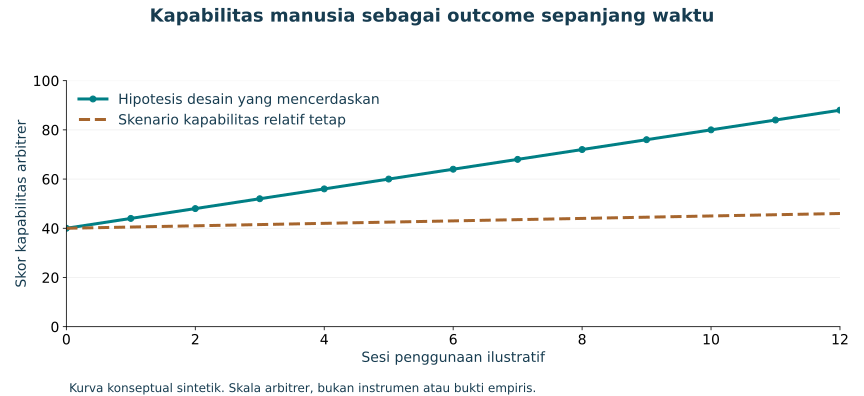

# Artefak cerdas, mencerdaskan, dan memampukan

## Prinsip rekayasa berorientasi kemanusiaan

Percakapan merumuskan tuntutan bahwa artefak harus cerdas dan mencerdaskan: semakin digunakan, semakin memampukan manusia memenuhi kebutuhan dasarnya serta mencapai aspirasinya [@percakapan2026]. Prinsip ini menjadikan perkembangan manusia sebagai tujuan desain dan objek evaluasi.

| Sifat | Makna operasional | Pertanyaan evaluasi |
|---|---|---|
| Cerdas | Memahami keadaan dan membantu tindakan | Apakah pekerjaan berhasil pada kondisi tertentu? |
| Mencerdaskan | Mendukung pemahaman, penilaian, koreksi, penciptaan | Apakah kemampuan pengguna berkembang? |
| Memampukan | Memperluas kesempatan serta kemampuan bertindak | Apakah manusia dapat memenuhi kebutuhan dan mengejar aspirasi? |

Pengetahuan saja tidak cukup untuk bertindak. Seseorang juga memerlukan sumber daya, akses, waktu, dukungan sosial, dan kewenangan. Karena itu, pengukuran kapabilitas perlu menilai kondisi yang memungkinkan kemampuan digunakan. TISE menghubungkan pertumbuhan kemampuan dengan lingkungan ekosistem.

## Dua keluaran dari interaksi

{#fig-empower}

Contoh tutor AI: sistem dapat membantu mahasiswa menyelesaikan soal sambil meningkatkan kemampuan mengenali masalah, memilih strategi, menjelaskan langkah, dan menilai jawaban. Dua hasil itu tidak selalu meningkat bersama. Desain perlu menyediakan kesempatan mencoba, penjelasan yang sesuai, koreksi, dan refleksi.

| Interaksi | Hasil misi | Hasil belajar yang dicari |
|---|---|---|
| Rekomendasi produksi | Rencana harian tersusun | Pedagang memahami dasar perkiraan |
| Tutor pemrograman | Tugas selesai | Mahasiswa mentransfer strategi |
| Layanan kesehatan digital | Informasi dapat diakses | Pengguna memahami pilihan dan pertanyaan |
| Sistem koordinasi | Tindakan terselaraskan | Pelaku memahami peran dan konsekuensi |

## Desain bantuan yang menumbuhkan kemampuan

{#fig-learning-design}

| Fitur | Mekanisme yang diharapkan | Cara menilainya |
|---|---|---|
| Penjelasan alasan | Pengguna memahami hubungan | Uji menjelaskan kembali |
| Petunjuk bertahap | Pengguna aktif mencoba | Catatan strategi dan tugas |
| Koreksi serta veto | Pengguna menjaga kendali | Kejadian koreksi yang beralasan |
| Refleksi hasil | Pengalaman menjadi pengetahuan | Perubahan alasan keputusan |
| Adaptasi bantuan | Dukungan sesuai kemampuan | Beban, keberhasilan, transfer |
| Akses sumber daya | Kemampuan dapat digunakan | Kesempatan bertindak nyata |

Mekanisme dalam tabel merupakan hipotesis desain. Efeknya perlu diuji. Pengurangan bantuan tidak selalu menjadi tujuan bagi setiap pengguna. Pengguna dengan kebutuhan aksesibilitas dapat memerlukan bantuan terus-menerus. Pertumbuhan kapabilitas berarti bertambahnya kemampuan dan pilihan yang bermakna, termasuk kemampuan memakai bantuan secara sadar.

## Ukuran sepanjang waktu

Menilai “semakin digunakan” memerlukan bukti longitudinal. Pengukuran sebelum penggunaan, selama penggunaan, dan setelahnya dapat menunjukkan perkembangan. Tugas transfer membantu memeriksa apakah kemampuan dapat digunakan pada situasi yang berbeda. Pengukuran perlu mempertimbangkan pengalaman awal serta kesempatan belajar.

| Outcome | Instrumen contoh | Batas penafsiran |
|---|---|---|
| Pencapaian misi | Ketepatan atau cakupan layanan | Dapat meningkat karena bantuan sistem |
| Pemahaman | Penjelasan mekanisme | Instrumen perlu valid untuk tujuan |
| Transfer | Tugas baru dengan bantuan yang dinyatakan | Konteks tugas menentukan klaim |
| Kendali | Koreksi, alasan, pilihan | Banyak koreksi bisa juga menandakan sistem buruk |
| Kesempatan | Akses serta kemampuan bertindak | Dipengaruhi lingkungan dan sumber daya |

{#fig-capability}

Plot tersebut hanya menjelaskan pertanyaan desain. Penelitian nyata perlu mengukur kapabilitas dengan instrumen yang memadai serta pembanding. Kurva yang meningkat tidak boleh diasumsikan berlaku karena suatu fitur telah ditambahkan.

## PUDAL sebagai pembelajaran timbal balik

Learn mencakup perubahan model dan praktik manusia. Artefak belajar dari pengalaman pengguna, sementara pengguna memperoleh pemahaman serta kesempatan baru. Catatan PUDAL perlu menunjukkan perubahan apa yang terjadi dan mengapa. Perubahan struktural dapat memicu Q-Cycle baru.

## Latihan

Rancang satu fitur yang mencerdaskan pada sistem pilihan Anda. Nyatakan mekanisme, ukuran, pembanding, dan waktu pengujian. Jelaskan satu kemungkinan hasil yang menunjukkan peningkatan kinerja tanpa pertumbuhan kapabilitas, serta perubahan desain yang akan Anda pertimbangkan.
