# TISE 1.0, 2.0, dan 3.0

## Tiga lapisan perkembangan

Dokumen TISE penulis menjelaskan tiga versi sebagai tumpukan kemampuan. TISE 1.0 menjaga operasi misi tetap layak. TISE 2.0 menambahkan pembelajaran timbal balik. TISE 3.0 menambahkan kemampuan menciptakan serta mengelola ekosistem baru [@langi2026tise; @langi2026transcript].

{#fig-versions}

| Versi | Pertanyaan | Kemampuan tambahan | Bukti yang dicari |
|---|---|---|---|
| 1.0 | Dapatkah misi terus dijalankan? | Adaptasi dan kelayakan operasi | Hasil misi serta batas keberlanjutan |
| 2.0 | Apakah penggunaan meningkatkan kemampuan? | Pembelajaran manusia dan sistem | Perkembangan kapabilitas sepanjang waktu |
| 3.0 | Dapatkah ekosistem baru diciptakan? | Penciptaan dan tata kelola portofolio | Validasi konteks baru dan kelayakan pelaku |

Nomor versi dalam buku ini menunjukkan perkembangan konseptual. Tabel tersebut tidak menyatakan bahwa seluruh kemampuan telah terimplementasi atau tervalidasi pada setiap contoh. Status konkret perlu dilaporkan per artefak dan kasus.

## TISE 1.0: menjaga kelayakan misi

Pada pangan kampus, perhatian utamanya mencakup akses pangan, kapasitas pedagang, sumber pasokan, biaya, serta limbah. PUDAL membantu adaptasi ketika kondisi berubah. Ekosistem dipandang layak ketika misi dapat dilanjutkan tanpa merusak prasyarat operasi berikutnya.

Pertanyaan penelitian dapat menilai kebijakan adaptasi atau distribusi risiko. Penilaian perlu menyebut horizon waktu. Kebijakan yang baik selama satu minggu belum membuktikan kelayakan selama satu tahun ketika biaya dan permintaan berubah.

## TISE 2.0: hasil misi dan hasil pembelajaran

Dalam versi 2.0, peningkatan kinerja disertai perkembangan kemampuan manusia, kelompok, organisasi, dan artefak. Pedagang belajar membaca data produksi. Mahasiswa belajar menilai informasi gizi. Operator belajar mengenali gangguan. Pengetahuan yang diperoleh kemudian digunakan untuk memperbaiki praktik.

| Pertanyaan | Outcome misi | Outcome kapabilitas |
|---|---|---|
| Apakah rekomendasi produksi membantu? | Cakupan dan sisa | Kemampuan menilai perkiraan |
| Apakah informasi pangan bermanfaat? | Pilihan sesuai kebutuhan | Pemahaman dan penilaian informasi |
| Apakah koordinasi membaik? | Pemulihan gangguan | Kemampuan mengambil peran |

Versi ini mempertegas prinsip artefak cerdas dan mencerdaskan. Bantuan perlu membuka kemampuan serta pilihan. Ukuran penggunaan atau kepuasan saja belum menguji prinsip tersebut.

## TISE 3.0: penciptaan ekosistem

TISE 3.0 menambahkan lapisan meta untuk menciptakan, menguji, meluncurkan, dan menghubungkan ekosistem baru. Ekosistem yang telah dipelajari menjadi sumber model, pengetahuan, dan praktik bagi konteks berikutnya. Adaptasi tetap diperlukan karena pelaku, sumber daya, aturan, serta kebutuhannya berbeda.

| Kegiatan penciptaan | Pertanyaan utama | Hasil yang perlu diperiksa |
|---|---|---|
| Identifikasi konteks | Misi apa dibutuhkan di lokasi baru? | Kebutuhan dan pelaku |
| Adaptasi model | Asumsi mana masih berlaku? | Parameter dan mekanisme |
| Pengujian virtual | Apa risiko dan batasnya? | Skenario serta sensitivitas |
| Pilot | Apakah pelaku dapat menjalankan? | Bukti penggunaan dan kelayakan |
| Penghubungan | Bagaimana keluaran saling mendukung? | Antarmuka, aturan, tanggung jawab |

Replikasi bukan penyalinan perangkat lunak saja. Ia mencakup penyesuaian misi, kemampuan, kewenangan, dan lingkungan. Bukti dari kampus pertama membantu perancangan kampus berikutnya, tetapi tidak menggantikan validasi pada konteks baru.

## Memilih cakupan penelitian

Satu proyek dapat menguji mekanisme dalam TISE 1.0 tanpa membangun seluruh versi. Proyek lain dapat menilai fitur pembelajaran 2.0 pada artefak yang sederhana. Penelitian 3.0 memerlukan perhatian terhadap mekanisme penciptaan dan batas transfer antarkonteks. Cakupan perlu mengikuti sumber daya dan pertanyaan yang dapat dijawab.

## Latihan

Untuk kasus Anda, tuliskan satu research question pada setiap versi. Pilih satu yang dapat diuji sekarang. Sebutkan prasyarat versi sebelumnya yang harus sudah memadai dan bukti yang belum tersedia untuk menyatakan kemampuan versi berikutnya.
