# Profesi rekayasawan paripurna

## Integrasi pengetahuan dan tanggung jawab

Rekayasawan paripurna dalam percakapan ini adalah profesional yang menghubungkan kebutuhan manusia, pengetahuan, rancangan, realisasi, dan bukti untuk menghasilkan manfaat berkelanjutan serta menumbuhkan kapabilitas [@percakapan2026]. Keparipurnaan diwujudkan melalui kedalaman keahlian, keluasan integrasi, dan tanggung jawab sepanjang siklus hidup.

{#fig-profession}

| Kemampuan profesi | Pekerjaan yang terlihat | Bukti dalam portofolio |
|---|---|---|
| Memahami kebutuhan | Berinteraksi dengan pihak terdampak | Rumusan masalah dan alasan |
| Menyelidiki | Menguji asumsi dan penjelasan | Data serta hasil analisis |
| Merancang | Membandingkan alternatif | Keputusan dan trade-off |
| Merealisasikan | Mengintegrasikan artefak | Hasil uji serta operasi |
| Membuktikan | Menilai klaim secara tepat | Ketertelusuran dan batas |
| Memelihara | Menjaga kelayakan | Catatan gangguan dan perbaikan |
| Memampukan | Mendukung perkembangan manusia | Bukti pembelajaran dan kesempatan |

## Keahlian individu dan kemampuan tim

Satu orang dapat memiliki spesialisasi utama, misalnya kendali, arsitektur perangkat lunak, ergonomi, atau tata kelola. Keparipurnaan tidak menuntut penguasaan tertinggi setiap disiplin. Ia menuntut kemampuan mengenali batas keahlian, menghubungkan kontribusi ahli, serta mempertanggungjawabkan keputusan dalam perannya.

| Peran dalam tim | Kedalaman keahlian | Tanggung jawab integrasi |
|---|---|---|
| Peneliti | Metode dan bukti | Menghubungkan klaim dengan kebutuhan |
| Perancang sistem | Fungsi dan arsitektur | Menghubungkan komponen serta pelaku |
| Pengembang | Implementasi | Menjaga persyaratan dan antarmuka |
| Operator | Kondisi penggunaan | Mengembalikan bukti operasi |
| Pengguna dan regulator | Kebutuhan dan kewenangan | Menilai manfaat serta penerimaan |

Triune intelligence memperluas kolaborasi ini. AI membantu analisis serta penelusuran. Kecerdasan kolektif menyediakan pengetahuan tersebar dan koordinasi. Manusia tetap memegang penilaian dan tanggung jawab sesuai kewenangan. Profesional perlu memahami apa yang dapat diperiksa dan kapan meminta keahlian tambahan.

## Tanggung jawab siklus hidup

Realisasi mengubah kehidupan pengguna. Karena itu, tanggung jawab profesi meliputi pengenalan kebutuhan, pengujian, operasi, pemeliharaan, serta penghentian yang layak. Ketika artefak dihentikan, pengguna dapat kehilangan akses, pengetahuan, atau layanan yang telah menjadi bagian pekerjaannya. Rancangan perlu mempertimbangkan kontinuitas kemampuan.

| Fase | Pertanyaan tanggung jawab | Catatan yang dibutuhkan |
|---|---|---|
| Perumusan | Siapa yang dilayani dan didengar? | Keputusan ruang lingkup |
| Perancangan | Risiko serta trade-off apa dipilih? | Alternatif dan alasan |
| Pengujian | Klaim apa benar-benar didukung? | Kondisi, metode, hasil |
| Operasi | Bagaimana kegagalan ditangani? | Insiden dan pemulihan |
| Perubahan | Siapa terdampak pembaruan? | Evaluasi serta persetujuan |
| Penghentian | Bagaimana kemampuan dan akses dijaga? | Transisi serta dokumentasi |

## Nilai kerja yang dapat diperiksa

Kualitas, kepedulian, kejujuran, keselamatan, dan penyelesaian pekerjaan perlu diterjemahkan menjadi praktik. Kejujuran ilmiah terlihat pada status data dan batas klaim. Kepedulian terlihat pada cara kebutuhan dipahami dan kesempatan dijaga. Penyelesaian terlihat pada artefak, dokumentasi, dukungan, dan bukti sesuai lingkup.

| Nilai | Praktik operasional | Pertanyaan telaah |
|---|---|---|
| Kualitas | Persyaratan dan pengujian | Apakah hasil memenuhi kriteria? |
| Kepedulian | Pertimbangan keadaan pengguna | Siapa menghadapi hambatan? |
| Kejujuran | Asumsi dan batas terbuka | Apakah bukti dibedakan dari harapan? |
| Keselamatan | Risiko dan penanganan kegagalan | Apa konsekuensi saat gagal? |
| Deliver | Hasil sesuai komitmen | Apa yang siap digunakan atau ditelaah? |

## Portofolio sebagai bukti kompetensi

Portofolio dapat berisi proyek yang berbeda tahap dan lapisan. Nilainya terletak pada keputusan, bukti, serta pembelajaran yang dapat ditelusuri. Catatan kegagalan yang dijelaskan dengan baik dapat menunjukkan kompetensi diagnosis dan revisi. Klaim keberhasilan tanpa kondisi uji justru sulit dinilai.

Sebuah entri portofolio yang padat menyebut misi, lapisan kontribusi, keputusan penting, tahap inovasi, kematangan, hasil uji, batas, dan perubahan yang dipelajari. Format ini memudahkan pembimbing atau reviewer menilai apa yang benar-benar dikerjakan.

## Latihan

Susun satu entri portofolio proyek Anda. Identifikasi keahlian utama dan kebutuhan kolaborasi. Jelaskan tanggung jawab yang masih berlaku setelah prototipe diserahkan kepada pengguna serta bukti bahwa artefak semakin memampukan mereka.
