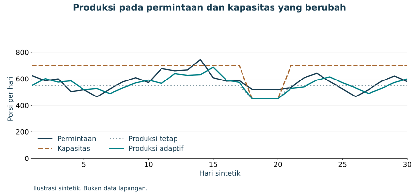

# Studi terpadu: ekosistem pangan kampus

## Misi dan batas kasus

Kasus ini merupakan contoh rancangan pembelajaran. Misinya adalah meningkatkan akses makanan sehat dan terjangkau sambil menjaga kelayakan pedagang, pemasok, dan lingkungan. Angka pada simulasi dibuat secara sintetik. Model sederhana hanya menggambarkan produksi, penjualan, sisa, dan kekurangan. Mutu gizi, harga yang adil, antrean, atau pembelajaran manusia memerlukan model serta data tambahan.

{#fig-food}

| Pelaku | Misi | Sumber daya | Nilai yang diharapkan |
|---|---|---|---|
| Mahasiswa | Memperoleh pangan sesuai kebutuhan | Permintaan, waktu, informasi | Akses dan kesehatan |
| Pedagang | Menjalankan usaha layak | Tenaga, dapur, pengetahuan | Pendapatan dan kemampuan |
| Pemasok | Menyediakan bahan | Bahan dan logistik | Kepastian serta kelayakan |
| Kampus | Menjaga layanan | Aturan dan fasilitas | Mutu serta keberlanjutan |

## Q-Cycle pada kasus

| Q | Keputusan rancangan | Bukti yang direncanakan |
|---|---|---|
| Q1 | Akses pangan dan sisa sebagai perhatian awal | Baseline layanan serta pengalaman |
| Q2 | Perkiraan, produksi, distribusi, koreksi | Model aliran dan keadaan |
| Q3 | Rekomendasi AI dengan penilaian pedagang | Pembagian fungsi dan otoritas |
| Q4 | Simulasi, pilot, evaluasi | Hasil virtual lalu pengamatan nyata |

Pertanyaan utama contoh adalah apakah rekomendasi produksi yang dapat dijelaskan dan dikoreksi membantu layanan sekaligus meningkatkan kemampuan pedagang mengambil keputusan. Pertanyaan tersebut mencakup outcome misi dan kapabilitas. Simulasi pada bab ini baru menguji bagian produksi.

## Model produksi harian

Permintaan hari ke-t adalah D_t, produksi Q_t, dan kapasitas K_t. Penjualan Y_t dibatasi oleh permintaan serta produksi. Sisa W_t dan permintaan yang belum terpenuhi U_t dihitung sebagai berikut:

$$
Y_t=\min(D_t,Q_t),\quad W_t=\max(Q_t-D_t,0),\quad U_t=\max(D_t-Q_t,0).
$$

Pendapatan kotor dari penjualan dihitung dengan harga per porsi p. Biaya produksi per porsi c dan biaya penanganan sisa w memberikan margin operasi sederhana:

$$
\Pi_t=pY_t-cQ_t-wW_t.
$$

Margin ini belum mencakup seluruh biaya usaha. Ia digunakan agar konsekuensi produksi dapat diperiksa dalam contoh. Cakupan permintaan adalah total penjualan dibagi total permintaan. Rasio sisa adalah total sisa dibagi total produksi.

| Parameter ilustratif | Nilai | Makna |
|---|---|---|
| Harga p | Rp20.000 per porsi | Asumsi penjualan |
| Biaya produksi c | Rp14.000 per porsi | Asumsi biaya variabel |
| Biaya sisa w | Rp1.000 per porsi | Asumsi penanganan |
| Produksi tetap | 550 porsi per hari | Baseline sederhana |
| Horizon | 30 hari sintetik | Bukan kalender lapangan |

## Kebijakan dan skenario

Kebijakan tetap menghasilkan 550 porsi sepanjang kapasitas memungkinkan. Kebijakan adaptif menggunakan permintaan kemarin dan nilai 550 sebagai jangkar. Produksi dibatasi kapasitas hari ini. Permintaan mengalami variasi dan lonjakan, sementara kapasitas turun pada beberapa hari.

{#fig-food-twin}

| Kebijakan | Aturan | Asumsi |
|---|---|---|
| Tetap | Q_t=min(550,K_t) | Rencana dasar tidak mengikuti data |
| Adaptif | Q_t=min(K_t,round(0,7D_{t-1}+0,3×550)) | Informasi permintaan kemarin tersedia |

Contoh ini menunjukkan bagaimana keterlambatan informasi dapat berpengaruh. Saat permintaan melonjak, kebijakan berdasarkan hari sebelumnya dapat tertinggal. Produksi yang meningkat kemudian dapat menghasilkan sisa ketika permintaan turun. Keunggulan tidak boleh diasumsikan dari nama kebijakannya.

{#fig-food-timeseries}

## Hasil yang dapat dihitung ulang



Hasil tersebut hanya berlaku untuk rangkaian permintaan, kapasitas, dan parameter contoh. Model belum mencakup pilihan menu, perilaku prapesan, perubahan harga, proses antrean, atau kemampuan pedagang. Kesimpulan yang sah menyatakan perbedaan kebijakan dalam skenario ini. Keputusan lapangan memerlukan kalibrasi dan pengujian tambahan.

{#fig-food-outcomes}

## Menambahkan bukti manusia dan ekosistem

| Lapisan | Bukti virtual | Bukti realisasi yang dibutuhkan |
|---|---|---|
| T | Perhitungan dan aturan | Kualitas data serta prediksi |
| S | Perilaku kebijakan | Integrasi dan gangguan nyata |
| A | Dugaan manfaat | Penggunaan dan pengalaman |
| E | Dugaan distribusi | Kelayakan serta dampak pelaku |
| Kapabilitas | Fitur penjelasan yang dirancang | Pemahaman dan transfer keputusan |

Pilot dapat meminta pedagang menjelaskan rekomendasi, memberi koreksi, dan menyusun rencana pada skenario baru. Pengujian perlu memperhatikan perubahan musiman serta pengalaman awal. Data kemampuan dihubungkan dengan data operasional untuk menilai prinsip cerdas dan mencerdaskan.

## Menjalankan contoh

Dari direktori proyek, jalankan `python scripts/simulate_food.py`. Script menulis CSV, ringkasan JSON, tabel untuk buku, dan plot jika Matplotlib tersedia. Data sintetik memakai seed tetap. Pengguna dapat mengubah parameter, membandingkan hasil, dan menjelaskan alasan perubahan.

## Latihan

Ubah panjang lonjakan permintaan atau kapasitas minimum. Tentukan kebijakan yang memberi cakupan lebih baik dan biaya sisa lebih rendah. Apakah peringkat kebijakan berubah? Kemudian tuliskan satu research question yang memerlukan data manusia dan belum dijawab oleh simulator.
