# Rancangan penelitian dan paket bukti

## Pertanyaan, kontribusi, dan kondisi berlaku

Rancangan penelitian menghubungkan apa yang hendak diketahui dengan kegiatan yang menghasilkan bukti. Posisi EASTF, tahap inovasi, dan kematangan membantu menentukan cakupan. Metodologi menjustifikasi cara pekerjaan disusun, sementara Q-Cycle membantu menjaga ketertelusuran keputusan rekayasa.

{#fig-claim}

| Elemen | Isi contoh | Pemeriksaan |
|---|---|---|
| Masalah | Ketidakpastian produksi dan keterbatasan pengetahuan | Ada bukti keadaan awal |
| RQ | Apakah dukungan keputusan meningkatkan hasil dan kemampuan? | Objek serta outcome jelas |
| Kontribusi | Prinsip interaksi rekomendasi–koreksi | Menghasilkan pengetahuan yang dapat digunakan |
| Lapisan | A dan S, dengan konteks E | Batas antarlapisan disebutkan |
| Tahap | Model, virtual, pilot | Jenis bukti dibedakan |
| Metodologi | DSRM atau DRM sesuai penekanan | Alasan pilihan tersedia |

## Protokol evaluasi yang terarah

Outcome misi, kapabilitas, dan keberlanjutan dapat memerlukan pengukuran berbeda. Tetapkan definisi, instrumen, waktu, serta pembanding sebelum melihat hasil. Ukuran sampel mengikuti ketelitian atau kekuatan inferensi yang dibutuhkan serta keterbatasan praktis. Jumlah tertentu tidak dapat ditetapkan hanya dari nama metodologi.

| Pertanyaan | Data | Analisis contoh | Batas |
|---|---|---|---|
| Apakah produksi membaik? | Penjualan, sisa, kekurangan | Perbandingan dengan ketidakpastian | Musim dan kapasitas |
| Apakah pengguna memahami? | Penjelasan beralasan | Rubrik dan pemeriksaan penilai | Instrumen serta pengalaman |
| Apakah kemampuan berpindah? | Tugas transfer | Perubahan dan kelompok pembanding | Kemiripan tugas |
| Apakah pelaku tetap layak? | Biaya, pendapatan, beban | Distribusi dan tren waktu | Horizon serta biaya lengkap |

Bukti kualitatif membantu menjelaskan mekanisme dan pengalaman. Bukti kuantitatif membantu menilai besaran serta variasi. Penggabungannya perlu direncanakan. Perbedaan hasil antarjenis data dapat menjadi temuan penting, bukan sesuatu yang dihapus dari laporan.

## Validitas dan penjelasan alternatif

| Risiko | Contoh | Penanganan rancangan |
|---|---|---|
| Pengaruh pelatihan | Kelompok intervensi menerima pelatihan tambahan | Jelaskan dan samakan kesempatan yang relevan |
| Perubahan konteks | Jadwal kuliah berubah | Catat konteks dan periode |
| Seleksi | Peserta lebih termotivasi | Laporkan cara pemilihan |
| Ukuran proksi | Kepuasan dianggap kemampuan | Ukur outcome yang dituju |
| Bias model | Parameter sintetik terlalu menguntungkan | Sensitivitas dan skenario beragam |
| Klaim terlalu luas | Pilot disebut berlaku universal | Nyatakan populasi dan kondisi |

Penanganan risiko mengikuti kebutuhan bukti. Pengujian acak dapat membantu pada pertanyaan tertentu, sedangkan studi kasus mendalam dapat sesuai untuk mekanisme organisasi yang kompleks. Metodologi tidak menggantikan alasan pemilihan desain penelitian.

## Buku besar klaim dan bukti

| ID | Klaim | Bukti tersedia | Status | Tindakan berikutnya |
|---|---|---|---|---|
| K1 | Aturan produksi memenuhi kapasitas | Pemeriksaan kode dan output | Didukung pada contoh | Uji implementasi |
| K2 | Kebijakan meningkatkan outcome | Simulasi sintetik | Terbatas pada skenario | Kalibrasi dan pilot |
| K3 | Pedagang semakin mampu | Belum diukur | Hipotesis | Uji pemahaman dan transfer |
| K4 | Ekosistem berkelanjutan | Model parsial | Belum cukup | Ukur biaya serta distribusi |

Status dapat berupa hipotesis, didukung pada kondisi tertentu, atau belum terjawab. Kata “tervalidasi” perlu selalu diikuti apa yang divalidasi, terhadap apa, dan dalam kondisi apa. Pemeriksaan kode menunjukkan implementasi mengikuti aturan; ia belum membuktikan aturan menggambarkan kenyataan.

## Anatomi laporan

| Bagian laporan | Pertanyaan pembaca | Visual utama |
|---|---|---|
| Masalah | Mengapa perlu diteliti? | Baseline dan peta pelaku |
| Pengetahuan awal | Apa yang sudah diketahui? | Tabel literatur dan gap |
| RQ dan kontribusi | Apa yang akan dijawab? | PICOC dan EASTF |
| Metode | Bagaimana bukti dihasilkan? | Alur metodologi |
| Rancangan | Bagaimana solusi bekerja? | Fungsi dan arsitektur |
| Hasil | Apa yang diamati? | Tabel, plot, ketidakpastian |
| Diskusi | Apa artinya dan batasnya? | Buku besar klaim |
| Kesimpulan | Jawaban apa didukung? | RQ–jawaban–bukti |

Dalam penelitian rekayasa, artefak dan pengetahuan perlu dinyatakan bersama. Deskripsi fitur menjelaskan apa yang dibangun. Kontribusi menjelaskan apa yang dapat dipelajari tentang solusi atau masalah. Bukti menentukan batas penggunaan pengetahuan itu.

## Latihan

Susun paket satu halaman: PICOC, lapisan kontribusi, pilihan metodologi, empat keputusan Q-Cycle, tahap inovasi, dan tiga klaim beserta bukti. Minta rekan menilai satu lompatan inferensi yang belum didukung. Revisi rumusan agar dapat ditelaah.
