# Visual dan tabel sebagai infrastruktur penjelasan

## Representasi yang membawa penalaran

Visual dan tabel dalam buku ini berfungsi sebagai infrastruktur penjelasan. Diagram menyatakan objek serta hubungan. Tabel menjaga pemetaan dan perbandingan. Plot memperlihatkan pola angka. Prosa menjelaskan alasan, asumsi, dan implikasi yang tidak cukup diwakili bentuk visual.

{#fig-visual}

| Kebutuhan penjelasan | Representasi | Yang harus terlihat |
|---|---|---|
| Urutan dan iterasi | Flowchart atau state diagram | Kondisi dan arah hubungan |
| Fungsi dan kendali | Diagram blok | Masukan, keluaran, umpan balik |
| Struktur dan peran | Diagram arsitektur | Komponen, antarmuka, kewenangan |
| Pemetaan yang tepat | Tabel | Baris, kolom, definisi |
| Perubahan angka | Plot | Sumbu, unit, data, ketidakpastian |
| Kondisi nyata | Foto atau gambar | Konteks dan sumber |

## Kosakata dan grammar visual

Sebuah diagram mempunyai kosakata berupa simpul, label, garis, dan simbol. Grammar-nya menentukan arti hubungan. Panah dapat berarti urutan, aliran data, pengaruh, atau ketergantungan; caption perlu menyatakan artinya. Panah dalam diagram konseptual tidak otomatis menunjukkan hubungan sebab-akibat yang sudah terbukti.

| Elemen | Arti yang dapat digunakan | Risiko |
|---|---|---|
| Kotak | Fungsi, komponen, atau keadaan | Jenis objek tercampur |
| Panah | Aliran atau hubungan tertentu | Pembaca menganggap kausalitas |
| Warna | Pengelompokan atau penekanan | Arti bergantung warna saja |
| Posisi | Lapisan atau kedekatan | Hierarki yang tidak dimaksudkan |
| Caption | Tujuan, sumber, batas | Gambar terlepas dari argumen |

Konsistensi lebih penting daripada banyaknya dekorasi. Label yang sama sebaiknya digunakan pada diagram, tabel, dan prosa. Ketika istilah berubah, pembaca perlu mengetahui apakah objeknya berubah atau hanya namanya.

## Tabel sebagai kontrak penjelasan

Tabel yang baik menetapkan dimensi perbandingan. Membandingkan DRM dan DSRM memerlukan baris yang sama, seperti fokus, kegiatan, keluaran, dan bukti. Membandingkan kebijakan produksi memerlukan definisi ukuran serta penyebut. Sel kosong perlu dijelaskan sebagai tidak berlaku, belum diketahui, atau belum diukur.

| Prinsip tabel | Pelaksanaan | Contoh |
|---|---|---|
| Satu tujuan | Kolom mengikuti pertanyaan | Tahap–bukti–gerbang |
| Kategori konsisten | Jenis isi sama pada kolom | Semua baris menyatakan outcome |
| Unit jelas | Unit pada judul atau label | Rupiah per periode |
| Status data | Bedakan sintetik dan lapangan | Caption simulasi |
| Batas klaim | Catatan dekat hasil | Skenario dan horizon |

## Visual dalam Q-Cycle dan EASTF

| Ruang | Visual yang membantu | Tabel pasangan |
|---|---|---|
| Q1 | Black box perubahan dan peta pelaku | Kebutuhan serta kriteria |
| Q2 | Fungsi, state, aliran, kurva | Fungsi dan persyaratan |
| Q3 | Arsitektur dan kendali | Alokasi serta trade-off |
| Q4 | Plot hasil dan jejak realisasi | Uji, bukti, batas |
| EASTF | Lapisan dan arah hubungan | RQ, kontribusi, outcome |

Diagram dapat membuka struktur argumen. Tabel dapat menguji konsistensinya. Jika kebutuhan tidak mempunyai fungsi atau uji, matriks ketertelusuran memperlihatkan kekosongan tersebut. Jika plot menunjukkan perbaikan satu outcome tetapi penurunan outcome lain, tabel membantu membandingkan trade-off secara tepat.

## Slide dan buku mempunyai kepadatan berbeda

Buku memungkinkan pembaca berhenti, memeriksa tabel, dan membaca penjelasan. Slide mendukung perhatian bersama dalam waktu terbatas. Deck memakai satu konsep utama per halaman, label pendek, serta catatan pengajar untuk detail. Tabel buku yang panjang dibagi menjadi beberapa slide sesuai tujuan penjelasan.

| Media | Isi utama | Tempat detail |
|---|---|---|
| Buku | Argumen lengkap dengan visual | Paragraf, tabel, lampiran |
| Slide | Hubungan atau perbandingan inti | Catatan pengajar dan buku |
| Lembar kerja | Keputusan yang harus dibuat | Jawaban peserta |
| Kode contoh | Mekanisme yang dapat diperiksa | Parameter dan keluaran |

## Pemeriksaan visual akademik

Periksa apakah visual menjawab pertanyaan, istilahnya konsisten, dan setiap hubungan mempunyai arti. Periksa keterbacaan pada ukuran penggunaan, bukan hanya pada editor. Untuk plot, cek sumbu dan unit. Untuk tabel, cek penyebut serta konteks. Untuk semua representasi, jaga sumber dan status klaim.

## Latihan

Ambil satu paragraf penjelasan dari proyek Anda. Ubah menjadi diagram dengan caption dan tabel pasangan. Tentukan hubungan yang sebelumnya tersembunyi. Sebutkan satu inferensi yang dapat disalahartikan dari visual tersebut, lalu perbaiki label atau caption.
