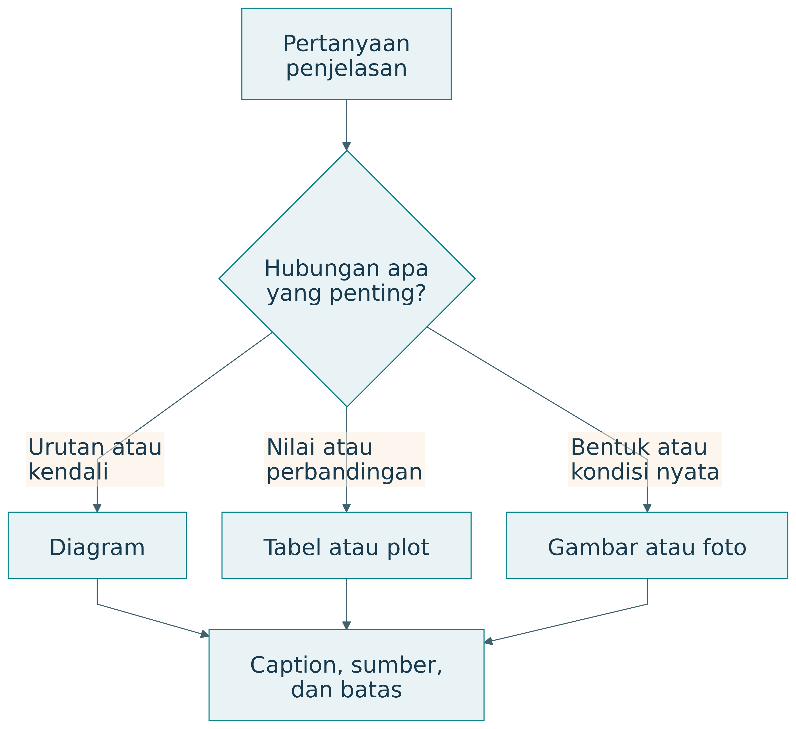

# Materi Teknis

## Reproduksi Simulasi

### Menjalankan contoh

Dari direktori `disertasi`, jalankan `python scripts/simulate_food.py`. Script menulis CSV, ringkasan JSON, tabel pada `includes/simulation-results.qmd`, dan plot jika Matplotlib tersedia. Data sintetik memakai seed tetap. Pengguna dapat mengubah parameter, membandingkan hasil, dan menjelaskan alasan perubahan.

## Glosarium

### Glosarium

| Istilah | Pengertian dalam buku |
|---|---|
| Artefak | Hasil rancangan yang dapat berupa perangkat, perangkat lunak, model, metode, layanan, atau pengaturan organisasi |
| Aspirasi | Keadaan atau pencapaian yang ingin diraih manusia |
| ASTF | Application, System, Technology, Fundamental Research |
| Baseline | Keadaan atau pendekatan pembanding yang dijelaskan |
| Black box | Representasi yang memusatkan perhatian pada masukan, keluaran, dan tujuan |
| Cerdas | Kemampuan membantu pemahaman, keputusan, tindakan, dan adaptasi |
| Mencerdaskan | Sifat interaksi yang mendukung pertumbuhan kemampuan manusia |
| Memampukan | Memperluas kemampuan serta kesempatan nyata untuk bertindak |
| Collective intelligence | Kecerdasan yang muncul melalui pengetahuan dan proses bersama |
| Contribution | Pengetahuan atau kemampuan baru yang didukung bukti sesuai ruang lingkup |
| Context | Lingkungan dan kondisi yang memengaruhi penerapan |
| Design | Perumusan alternatif serta keputusan untuk solusi yang diinginkan |
| Digital twin | Representasi digital sasaran yang mendukung hubungan data, analisis, serta penggunaan sepanjang siklus hidup |
| Prototipe digital twin | Representasi virtual pada tahap pengembangan dengan status serta batas yang dijelaskan |
| DRM | Design Research Methodology dari Blessing dan Chakrabarti |
| DSR | Design Science Research, pendekatan penelitian melalui penciptaan dan evaluasi artefak |
| DSRM | Design Science Research Methodology, dalam buku merujuk model Peffers dan rekan |
| EASTF | Ecosystem, Application, System, Technology, Fundamental Research, sesuai rumusan percakapan |
| Ekosistem | Jaringan pelaku, misi, sumber daya, teknologi, aturan, dan lingkungan yang saling bergantung |
| Engineering | Realisasi dan pengelolaan solusi agar memenuhi persyaratan pada kondisi nyata |
| Fidelity | Detail dan ketepatan representasi yang diperlukan untuk suatu tujuan |
| Full release | Versi yang resmi tersedia pada cakupan penggunaan yang ditetapkan |
| Fundamental research | Penyelidikan prinsip, hubungan, mekanisme, atau batas dasar |
| Gagasan | Usulan perubahan serta dugaan mekanisme dan manfaat |
| Intervention | Tindakan, metode, atau teknologi yang dikaji |
| Kapabilitas | Kemampuan dan kesempatan bermakna untuk bertindak |
| Kematangan | Kesiapan yang didukung bukti untuk suatu lingkup penggunaan |
| Lab demo | Demonstrasi fungsi inti dalam kondisi laboratorium terkendali |
| MA-DT | Multi-Agentic Digital Twin, representasi interaksi banyak agen |
| Metode | Prosedur menjalankan kegiatan penelitian |
| Metodologi | Logika yang menjustifikasi pilihan metode serta hubungan bukti dan kesimpulan |
| Misi | Tujuan tindakan yang menghasilkan keluaran dan manfaat |
| Model | Representasi struktur, hubungan, perilaku, atau asumsi |
| MOE | Dalam konteks ekosistem: Mission-Oriented Ecosystem |
| MoE | Dalam konteks ukuran: Measure of Effectiveness; buku membedakannya dari MOE |
| Outcome | Hasil atau perubahan yang dinilai |
| Output | Keluaran kegiatan atau misi |
| PICOC | Population, Intervention, Comparison, Outcome, Context |
| PSKVE | Products, Services, Knowledge, Values, Environment |
| PUDAL | Perceive, Understand, Decide, Act, Learn |
| Q-Cycle | Siklus masalah, fungsi, arsitektur, konstruksi dan bukti |
| Realisasi | Perwujudan rancangan pada lingkungan nyata |
| Release candidate | Versi calon rilis yang menunggu hasil penerimaan sesuai kriteria |
| Research question | Pertanyaan yang mengarahkan pencarian pengetahuan dan bukti |
| Riset | Kegiatan menghasilkan atau menguji pengetahuan yang dapat dipertanggungjawabkan |
| RMOV | Resource, Mission, Output, Value |
| Sustainability | Kelayakan melanjutkan misi dengan menjaga prasyarat masa depan |
| Testbed | Lingkungan atau fasilitas uji yang mewakili aspek penggunaan |
| Traceability | Ketertelusuran hubungan kebutuhan, keputusan, dan bukti |
| Transfer | Penggunaan kemampuan pada tugas atau keadaan baru |
| Triune intelligence | Integrasi kecerdasan manusia, kolektif, dan artifisial |
| Validasi | Penilaian terhadap sasaran atau kenyataan sesuai klaim yang dinyatakan |
| Verifikasi | Pemeriksaan bahwa implementasi mengikuti spesifikasi atau model |

: Glosarium — tabel 1 {#tbl-buku-0-1}

Singkatan dapat mempunyai arti lain di bidang lain. Penulis perlu menyatakan kepanjangan pada penggunaan pertama dan menjaga konsistensi selanjutnya.

## Visual dan Tabel sebagai Infrastruktur Penjelasan

### Representasi yang membawa penalaran

Visual dan tabel dalam buku ini berfungsi sebagai infrastruktur penjelasan. Diagram menyatakan objek serta hubungan. Tabel menjaga pemetaan dan perbandingan. Plot memperlihatkan pola angka. Prosa menjelaskan alasan, asumsi, dan implikasi yang tidak cukup diwakili bentuk visual.

{#fig-visual}

| Kebutuhan penjelasan | Representasi | Yang harus terlihat |
|---|---|---|
| Urutan dan iterasi | Flowchart atau state diagram | Kondisi dan arah hubungan |
| Fungsi dan kendali | Diagram blok | Masukan, keluaran, umpan balik |
| Struktur dan peran | Diagram arsitektur | Komponen, antarmuka, kewenangan |
| Pemetaan yang tepat | Tabel | Baris, kolom, definisi |
| Perubahan angka | Plot | Sumbu, unit, data, ketidakpastian |
| Kondisi nyata | Foto atau gambar | Konteks dan sumber |

: Representasi yang membawa penalaran — tabel 1 {#tbl-buku-114-1}


### Kosakata dan grammar visual

Sebuah diagram mempunyai kosakata berupa simpul, label, garis, dan simbol. Grammar-nya menentukan arti hubungan. Panah dapat berarti urutan, aliran data, pengaruh, atau ketergantungan; caption perlu menyatakan artinya. Panah dalam diagram konseptual tidak otomatis menunjukkan hubungan sebab-akibat yang sudah terbukti.

| Elemen | Arti yang dapat digunakan | Risiko |
|---|---|---|
| Kotak | Fungsi, komponen, atau keadaan | Jenis objek tercampur |
| Panah | Aliran atau hubungan tertentu | Pembaca menganggap kausalitas |
| Warna | Pengelompokan atau penekanan | Arti bergantung warna saja |
| Posisi | Lapisan atau kedekatan | Hierarki yang tidak dimaksudkan |
| Caption | Tujuan, sumber, batas | Gambar terlepas dari argumen |

: Kosakata dan grammar visual — tabel 1 {#tbl-buku-115-1}

Konsistensi lebih penting daripada banyaknya dekorasi. Label yang sama sebaiknya digunakan pada diagram, tabel, dan prosa. Ketika istilah berubah, pembaca perlu mengetahui apakah objeknya berubah atau hanya namanya.

### Tabel sebagai kontrak penjelasan

Tabel yang baik menetapkan dimensi perbandingan. Membandingkan DRM dan DSRM memerlukan baris yang sama, seperti fokus, kegiatan, keluaran, dan bukti. Membandingkan kebijakan produksi memerlukan definisi ukuran serta penyebut. Sel kosong perlu dijelaskan sebagai tidak berlaku, belum diketahui, atau belum diukur.

| Prinsip tabel | Pelaksanaan | Contoh |
|---|---|---|
| Satu tujuan | Kolom mengikuti pertanyaan | Tahap–bukti–gerbang |
| Kategori konsisten | Jenis isi sama pada kolom | Semua baris menyatakan outcome |
| Unit jelas | Unit pada judul atau label | Rupiah per periode |
| Status data | Bedakan sintetik dan lapangan | Caption simulasi |
| Batas klaim | Catatan dekat hasil | Skenario dan horizon |

: Tabel sebagai kontrak penjelasan — tabel 1 {#tbl-buku-116-1}


### Visual dalam Q-Cycle dan EASTF

| Ruang | Visual yang membantu | Tabel pasangan |
|---|---|---|
| Q1 | Black box perubahan dan peta pelaku | Kebutuhan serta kriteria |
| Q2 | Fungsi, state, aliran, kurva | Fungsi dan persyaratan |
| Q3 | Arsitektur dan kendali | Alokasi serta trade-off |
| Q4 | Plot hasil dan jejak realisasi | Uji, bukti, batas |
| EASTF | Lapisan dan arah hubungan | RQ, kontribusi, outcome |

: Visual dalam Q-Cycle dan EASTF — tabel 1 {#tbl-buku-117-1}

Diagram dapat membuka struktur argumen. Tabel dapat menguji konsistensinya. Jika kebutuhan tidak mempunyai fungsi atau uji, matriks ketertelusuran memperlihatkan kekosongan tersebut. Jika plot menunjukkan perbaikan satu outcome tetapi penurunan outcome lain, tabel membantu membandingkan trade-off secara tepat.

### Slide dan buku mempunyai kepadatan berbeda

Buku memungkinkan pembaca berhenti, memeriksa tabel, dan membaca penjelasan. Slide mendukung perhatian bersama dalam waktu terbatas. Deck memakai satu konsep utama per halaman, label pendek, serta catatan pengajar untuk detail. Tabel buku yang panjang dibagi menjadi beberapa slide sesuai tujuan penjelasan.

| Media | Isi utama | Tempat detail |
|---|---|---|
| Buku | Argumen lengkap dengan visual | Paragraf, tabel, lampiran |
| Slide | Hubungan atau perbandingan inti | Catatan pengajar dan buku |
| Lembar kerja | Keputusan yang harus dibuat | Jawaban peserta |
| Kode contoh | Mekanisme yang dapat diperiksa | Parameter dan keluaran |

: Slide dan buku mempunyai kepadatan berbeda — tabel 1 {#tbl-buku-118-1}


### Pemeriksaan visual akademik

Periksa apakah visual menjawab pertanyaan, istilahnya konsisten, dan setiap hubungan mempunyai arti. Periksa keterbacaan pada ukuran penggunaan, bukan hanya pada editor. Untuk plot, cek sumbu dan unit. Untuk tabel, cek penyebut serta konteks. Untuk semua representasi, jaga sumber dan status klaim.

### Cara menggunakan visuals

Setiap gambar menjelaskan satu hubungan utama. Baca judul dan caption terlebih dahulu, identifikasi objek serta arah hubungan, kemudian gunakan tabel di dekatnya untuk memeriksa definisi dan kriteria. Diagram menunjukkan mekanisme atau urutan. Tabel menjaga ketepatan pemetaan. Plot menunjukkan perubahan atau hubungan angka, dengan status data yang selalu disebutkan.

Buku dapat dipakai untuk belajar mandiri atau enam pertemuan kuliah. Deck Reveal.js menyajikan materi dengan catatan pengajar. Lampiran menyediakan lembar kerja dan contoh jawaban. Studi kasus pangan kampus digunakan berulang agar perhatian pembaca tertuju pada perubahan sudut pandang, bukan pada pengenalan kasus baru setiap bab.

## Panduan Kuliah dan Capaian Pembelajaran

### Panduan kuliah


### Enam pertemuan

Rancangan berikut merupakan usulan pengajaran. Durasi dapat disesuaikan dengan pengalaman peserta. Setiap pertemuan 90 menit dapat terdiri dari penjelasan visual 25 menit, pembacaan kasus 20 menit, kerja kelompok 30 menit, dan diskusi bukti 15 menit. Deck utama berisi 64 slide termasuk sampul dan rujukan.

| Pertemuan | Bab | Slide | Tujuan | Aktivitas |
|---|---|---|---|---|
| 1 | 1–3 | 2–12 | Membedakan kegiatan dan metodologi | PICOC serta pemilihan DRM/DSRM |
| 2 | 4–6 | 13–26 | Memodelkan TISE dan Q-Cycle | Peta peran dan ketertelusuran |
| 3 | 7 | 27–33 | Menentukan lapisan kontribusi | Lima RQ untuk satu topik |
| 4 | 8 | 34–40 | Menyatakan tahap dan bukti | Gerbang dari virtual ke pilot |
| 5 | 9–11 | 41–50 | Menilai pemberdayaan serta profesi | Rancangan outcome kapabilitas |
| 6 | 12–14 | 51–64 | Menyusun paket penelitian | Simulasi dan presentasi visual |

: Enam pertemuan — tabel 1 {#tbl-buku-14-1}


### Capaian dan artefak belajar

| Capaian | Artefak mahasiswa | Kriteria penilaian |
|---|---|---|
| Pertanyaan terarah | Tabel PICOC | Objek, intervensi, hasil, konteks jelas |
| Justifikasi penelitian | Pilihan metodologi | Hubungan metode dan bukti |
| Penalaran rekayasa | Matriks Q-Cycle | Ketertelusuran kebutuhan sampai uji |
| Posisi kontribusi | Peta EASTF | Batas antarlapisan |
| Evaluasi manusia | Protokol kapabilitas | Outcome dan waktu sesuai tujuan |
| Komunikasi | Diagram, tabel, narasi | Ketepatan label serta klaim |

: Capaian dan artefak belajar — tabel 1 {#tbl-buku-15-1}


### Pertanyaan pembuka diskusi

1. Apakah artefak yang berhasil selalu merupakan hasil riset?
2. Bukti apa membedakan demonstrasi dari evaluasi?
3. Apakah teknologi yang lebih akurat selalu memperbaiki ekosistem?
4. Apa yang harus diketahui sebelum maju dari model ke pilot?
5. Bagaimana mengukur manusia semakin mampu menggunakan bantuan?
6. Apa tanggung jawab rekayasawan setelah rilis?

### Penggunaan deck

Buka `reading/kuliah.html` untuk presentasi. Panah berpindah slide, `O` menampilkan overview, dan `S` membuka catatan pengajar. Catatan berisi tujuan slide, cara membaca visual, pertanyaan diskusi, serta rujukan. Speaker view paling andal melalui server lokal. Semua gambar utama tersedia sebagai SVG dan sumber Mermaid.

### Penilaian tugas terpadu

Rubrik berikut merupakan contoh, bukan ketentuan program studi.

| Dimensi | Bobot contoh | Kriteria |
|---|---:|---|
| Masalah, misi, PICOC | 20% | Terarah dan didukung baseline |
| Kontribusi serta metodologi | 20% | Klaim dan alasan yang dapat ditelaah |
| Fungsi, arsitektur, ketertelusuran | 25% | Hubungan kebutuhan sampai bukti |
| Kapabilitas dan keberlanjutan | 20% | Outcome serta batas yang nyata |
| Visual dan komunikasi | 15% | Tepat, terbaca, sumber jelas |

: Penilaian tugas terpadu — tabel 1 {#tbl-buku-18-1}


### Proyek akhir contoh

Kelompok memilih satu layanan kampus. Mereka menyusun misi, lima pertanyaan EASTF, dan kontribusi utama. Mereka mengembangkan model serta rancangan pengujian, menilai tahap inovasi dan kematangan, kemudian mempresentasikan paket bukti. Realisasi penuh tidak diwajibkan pada tugas ini. Klaim disesuaikan dengan apa yang benar-benar dikerjakan.

### Tujuan belajar

Setelah mempelajari buku, pembaca diharapkan mampu merumuskan pertanyaan penelitian yang terarah, menjelaskan pilihan metodologi, membedakan kontribusi ilmiah dari kesiapan produk, menyusun rantai kebutuhan–fungsi–arsitektur–bukti, dan menilai apakah artefak semakin memampukan penggunanya. Pembaca juga dapat menggunakan diagram dan tabel untuk menjelaskan mekanisme, perbandingan, serta batas klaim.

| Bagian | Isi | Keluaran belajar |
|---|---|---|
| Bahasa dan logika penelitian | Riset, desain, engineering, metode, PICOC, DRM, DSRM | Pertanyaan dan justifikasi penelitian |
| Kerangka TISE | Triune intelligence, misi, PSKVE, PUDAL, Q-Cycle | Model rekayasa ekosistem |
| Lapisan dan inovasi | EASTF, perwujudan, kematangan, pemberdayaan, versi TISE | Posisi dan tujuan pengembangan |
| Praktik profesi | Kompetensi, kasus pangan, rancangan riset, komunikasi visual | Paket bukti yang dapat ditelaah |

: Tujuan belajar — tabel 1 {#tbl-buku-123-1}


## Kode Simulasi

Kode berikut menyertakan generator data, parameter, aturan produksi, agregasi, serta pembuatan grafik. Semua masukan bersifat sintetik.

```python
#!/usr/bin/env python3
"""Simulasi pedagogis pangan. Seluruh data sintetik, bukan hasil penelitian."""
from pathlib import Path
import csv, json, random, math
ROOT=Path(__file__).resolve().parents[1]
DATA=ROOT/'data'; PLOTS=ROOT/'assets/plots'; INC=ROOT/'includes'
for p in [DATA,PLOTS,INC]: p.mkdir(parents=True,exist_ok=True)
rng=random.Random(1962)
rows=[]
for day in range(1,31):
    shock=170 if 11<=day<=14 else 0
    demand=max(200,round(550+70*math.sin(day*2*math.pi/7)+rng.uniform(-40,40)+shock))
    capacity=450 if day in [18,19,20] else 700
    rows.append({'hari':day,'permintaan':demand,'kapasitas':capacity})
summary={}
for name in ['Tetap','Adaptif']:
    prev=550; totals={'produksi':0,'penjualan':0,'sisa':0,'kekurangan':0,'margin_rp':0}
    for r in rows:
        q=min(r['kapasitas'],550 if name=='Tetap' else round(.7*prev+.3*550))
        sold=min(r['permintaan'],q);waste=max(q-r['permintaan'],0);unmet=max(r['permintaan']-q,0)
        margin=20000*sold-14000*q-1000*waste
        for k,v in [('produksi',q),('penjualan',sold),('sisa',waste),('kekurangan',unmet),('margin_rp',margin)]: totals[k]+=v
        r['produksi_'+name.lower()]=q
        r['sisa_'+name.lower()]=waste
        prev=r['permintaan']
    totals['cakupan_persen']=100*totals['penjualan']/sum(r['permintaan'] for r in rows)
    totals['sisa_persen']=100*totals['sisa']/totals['produksi']
    summary[name]=totals
with (DATA/'food-synthetic.csv').open('w',newline='') as f:
    w=csv.DictWriter(f,fieldnames=list(rows[0]));w.writeheader();w.writerows(rows)
(DATA/'food-summary.json').write_text(json.dumps({'status':'data sintetik pedagogis','seed':1962,'days':30,'policies':summary},indent=2))
lines=['| Ukuran, 30 hari sintetik | Tetap | Adaptif |','|---|---:|---:|']
metrics=[('Cakupan permintaan (%)','cakupan_persen'),('Sisa/produksi (%)','sisa_persen'),('Penjualan (porsi)','penjualan'),('Sisa (porsi)','sisa'),('Kekurangan (porsi)','kekurangan'),('Margin sederhana (Rp)','margin_rp')]
for label,key in metrics:
    vals=[]
    for policy in ['Tetap','Adaptif']:
        v=summary[policy][key]
        vals.append((f'{v:.2f}' if isinstance(v,float) else f'{v:,}').replace(',','.'))
    lines.append('| '+label+' | '+' | '.join(vals)+' |')
(INC/'simulation-results.qmd').write_text('\n'.join(lines)+'\n\n: Perbandingan kebijakan pada 30 hari sintetik {#tbl-buku-102-1}\n\nSeluruh angka adalah keluaran simulasi sintetik dengan seed 1962.\n')
try:
    import matplotlib
    matplotlib.use('Agg')
    import matplotlib.pyplot as plt
    plt.rcParams.update({'font.family':'DejaVu Sans','font.size':14,'axes.spines.top':False,'axes.spines.right':False,'axes.labelcolor':'#173c50','text.color':'#173c50','svg.fonttype':'none'})
    fig,ax=plt.subplots(figsize=(12,5.5))
    x=[r['hari'] for r in rows]
    for key,label,color,ls in [('permintaan','Permintaan','#173c50','-'),('kapasitas','Kapasitas','#a6652d','--'),('produksi_tetap','Produksi tetap','#7e969f',':'),('produksi_adaptif','Produksi adaptif','#007f85','-')]:
        ax.plot(x,[r[key] for r in rows],label=label,color=color,linestyle=ls,lw=2.5)
    ax.set(xlabel='Hari sintetik',ylabel='Porsi per hari',ylim=(0,900),xlim=(1,30))
    ax.grid(axis='y',alpha=.2);ax.legend(loc='lower left',ncol=2,frameon=False)
    fig.suptitle('Produksi pada permintaan dan kapasitas yang berubah',fontsize=18,fontweight='bold')
    fig.text(.08,.01,'Ilustrasi sintetik. Bukan data lapangan.',fontsize=12)
    fig.tight_layout(rect=(0,.04,1,.93));fig.savefig(PLOTS/'food-timeseries.svg');plt.close(fig)
    fig,axs=plt.subplots(1,2,figsize=(12,5.5))
    for ax,key,title in zip(axs,['cakupan_persen','sisa_persen'],['Cakupan: penjualan / permintaan (%)','Sisa / produksi (%)']):
        v=[summary[k][key] for k in ['Tetap','Adaptif']]
        bars=ax.bar(['Tetap','Adaptif'],v,color=['#7e969f','#007f85'],width=.55)
        ax.set_title(title,fontsize=15,pad=15);ax.set_ylim(0,100 if key=='cakupan_persen' else max(v)*1.5)
        ax.grid(axis='y',alpha=.2);ax.set_axisbelow(True)
        ax.bar_label(bars,labels=[f'{x:.2f}%' for x in v],padding=7,fontsize=16)
    fig.text(.08,.01,'Ilustrasi sintetik, 30 hari. Penyebut mengikuti label tiap panel.',fontsize=12)
    fig.tight_layout(rect=(0,.05,1,1));fig.savefig(PLOTS/'food-outcomes.svg');plt.close(fig)
    x=list(range(0,13));grow=[40+4*i for i in x];flat=[40+.5*i for i in x]
    fig,ax=plt.subplots(figsize=(12,5.5))
    ax.plot(x,grow,label='Hipotesis desain yang mencerdaskan',color='#007f85',lw=3,marker='o')
    ax.plot(x,flat,label='Skenario kapabilitas relatif tetap',color='#a6652d',lw=3,ls='--')
    ax.set(xlabel='Sesi penggunaan ilustratif',ylabel='Skor kapabilitas arbitrer',ylim=(0,100),xlim=(0,12))
    ax.grid(axis='y',alpha=.2);ax.legend(frameon=False,loc='upper left')
    fig.suptitle('Kapabilitas manusia sebagai outcome sepanjang waktu',fontsize=18,fontweight='bold')
    fig.text(.08,.01,'Kurva konseptual sintetik. Skala arbitrer, bukan instrumen atau bukti empiris.',fontsize=12)
    fig.tight_layout(rect=(0,.04,1,.93));fig.savefig(PLOTS/'capability.svg');plt.close(fig)
except ImportError:
    print('CSV dan tabel dibuat. Install matplotlib untuk meregenerasi plot.')
print(json.dumps(summary,indent=2))

```
