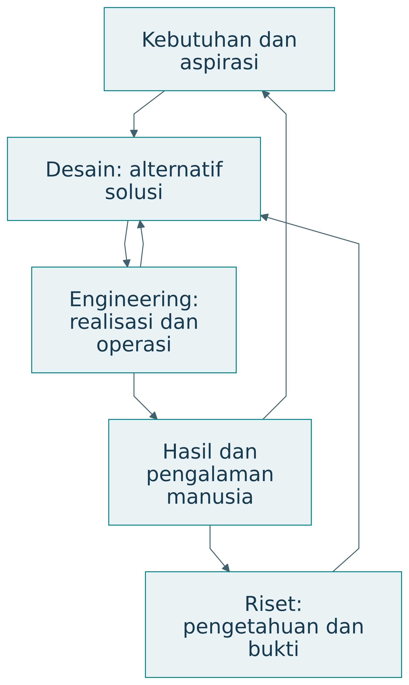
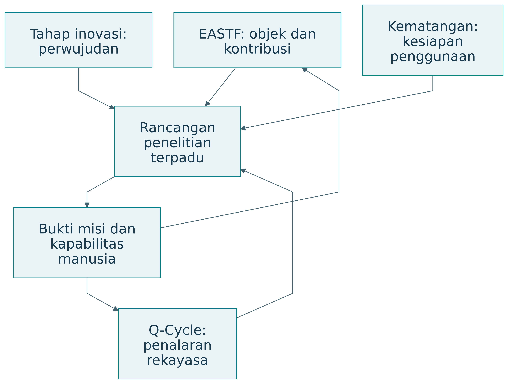
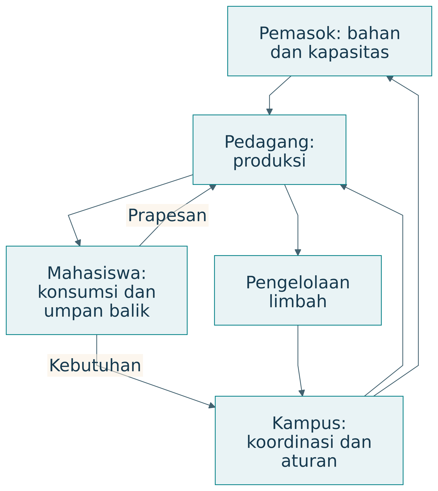

# Pendahuluan

Naskah ini menyusun ulang materi *Rekayasawan Paripurna* mengikuti struktur disertasi. Status sumber tetap dipertahankan: kerangka konseptual, sintesis pedagogis, dan simulasi sintetik.

## Latar Belakang

### Orientasi

> Rekayasa berorientasi kemanusiaan menghasilkan artefak yang cerdas dan mencerdaskan. Semakin digunakan, semakin memampukan manusia memenuhi kebutuhan dasar dan mencapai aspirasinya.

Buku ini menyatukan percakapan tentang penelitian, desain, engineering, TISE, dan pembentukan rekayasawan paripurna. Gagasan utamanya adalah bahwa keberhasilan teknis, pertumbuhan kemampuan manusia, dan keberlanjutan ekosistem perlu dipikirkan bersama. Artefak bekerja di dalam kehidupan manusia. Ia menggunakan sumber daya, memengaruhi keputusan, mengubah kebiasaan, dan dapat membuka atau menutup kesempatan.

### Tiga kegiatan yang saling menghidupi

Riset berusaha menghasilkan atau menguji pengetahuan yang dapat dipertanggungjawabkan. Desain merumuskan solusi untuk keadaan yang diinginkan. Engineering merealisasikan dan menjaga solusi agar memenuhi persyaratan pada kondisi operasi yang ditetapkan. Ketiganya saling memberi masukan. Pengujian dapat memunculkan pertanyaan baru, dan temuan riset dapat mengubah rancangan.

{#fig-research-design}

| Aspek | Riset | Desain | Engineering |
|---|---|---|---|
| Pertanyaan utama | Apa yang belum diketahui? | Solusi seperti apa yang diperlukan? | Bagaimana solusi bekerja secara andal? |
| Objek perhatian | Klaim dan pengetahuan | Alternatif serta keputusan rancangan | Realisasi dan operasi |
| Hasil | Temuan, model, prinsip | Spesifikasi, konsep, arsitektur | Artefak atau layanan yang bekerja |
| Kriteria | Validitas dan kontribusi | Kesesuaian kebutuhan | Kinerja, keselamatan, kelayakan |
| Tanggung jawab | Menjelaskan batas pengetahuan | Menjelaskan alasan pilihan | Menanggung konsekuensi implementasi |

: Tiga kegiatan yang saling menghidupi — tabel 1 {#tbl-buku-21-1}

Satu kegiatan dapat mempunyai beberapa tujuan sekaligus. Membangun simulator untuk membantu keputusan merupakan kegiatan desain dan engineering. Simulator menjadi bagian penelitian ketika pertanyaan, pembanding, data, dan analisisnya digunakan untuk menghasilkan pengetahuan. Artefak yang berfungsi belum menentukan apakah suatu klaim baru telah didukung.

### Engineering pada skala dan beban nyata

Engineering mensyaratkan perhatian terhadap kapasitas, gangguan, pengulangan kinerja, sumber daya, dan pemeliharaan. Mesin serta otomasi memperbesar kemampuan manusia dalam kekuatan, kecepatan, ketelitian, dan pengulangan. Ukuran fisik artefak sendiri tidak menentukan kualitas rekayasa. Perangkat kecil dapat menghadapi tuntutan keandalan yang berat.

| Tuntutan | Pertanyaan | Contoh ukuran |
|---|---|---|
| Kapasitas | Berapa banyak pekerjaan dapat dilayani? | Porsi per jam, transaksi per detik |
| Beban | Apa yang terjadi saat penggunaan meningkat? | Waktu tunggu, antrean, kegagalan |
| Keandalan | Apakah hasil dapat diulang? | Frekuensi kegagalan pada rentang waktu |
| Pemeliharaan | Bagaimana kemampuan dipulihkan? | Waktu perbaikan dan ketersediaan suku cadang |
| Keberlanjutan | Dapatkah operasi diteruskan? | Biaya, energi, tenaga kerja, kondisi lingkungan |

: Engineering pada skala dan beban nyata — tabel 1 {#tbl-buku-22-1}

Keberlanjutan operasi perlu dihubungkan dengan kesejahteraan pelaku. Kapasitas dapat tampak tinggi karena pekerja menanggung jam kerja berlebihan. Efisiensi suatu unit dapat memindahkan biaya ke pemasok atau pengguna. Penilaian engineering berorientasi kemanusiaan perlu menjelaskan siapa yang memperoleh manfaat dan siapa yang menanggung beban.

### Peta penjelasan

{#fig-overview}

| Dimensi | Pertanyaan yang dibantu | Contoh posisi penelitian |
|---|---|---|
| EASTF | Di lapisan mana objek dan kontribusi berada? | Sistem koordinasi pangan |
| Q-Cycle | Bagaimana kebutuhan ditelusuri sampai bukti? | Q3 arsitektur, lalu Q4 evaluasi |
| Tahap inovasi | Dalam bentuk apa solusi telah diwujudkan? | Prototipe digital twin |
| Kematangan artefak | Pada kondisi apa artefak telah diuji? | Testbed, belum penggunaan luas |

: Peta penjelasan — tabel 1 {#tbl-buku-122-1}

Keempat dimensi tidak mempunyai pasangan satu-satu. Sebuah kontribusi teknologi dapat diuji melalui beberapa siklus Q, diwujudkan sebagai model, lalu diuji pada lab demo. Sebuah kontribusi ekosistem dapat berupa pengetahuan tentang tata kelola yang diperoleh dari pilot. Istilah lapisan menunjukkan objek, sementara tahap menunjukkan keadaan pekerjaan.

## Rumusan Masalah

Ketidakpastian permintaan dan keterbatasan kapasitas menimbulkan pertukaran antara cakupan layanan, sisa produksi, dan kelayakan operasi. Kerangka rekayasa juga perlu menjelaskan bagaimana bantuan teknis mendukung kemampuan manusia.

### Satu kasus, tiga perhatian

Pada sistem pangan kampus, riset dapat menyelidiki hubungan ketidakpastian permintaan dengan limbah. Desain menentukan cara prapesan, alokasi produksi, dan tampilan informasi. Engineering mengintegrasikan pembayaran, kapasitas dapur, proses pengambilan, dan operasi ketika jaringan terputus. Setiap kegiatan memiliki keputusan serta bukti sendiri.

| Pernyataan | Kategori yang dominan | Bukti yang diperlukan |
|---|---|---|
| Kami menemukan pola permintaan menurut jadwal kuliah | Riset | Data, metode, ketidakpastian, replikasi |
| Kami memilih prapesan dengan jendela pengambilan | Desain | Kebutuhan, alternatif, alasan pilihan |
| Sistem melayani beban puncak yang ditetapkan | Engineering | Hasil uji beban dan kondisi uji |
| Pedagang dapat memperbaiki rencana produksinya | Pemberdayaan | Bukti perubahan kemampuan dan kesempatan |

: Satu kasus, tiga perhatian — tabel 1 {#tbl-buku-23-1}

Kategori tersebut bukan label eksklusif. Riset dapat menghasilkan prinsip desain, sedangkan engineering dapat mengungkap mekanisme kegagalan yang belum diketahui. Yang perlu dijaga adalah tujuan dan jenis klaimnya.

### Dari topik menuju pertanyaan

Topik seperti “AI untuk kantin” belum menunjukkan hubungan yang hendak diteliti. Pertanyaan yang lebih terarah adalah: pada pedagang kantin kampus selama hari kuliah, apakah prapesan dengan rekomendasi produksi mengurangi limbah tanpa menurunkan cakupan permintaan dibandingkan perkiraan produksi biasa?

| Bentuk rumusan | Masalahnya | Perbaikan |
|---|---|---|
| Apakah AI bermanfaat? | Objek dan manfaat terlalu luas | Nyatakan pengguna, kegiatan, hasil |
| Apakah sistem akurat? | Ukuran serta pembanding belum jelas | Nyatakan galat, data, baseline |
| Bagaimana membuat aplikasi? | Tujuan pembangunan saja | Tambahkan gap dan pertanyaan pengetahuan |
| Apakah pengguna puas? | Belum menjelaskan kemampuan atau dampak | Hubungkan kepuasan dengan hasil yang relevan |

: Dari topik menuju pertanyaan — tabel 1 {#tbl-buku-29-1}

Pertanyaan tidak harus menjadi satu kalimat yang sangat panjang. Peneliti dapat menyatakan pertanyaan utama yang ringkas, lalu melengkapinya dengan tabel PICOC. Tabel menjaga agar konteks tidak hilang ketika pertanyaan dikutip di bagian metode dan hasil.

## Kesenjangan Penelitian

Materi sumber belum menyediakan bukti lapangan yang menghubungkan perbaikan produksi, pertumbuhan kapabilitas pedagang, dan keberlanjutan ekosistem. Kesenjangan ini merupakan agenda evaluasi yang diturunkan dari kerangka konseptual; statusnya belum merupakan hasil kajian sistematis yang menyeluruh.

## Tujuan Penelitian

### Tujuan Umum

Menyusun kerangka TISE untuk menghubungkan kebutuhan ekosistem, keputusan rekayasa, dan bukti hasil misi serta kapabilitas manusia.

### Tujuan Khusus

1. Menata hubungan PICOC, DRM/DSRM, Q-Cycle, dan EASTF.
2. Mendemonstrasikan perbandingan kebijakan produksi melalui simulasi sintetik pangan kampus.
3. Menentukan bukti tambahan untuk evaluasi manusia dan ekosistem.

## Pertanyaan Penelitian atau Hipotesis

Pertanyaan pengikat naskah ini diturunkan dari materi sumber:

- **PP1:** Bagaimana kerangka TISE menata kebutuhan, fungsi, arsitektur, dan bukti?
- **PP2:** Bagaimana hasil kebijakan tetap dan adaptif berbeda pada skenario produksi sintetik?
- **PP3:** Bukti apa yang diperlukan untuk menilai pertumbuhan kapabilitas manusia dan keberlanjutan ekosistem?

### Pertanyaan penelitian tentang triune intelligence

Peneliti dapat menanyakan pembagian fungsi apa yang memberi hasil terbaik pada suatu konteks, bagaimana pengguna menilai rekomendasi, atau bagaimana mekanisme koreksi memengaruhi keputusan. Setiap pertanyaan perlu menyebut unit analisis dan outcome. Jumlah pengguna AI tidak dengan sendirinya mengukur pemberdayaan. Kecepatan keputusan tidak dengan sendirinya menunjukkan legitimasi.

Sebagai contoh rancangan, bandingkan rekomendasi otomatis dengan rekomendasi yang dapat dijelaskan dan dikoreksi. Ukur hasil misi, kemampuan pengguna menjelaskan alasan, serta kejadian koreksi. Hipotesis tentang manfaat pembagian peran harus diuji; dokumen konseptual tidak menggantikan pengukuran.

### Pertanyaan pada satu kasus

| Lapisan | Pangan kampus | Outcome contoh |
|---|---|---|
| E | Bagaimana koordinasi menjaga akses dan kelayakan pelaku? | Distribusi manfaat, kapasitas berkelanjutan |
| A | Apakah prapesan memperbaiki layanan? | Waktu tunggu, sisa, akses |
| S | Bagaimana layanan bertahan saat gangguan pasokan? | Degradasi kinerja dan pemulihan |
| T | Metode prediksi mana memberi galat lebih kecil? | Galat pada data serta baseline |
| F | Bagaimana delay informasi memengaruhi kestabilan kendali? | Hubungan teoretis dan batas kestabilan |

: Pertanyaan pada satu kasus — tabel 1 {#tbl-buku-64-1}

Outcome tersebut memerlukan alat ukur berbeda. Penelitian tidak cukup berpindah kata dari “akurasi” menjadi “manfaat”. Ia perlu menjelaskan mekanisme yang menghubungkan kemampuan teknis dengan keputusan, layanan, dan dampak. Hubungan itu dapat gagal ketika pengguna tidak mempunyai sumber daya atau kewenangan untuk bertindak.

## Ruang Lingkup dan Batasan

Naskah memuat sintesis konseptual dan demonstrasi simulasi 30 hari dengan seed 1962. Tidak tersedia pengukuran peserta, pilot lapangan, atau hasil uji kapabilitas manusia.

### Misi dan batas kasus

Kasus ini merupakan contoh rancangan pembelajaran. Misinya adalah meningkatkan akses makanan sehat dan terjangkau sambil menjaga kelayakan pedagang, pemasok, dan lingkungan. Angka pada simulasi dibuat secara sintetik. Model sederhana hanya menggambarkan produksi, penjualan, sisa, dan kekurangan. Mutu gizi, harga yang adil, antrean, atau pembelajaran manusia memerlukan model serta data tambahan.

{#fig-food}

| Pelaku | Misi | Sumber daya | Nilai yang diharapkan |
|---|---|---|---|
| Mahasiswa | Memperoleh pangan sesuai kebutuhan | Permintaan, waktu, informasi | Akses dan kesehatan |
| Pedagang | Menjalankan usaha layak | Tenaga, dapur, pengetahuan | Pendapatan dan kemampuan |
| Pemasok | Menyediakan bahan | Bahan dan logistik | Kepastian serta kelayakan |
| Kampus | Menjaga layanan | Aturan dan fasilitas | Mutu serta keberlanjutan |

: Misi dan batas kasus — tabel 1 {#tbl-buku-98-1}

### Memilih cakupan penelitian

Satu proyek dapat menguji mekanisme dalam TISE 1.0 tanpa membangun seluruh versi. Proyek lain dapat menilai fitur pembelajaran 2.0 pada artefak yang sederhana. Penelitian 3.0 memerlukan perhatian terhadap mekanisme penciptaan dan batas transfer antarkonteks. Cakupan perlu mengikuti sumber daya dan pertanyaan yang dapat dijawab.

## Asumsi

Permintaan dan kapasitas bersifat sintetik. Harga, biaya produksi, dan biaya sisa dianggap tetap; produksi dibatasi kapasitas; penjualan dibatasi permintaan dan produksi. Rincian parameter dan aturan diberikan pada Bab Metodologi.

## Sistematika Pembahasan

Bab Tinjauan Pustaka menjelaskan landasan dan posisi kerangka. Bab Metodologi menata prosedur serta model. Bab Hasil menyajikan keluaran sintetik. Bab Pembahasan menilai arti dan batas bukti. Bab Kesimpulan menjawab pertanyaan sesuai bukti yang tersedia. Lampiran memuat data, instrumen, latihan, glosarium, dan materi teknis.

### Anatomi laporan

| Bagian laporan | Pertanyaan pembaca | Visual utama |
|---|---|---|
| Masalah | Mengapa perlu diteliti? | Baseline dan peta pelaku |
| Pengetahuan awal | Apa yang sudah diketahui? | Tabel literatur dan gap |
| RQ dan kontribusi | Apa yang akan dijawab? | PICOC dan EASTF |
| Metode | Bagaimana bukti dihasilkan? | Alur metodologi |
| Rancangan | Bagaimana solusi bekerja? | Fungsi dan arsitektur |
| Hasil | Apa yang diamati? | Tabel, plot, ketidakpastian |
| Diskusi | Apa artinya dan batasnya? | Buku besar klaim |
| Kesimpulan | Jawaban apa didukung? | RQ–jawaban–bukti |

: Anatomi laporan — tabel 1 {#tbl-buku-111-1}

Dalam penelitian rekayasa, artefak dan pengetahuan perlu dinyatakan bersama. Deskripsi fitur menjelaskan apa yang dibangun. Kontribusi menjelaskan apa yang dapat dipelajari tentang solusi atau masalah. Bukti menentukan batas penggunaan pengetahuan itu.
