# Tinjauan Pustaka

## Landasan Teoretis

### Rekayasa ekosistem berorientasi misi

TISE berarti Triune-Intelligence Smart Engineering. Dalam dokumen penulis, TISE merekayasa ekosistem sosio-teknis agar manusia dan organisasi otonom dapat menjalankan misi yang melayani kebutuhan publik. Fondasinya memadukan kecerdasan manusia, kolektif, dan artifisial, dengan keberlanjutan sebagai batas kelayakan [@langi2026tise].

Ekosistem terdiri dari pihak yang saling bergantung tetapi tidak mempunyai tujuan yang identik. Mahasiswa ingin makanan terjangkau, pedagang ingin pendapatan layak, pemasok ingin kepastian pembelian, dan kampus ingin layanan yang aman. Rekayasa perlu membuat hubungan tersebut terlihat agar optimasi satu pihak dapat dinilai bersama dampaknya pada pihak lain.

### Arsitektur triune intelligence

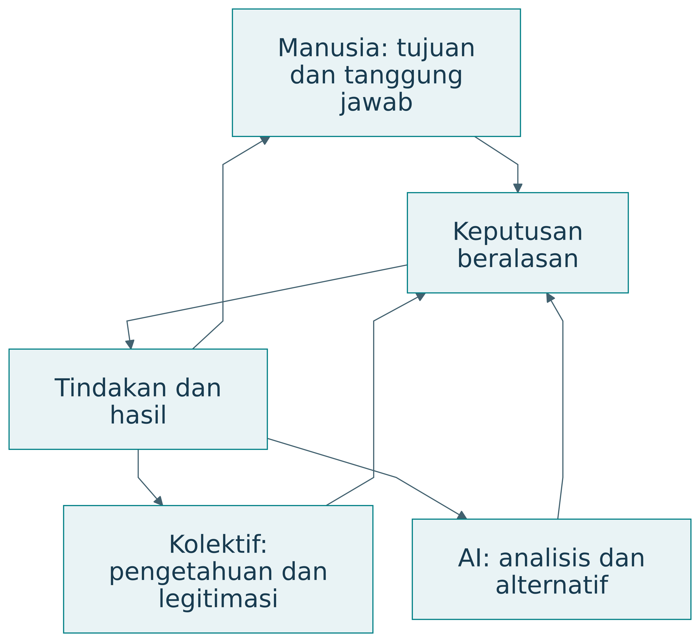{#fig-triune}

| Sumber | Kemampuan utama | Alokasi tanggung jawab |
|---|---|---|
| Manusia atau alamiah | Tujuan, pengalaman, penilaian, kreativitas | Menilai keadaan dan memegang tanggung jawab sesuai peran |
| Kolektif atau kultural | Pengetahuan tersebar, norma, koordinasi, legitimasi | Menetapkan proses bersama dan mekanisme koreksi |
| Artifisial | Analitik, prediksi, simulasi, pencarian alternatif | Memberikan dukungan yang dapat diperiksa |

: Arsitektur triune intelligence — tabel 1 {#tbl-buku-42-1}

Tiga sumber itu diwujudkan sebagai pembagian kerja. Sebuah rekomendasi produksi dari AI perlu dapat dijelaskan kepada pedagang, dikoreksi berdasarkan keadaan dapur, dan diterapkan sesuai aturan layanan. Proses kolektif menentukan standar, pembagian kewenangan, dan penyelesaian konflik. Manusia mempertanggungjawabkan keputusan sesuai otoritasnya [@langi2026transcript].

### Tujuan, kemampuan, dan otoritas

Kecerdasan tidak sama dengan kewenangan. Sistem dapat sangat baik memprediksi permintaan tetapi tidak mempunyai legitimasi untuk mengubah harga sepihak. Arsitektur keputusan perlu memisahkan masukan, rekomendasi, persetujuan, tindakan, dan audit. Pemisahan tersebut membantu pelaku memahami apa yang dapat mereka ubah.

| Keputusan contoh | Masukan AI | Penilaian manusia | Proses kolektif |
|---|---|---|---|
| Jumlah produksi | Perkiraan dan rentang galat | Ketersediaan bahan dan tenaga | Aturan kapasitas serta layanan |
| Harga dan subsidi | Simulasi biaya dan akses | Pengalaman pengguna dan pedagang | Kesepakatan kewenangan |
| Perubahan layanan | Perbandingan skenario | Risiko penggunaan nyata | Persetujuan dan pengawasan |
| Peluncuran ekosistem baru | Hasil uji virtual | Kesiapan pelaku | Tata kelola dan penerimaan |

: Tujuan, kemampuan, dan otoritas — tabel 1 {#tbl-buku-43-1}

AI dapat memperbesar kecepatan penelusuran alternatif. Kecerdasan kolektif memperluas basis pengetahuan. Kecerdasan manusia memberi penilaian yang terkait pengalaman hidup serta tanggung jawab. Mutu keseluruhan bergantung pada hubungan ketiganya dan kemampuan saling mengoreksi.

### Keberlanjutan sebagai batas kelayakan

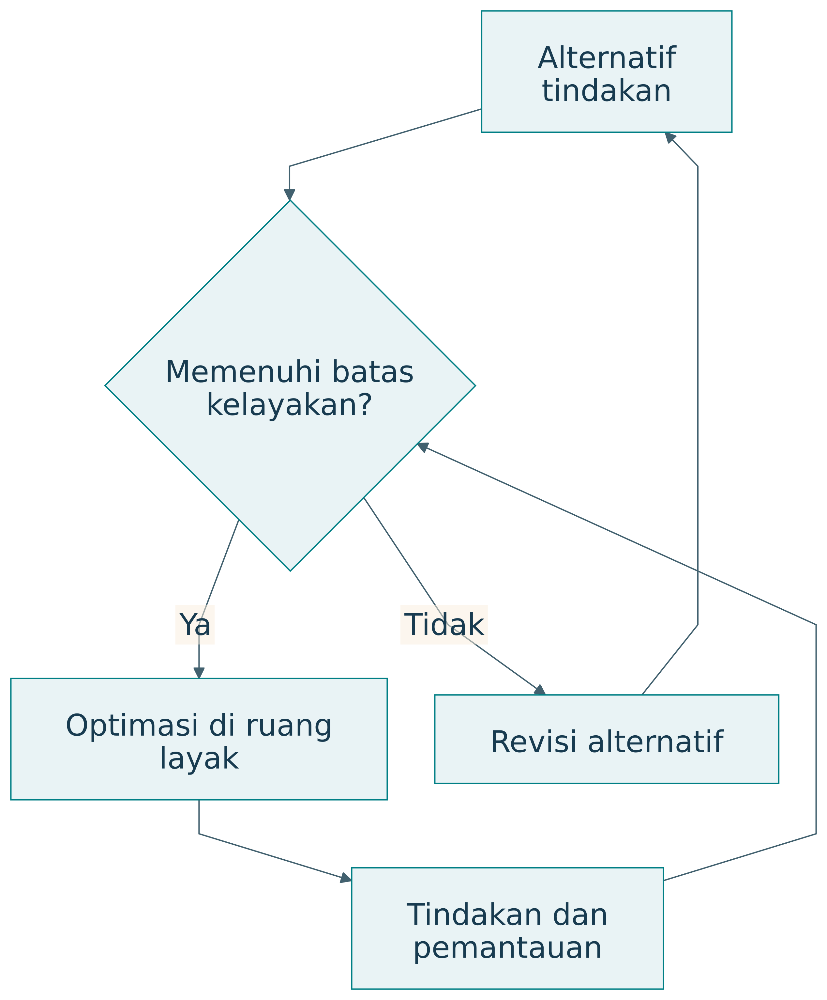{#fig-sustainability}

| Batas | Pertanyaan untuk rancangan | Contoh bukti |
|---|---|---|
| Finansial | Dapatkah pelaku melanjutkan operasi? | Arus kas dan biaya |
| Operasional | Apakah kapasitas dan tenaga cukup? | Uji beban, jadwal, ketersediaan |
| Sosial | Siapa kehilangan akses atau menanggung beban? | Data distribusi dan pengalaman |
| Lingkungan | Apa konsekuensi sumber daya dan limbah? | Pengukuran penggunaan dan sisa |
| Kapabilitas manusia | Apakah pengguna masih dapat memahami dan mengoreksi? | Uji penjelasan, koreksi, transfer |

: Keberlanjutan sebagai batas kelayakan — tabel 1 {#tbl-buku-44-1}

Dalam TISE, batas tersebut menentukan tindakan yang layak. Keberhasilan perlu dinilai sepanjang waktu. Solusi yang meningkatkan keluaran hari ini tetapi mengurangi kemampuan melayani misi berikutnya menghadapi masalah keberlanjutan.

### Rantai sumber daya dan nilai

RMOV menghubungkan Resource, Mission, Output, dan Value. Sumber daya digunakan untuk menjalankan misi, misi menghasilkan keluaran, dan keluaran memperoleh nilai dalam kehidupan para pihak. Nilai dapat berupa uang, akses, kesehatan, pengetahuan, kepercayaan, atau kondisi lingkungan [@langi2026tise].

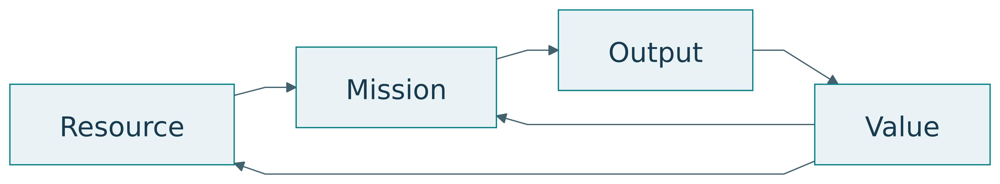{#fig-rmov}

| Unsur | Pangan kampus | Kesalahan penafsiran |
|---|---|---|
| Resource | Bahan, kapasitas dapur, tenaga, informasi | Menghitung uang saja |
| Mission | Menyediakan makanan sehat dan terjangkau | Menyebut fitur sebagai misi |
| Output | Porsi makanan serta layanan pengambilan | Menganggap keluaran pasti bermanfaat |
| Value | Akses pangan, pendapatan, pengetahuan | Menyamakan nilai dengan harga |

: Rantai sumber daya dan nilai — tabel 1 {#tbl-buku-48-1}

Keluaran dan nilai perlu dibedakan. Seratus porsi merupakan keluaran. Manfaatnya bergantung pada siapa yang dapat mengaksesnya, mutu makanan, waktu tersedia, biaya, dan dampaknya pada pelaku lain. Pengukuran nilai mengikuti misi yang dinyatakan.

### Empat peran fungsional

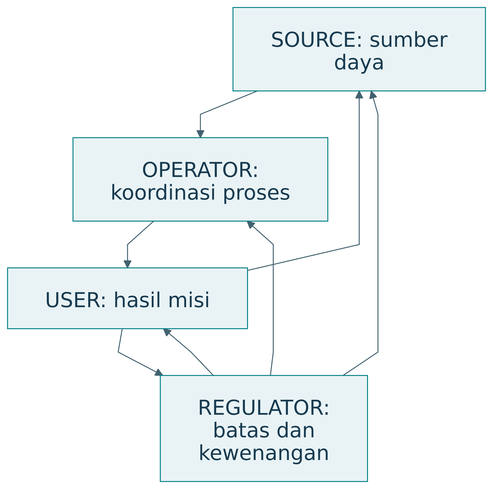{#fig-roles}

| Peran | Kontribusi | Pertanyaan kendali |
|---|---|---|
| SOURCE | Sumber daya, talenta, keluaran | Apakah pasokan dan kapasitas cukup? |
| USER | Penggunaan dan penerimaan hasil | Apakah manfaat mencapai pihak sasaran? |
| OPERATOR | Koordinasi serta pelaksanaan | Apakah proses dapat dijalankan? |
| REGULATOR | Batas, aturan, kewenangan | Apakah keputusan memenuhi syarat? |

: Empat peran fungsional — tabel 1 {#tbl-buku-49-1}

Satu pihak dapat memegang beberapa peran. Pembagian fungsi tetap perlu terlihat agar konflik kepentingan serta kewenangan dapat diperiksa. Identifikasi peran juga membantu menentukan data: sumber memberi data kapasitas, pengguna memberi pengalaman, operator memberi catatan proses, dan regulator memberi kriteria penerimaan.

### Lima dimensi PSKVE

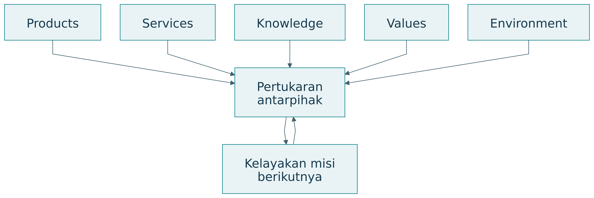{#fig-pskve}

| Dimensi | Makna dalam dokumen TISE | Contoh perhatian |
|---|---|---|
| Products | Produk fisik atau digital | Mutu serta ketersediaan |
| Services | Layanan yang menyertai penggunaan | Akses, ketepatan, keandalan |
| Knowledge | Aliran pengetahuan dan pembelajaran | Pemahaman, transfer, koreksi |
| Values | Nilai, komitmen, kepercayaan | Martabat, keadilan, tanggung jawab |
| Environment | Lingkungan fisik, digital, sosial, kelembagaan | Sumber daya dan kondisi interaksi |

: Lima dimensi PSKVE — tabel 1 {#tbl-buku-50-1}

PSKVE membuat pertukaran nonfinansial terlihat. Sebuah sistem dapat menghasilkan pendapatan sambil menghambat aliran pengetahuan atau mengurangi kepercayaan. Karena itu, evaluasi perlu memilih indikator yang relevan untuk tiap dimensi, dengan alasan yang jelas. Tidak semua dimensi harus diringkas menjadi satu skor.

### Kendali dan pembelajaran PUDAL

PUDAL adalah Perceive, Understand, Decide, Act, Learn. Siklus ini mengamati kondisi, memahami perubahan, menyusun keputusan, melakukan tindakan yang disetujui, dan mempelajari hasil. Dalam dokumen TISE, PUDAL menjaga adaptasi operasi [@langi2026transcript].

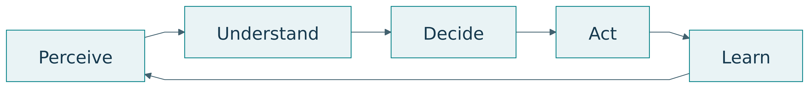{#fig-pudal}

| Langkah | Pertanyaan | Keluaran yang dapat dicatat |
|---|---|---|
| Perceive | Apa yang berubah? | Data dan kejadian |
| Understand | Apa artinya terhadap misi? | Diagnosis beserta ketidakpastian |
| Decide | Pilihan apa yang layak? | Alternatif dan alasan |
| Act | Siapa melakukan apa? | Tindakan serta persetujuan |
| Learn | Apa yang berhasil dan perlu diperbaiki? | Pembaruan model atau praktik |

: Kendali dan pembelajaran PUDAL — tabel 1 {#tbl-buku-51-1}

### Dua bagian arsitektur

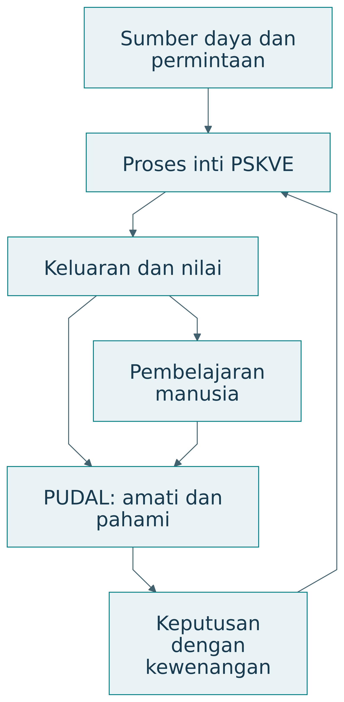{#fig-dual-engine}

Proses inti PSKVE mengubah sumber daya menjadi keluaran dan nilai. PUDAL mengamati keadaan dan membantu penyesuaian. Pengguna berpartisipasi dengan memberi koreksi serta pengalaman. Arsitektur perlu menyatakan informasi yang menghubungkan kedua bagian dan kewenangan untuk melakukan perubahan.

Dalam pangan kampus, proses inti meliputi pasokan, produksi, penjualan, dan pengelolaan sisa. Kendali meliputi perkiraan permintaan, pemeriksaan kapasitas, keputusan produksi, serta evaluasi hasil. Model yang hanya menggambarkan pembayaran belum menjelaskan keseluruhan mekanisme.

### Objek dan kontribusi pada lima lapisan

EASTF mengikuti susunan yang dirumuskan dalam percakapan: Ecosystem, Application, System, Technology, Fundamental Research [@percakapan2026]. Penjelasan di bab ini merupakan sintesis pedagogis. EASTF membantu menjawab di mana pertanyaan dan kontribusi berada serta bagaimana bukti dihubungkan antarlapisan.

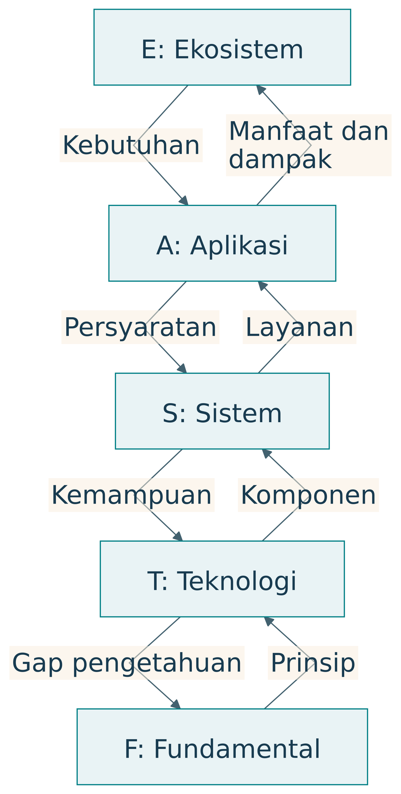{#fig-eastf}

| Lapisan | Unit perhatian | Research question khas | Kontribusi yang mungkin |
|---|---|---|---|
| E, Ekosistem | Hubungan pelaku, misi, sumber daya, aturan | Bagaimana misi saling mendukung secara berkelanjutan? | Pengetahuan tentang koordinasi, tata kelola, distribusi |
| A, Aplikasi | Penggunaan pada pekerjaan tertentu | Apakah intervensi membantu pengguna? | Bukti manfaat dan kondisi penerapan |
| S, Sistem | Kesatuan fungsi dan komponen | Arsitektur apa menghasilkan perilaku yang diperlukan? | Pengetahuan integrasi dan kendali |
| T, Teknologi | Mekanisme atau komponen | Bagaimana kemampuan teknis ditingkatkan? | Metode, perangkat, algoritma yang diuji |
| F, Fundamental | Prinsip, hubungan, mekanisme, batas | Mengapa bekerja dan apa batasnya? | Pengetahuan teoretis atau empiris mendasar |

: Objek dan kontribusi pada lima lapisan — tabel 1 {#tbl-buku-63-1}

Aplikasi berarti penerapan pada pekerjaan, termasuk layanan atau praktik organisasi. Sistem dapat berupa kesatuan sosio-teknis, dengan manusia dan aturan sebagai bagian arsitektur. Teknologi mencakup mekanisme yang memungkinkan fungsi diwujudkan. Fundamental research tidak terbatas pada pembuktian matematis; mekanisme dasar dapat diselidiki melalui eksperimen yang tepat.

### Gagasan, model, digital twin, realisasi

Tahapan inovasi yang dirumuskan dalam percakapan adalah gagasan, model, digital twin, dan realisasi [@percakapan2026]. Tahapan ini menjelaskan bentuk perwujudan dan bertambahnya bukti. Proses dapat kembali ke tahap sebelumnya ketika pengalaman menunjukkan asumsi yang perlu diperbaiki.

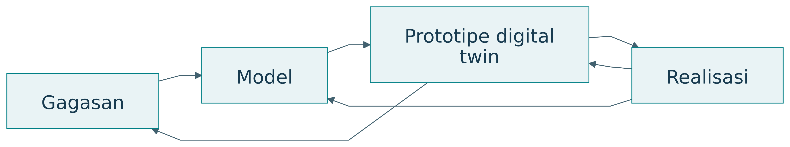{#fig-innovation}

| Tahap | Pekerjaan utama | Hasil | Gerbang keputusan |
|---|---|---|---|
| Gagasan | Mengusulkan perubahan | Konsep dan dugaan manfaat | Masalah serta mekanisme cukup jelas |
| Model | Menyatakan hubungan dan asumsi | Representasi konseptual, logis, matematis | Model konsisten dan sesuai tujuan |
| Prototipe digital twin | Menjalankan representasi virtual | Uji skenario dan interaksi | Batas model serta hasil uji dipahami |
| Realisasi | Mewujudkan pada lingkungan nyata | Artefak, layanan, ekosistem | Bukti memenuhi cakupan penggunaan |

: Gagasan, model, digital twin, realisasi — tabel 1 {#tbl-buku-70-1}

Model bisa bersifat statis atau dinamis. Ia dapat menampilkan struktur, hubungan sebab-akibat yang dihipotesiskan, state, atau aturan keputusan. Kejelasan model membantu menemukan apa yang belum diketahui sebelum biaya realisasi meningkat.

### Digital twin dan hubungan dengan sasaran

Digital twin mendukung representasi, diagnosis, prediksi, optimasi, dan pengendalian sasaran sepanjang siklus hidup [@lin2023]. Keterhubungan serta sinkronisasi dengan sasaran nyata merupakan perhatian penting [@nistdt]. Pada prarealisasi, istilah prototipe digital twin atau model virtual digunakan untuk memperjelas status bukti dan hubungan data.

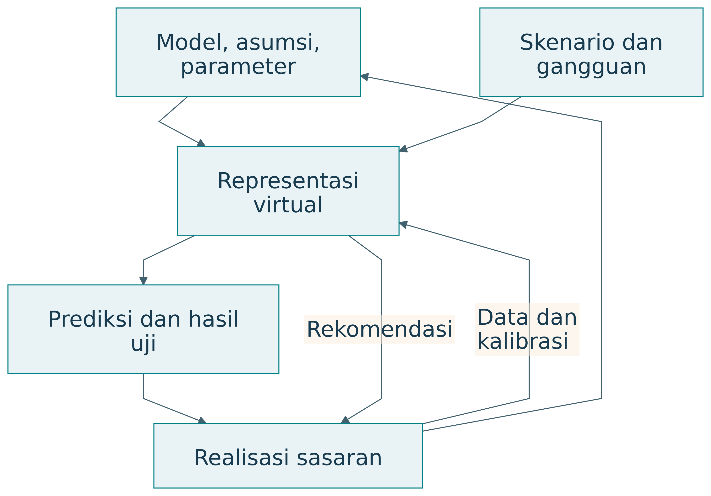{#fig-digital-twin}

| Unsur yang perlu dinyatakan | Pertanyaan | Contoh |
|---|---|---|
| Sasaran | Entitas apa direpresentasikan? | Kantin, pelaku, aliran produksi |
| Fidelity | Detail apa cukup untuk tujuan? | Produksi harian atau antrean per menit |
| Data | Dari mana parameter berasal? | Sintetik, historis, pengukuran |
| Validasi | Apa yang dibandingkan? | Prediksi dengan pengamatan |
| Sinkronisasi | Bagaimana keadaan diperbarui? | Batch harian sesuai keputusan |
| Ketidakpastian | Di mana model lemah? | Perubahan perilaku pelaku |

: Digital twin dan hubungan dengan sasaran — tabel 1 {#tbl-buku-71-1}

Representasi visual tiga dimensi tidak selalu diperlukan. Model perilaku sederhana dapat lebih berguna untuk pertanyaan tertentu. Sebaliknya, grafik yang menarik belum menunjukkan bahwa model menghasilkan prediksi yang dapat dipercaya.

### Kematangan industri

Konsep, lab demo, testbed, release candidate, dan full release menunjukkan kesiapan penggunaan. Istilah serta gerbangnya bervariasi antarindustri. Tabel berikut adalah kerangka pedagogis dari percakapan, bukan standar sertifikasi universal.

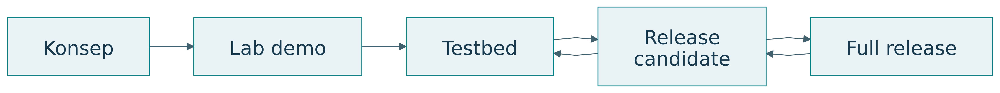{#fig-maturity}

| Tahap | Cakupan bukti | Keputusan berikutnya |
|---|---|---|
| Konsep | Alasan dan kelayakan awal | Investasi pengembangan |
| Lab demo | Fungsi inti pada kondisi terkendali | Uji integrasi |
| Testbed | Skenario yang mewakili penggunaan | Uji penerimaan |
| Release candidate | Versi calon rilis sesuai kriteria | Rilis pada lingkup ditetapkan |
| Full release | Kesiapan operasi dan dukungan | Pemantauan serta pemeliharaan |

: Kematangan industri — tabel 1 {#tbl-buku-72-1}

Testbed secara tepat adalah lingkungan atau fasilitas uji. Istilah “tahap testbed” menyatakan bahwa artefak telah diuji di sana. Rilis juga tidak berarti pekerjaan selesai. Pengalaman operasi dapat mengubah persyaratan, model, atau arsitektur.

### Prinsip rekayasa berorientasi kemanusiaan

Percakapan merumuskan tuntutan bahwa artefak harus cerdas dan mencerdaskan: semakin digunakan, semakin memampukan manusia memenuhi kebutuhan dasarnya serta mencapai aspirasinya [@percakapan2026]. Prinsip ini menjadikan perkembangan manusia sebagai tujuan desain dan objek evaluasi.

| Sifat | Makna operasional | Pertanyaan evaluasi |
|---|---|---|
| Cerdas | Memahami keadaan dan membantu tindakan | Apakah pekerjaan berhasil pada kondisi tertentu? |
| Mencerdaskan | Mendukung pemahaman, penilaian, koreksi, penciptaan | Apakah kemampuan pengguna berkembang? |
| Memampukan | Memperluas kesempatan serta kemampuan bertindak | Apakah manusia dapat memenuhi kebutuhan dan mengejar aspirasi? |

: Prinsip rekayasa berorientasi kemanusiaan — tabel 1 {#tbl-buku-77-1}

Pengetahuan saja tidak cukup untuk bertindak. Seseorang juga memerlukan sumber daya, akses, waktu, dukungan sosial, dan kewenangan. Karena itu, pengukuran kapabilitas perlu menilai kondisi yang memungkinkan kemampuan digunakan. TISE menghubungkan pertumbuhan kemampuan dengan lingkungan ekosistem.

### Dua keluaran dari interaksi

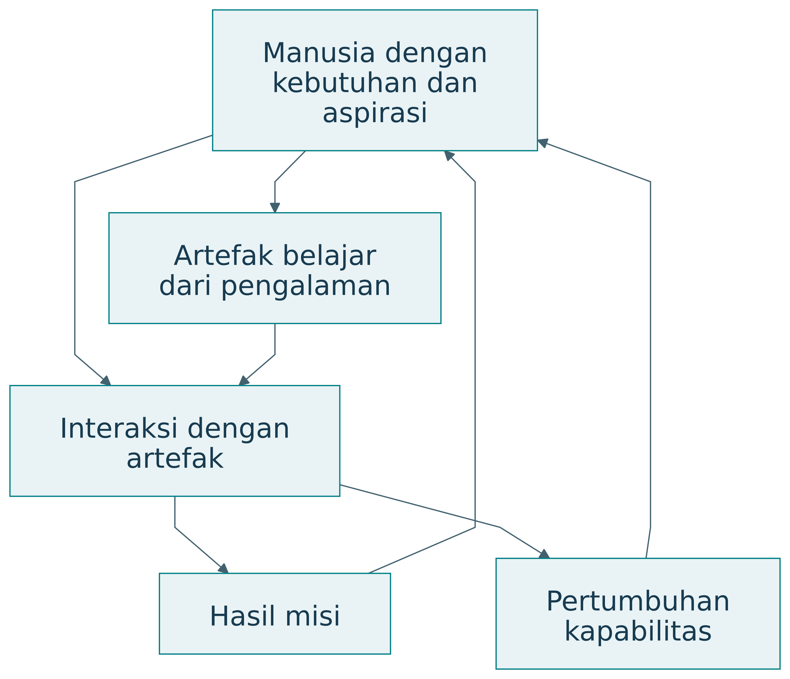{#fig-empower}

Contoh tutor AI: sistem dapat membantu mahasiswa menyelesaikan soal sambil meningkatkan kemampuan mengenali masalah, memilih strategi, menjelaskan langkah, dan menilai jawaban. Dua hasil itu tidak selalu meningkat bersama. Desain perlu menyediakan kesempatan mencoba, penjelasan yang sesuai, koreksi, dan refleksi.

| Interaksi | Hasil misi | Hasil belajar yang dicari |
|---|---|---|
| Rekomendasi produksi | Rencana harian tersusun | Pedagang memahami dasar perkiraan |
| Tutor pemrograman | Tugas selesai | Mahasiswa mentransfer strategi |
| Layanan kesehatan digital | Informasi dapat diakses | Pengguna memahami pilihan dan pertanyaan |
| Sistem koordinasi | Tindakan terselaraskan | Pelaku memahami peran dan konsekuensi |

: Dua keluaran dari interaksi — tabel 1 {#tbl-buku-78-1}

### Tiga lapisan perkembangan

Dokumen TISE penulis menjelaskan tiga versi sebagai tumpukan kemampuan. TISE 1.0 menjaga operasi misi tetap layak. TISE 2.0 menambahkan pembelajaran timbal balik. TISE 3.0 menambahkan kemampuan menciptakan serta mengelola ekosistem baru [@langi2026tise; @langi2026transcript].

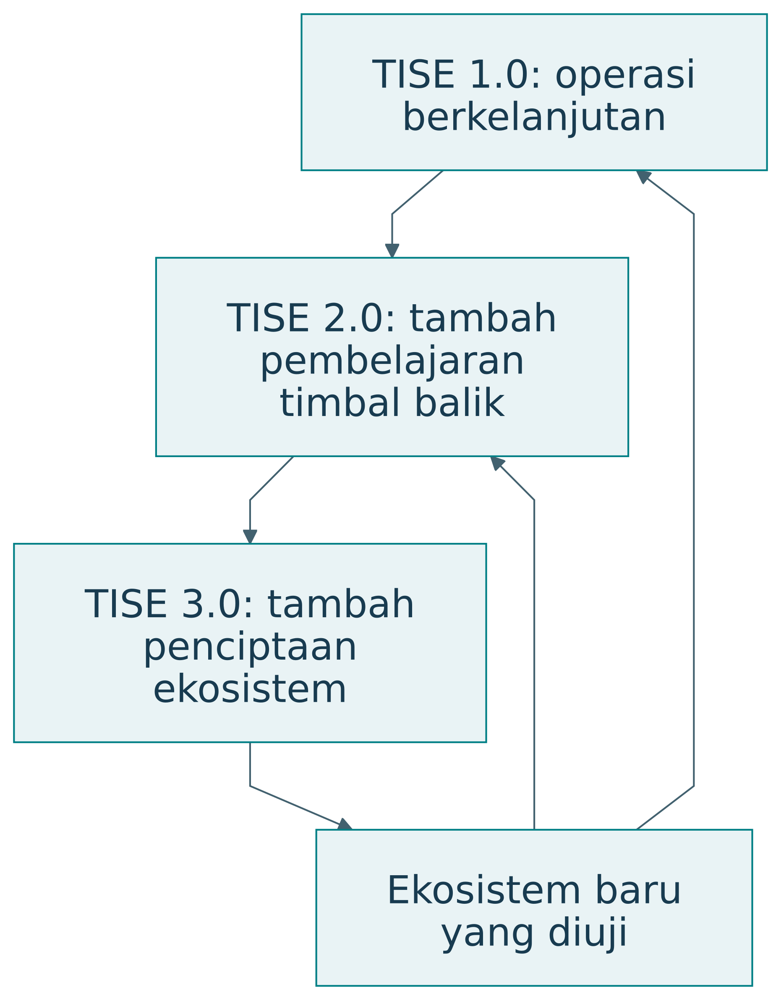{#fig-versions}

| Versi | Pertanyaan | Kemampuan tambahan | Bukti yang dicari |
|---|---|---|---|
| 1.0 | Dapatkah misi terus dijalankan? | Adaptasi dan kelayakan operasi | Hasil misi serta batas keberlanjutan |
| 2.0 | Apakah penggunaan meningkatkan kemampuan? | Pembelajaran manusia dan sistem | Perkembangan kapabilitas sepanjang waktu |
| 3.0 | Dapatkah ekosistem baru diciptakan? | Penciptaan dan tata kelola portofolio | Validasi konteks baru dan kelayakan pelaku |

: Tiga lapisan perkembangan — tabel 1 {#tbl-buku-84-1}

Nomor versi dalam buku ini menunjukkan perkembangan konseptual. Tabel tersebut tidak menyatakan bahwa seluruh kemampuan telah terimplementasi atau tervalidasi pada setiap contoh. Status konkret perlu dilaporkan per artefak dan kasus.

### TISE 1.0: menjaga kelayakan misi

Pada pangan kampus, perhatian utamanya mencakup akses pangan, kapasitas pedagang, sumber pasokan, biaya, serta limbah. PUDAL membantu adaptasi ketika kondisi berubah. Ekosistem dipandang layak ketika misi dapat dilanjutkan tanpa merusak prasyarat operasi berikutnya.

Pertanyaan penelitian dapat menilai kebijakan adaptasi atau distribusi risiko. Penilaian perlu menyebut horizon waktu. Kebijakan yang baik selama satu minggu belum membuktikan kelayakan selama satu tahun ketika biaya dan permintaan berubah.

### TISE 2.0: hasil misi dan hasil pembelajaran

Dalam versi 2.0, peningkatan kinerja disertai perkembangan kemampuan manusia, kelompok, organisasi, dan artefak. Pedagang belajar membaca data produksi. Mahasiswa belajar menilai informasi gizi. Operator belajar mengenali gangguan. Pengetahuan yang diperoleh kemudian digunakan untuk memperbaiki praktik.

| Pertanyaan | Outcome misi | Outcome kapabilitas |
|---|---|---|
| Apakah rekomendasi produksi membantu? | Cakupan dan sisa | Kemampuan menilai perkiraan |
| Apakah informasi pangan bermanfaat? | Pilihan sesuai kebutuhan | Pemahaman dan penilaian informasi |
| Apakah koordinasi membaik? | Pemulihan gangguan | Kemampuan mengambil peran |

: TISE 2.0: hasil misi dan hasil pembelajaran — tabel 1 {#tbl-buku-86-1}

Versi ini mempertegas prinsip artefak cerdas dan mencerdaskan. Bantuan perlu membuka kemampuan serta pilihan. Ukuran penggunaan atau kepuasan saja belum menguji prinsip tersebut.

### TISE 3.0: penciptaan ekosistem

TISE 3.0 menambahkan lapisan meta untuk menciptakan, menguji, meluncurkan, dan menghubungkan ekosistem baru. Ekosistem yang telah dipelajari menjadi sumber model, pengetahuan, dan praktik bagi konteks berikutnya. Adaptasi tetap diperlukan karena pelaku, sumber daya, aturan, serta kebutuhannya berbeda.

| Kegiatan penciptaan | Pertanyaan utama | Hasil yang perlu diperiksa |
|---|---|---|
| Identifikasi konteks | Misi apa dibutuhkan di lokasi baru? | Kebutuhan dan pelaku |
| Adaptasi model | Asumsi mana masih berlaku? | Parameter dan mekanisme |
| Pengujian virtual | Apa risiko dan batasnya? | Skenario serta sensitivitas |
| Pilot | Apakah pelaku dapat menjalankan? | Bukti penggunaan dan kelayakan |
| Penghubungan | Bagaimana keluaran saling mendukung? | Antarmuka, aturan, tanggung jawab |

: TISE 3.0: penciptaan ekosistem — tabel 1 {#tbl-buku-87-1}

Replikasi bukan penyalinan perangkat lunak saja. Ia mencakup penyesuaian misi, kemampuan, kewenangan, dan lingkungan. Bukti dari kampus pertama membantu perancangan kampus berikutnya, tetapi tidak menggantikan validasi pada konteks baru.

## Penelitian Terdahulu

### Dua penekanan dalam penelitian melalui desain

DRM dari Blessing dan Chakrabarti menata penelitian untuk memahami desain serta mengembangkan dukungan perbaikannya [@blessing2009]. DSRM dari Peffers dan rekan menata penciptaan, demonstrasi, evaluasi, dan komunikasi artefak pemecahan masalah dalam sistem informasi [@peffers2007]. Keduanya menghubungkan tindakan merancang dengan bukti ilmiah.

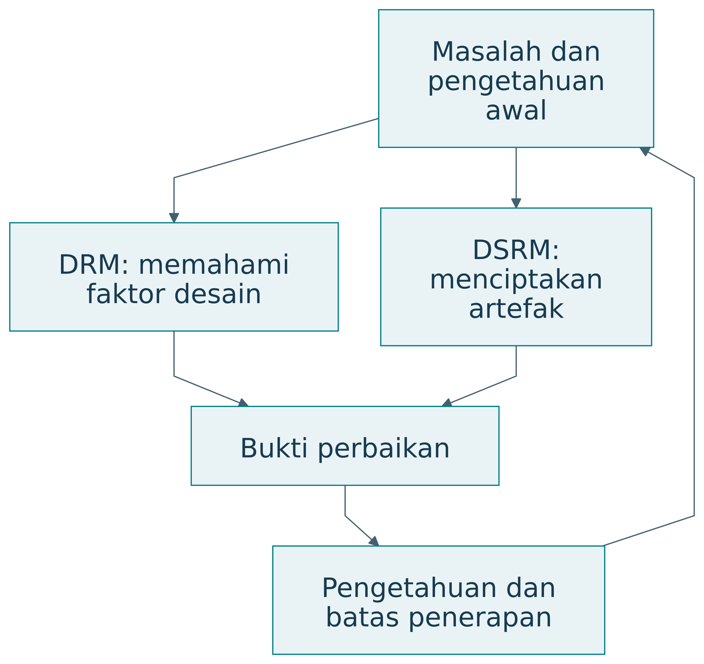{#fig-comparison-method}

### Empat tahap DRM

| Tahap | Tujuan | Keluaran yang perlu terlihat |
|---|---|---|
| Research Clarification | Memperjelas fokus dan kriteria | Masalah, tujuan, ukuran keberhasilan |
| Descriptive Study I | Memahami proses dan faktor berpengaruh | Penjelasan keadaan awal |
| Prescriptive Study | Mengembangkan dukungan desain | Metode, pedoman, alat, atau konsep |
| Descriptive Study II | Mengevaluasi dukungan | Bukti penerapan dan perbaikan |

: Empat tahap DRM — tabel 1 {#tbl-buku-35-1}

RC memperjelas penelitian yang layak secara akademik serta praktis [@blessingrc]. DS-I menyediakan pemahaman tentang faktor keberhasilan [@blessingds1]. PS dapat menghasilkan pengetahuan, checklist, metode, atau alat bantu [@blessingps]. DS-II mengevaluasi dukungan tersebut [@blessingds2]. Kedalaman setiap tahap dapat berbeda sesuai fokus proyek; DRM memungkinkan iterasi [@blessing2002].

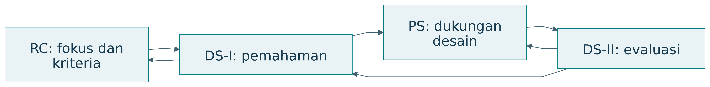{#fig-drm}

Contoh rancangan DRM pada pangan kampus: peneliti mengamati bagaimana pedagang merencanakan produksi, mengenali informasi yang hilang, mengembangkan metode perencanaan, lalu menilai apakah metode itu dapat diterapkan dan memperbaiki hasil. Fokus ilmiahnya dapat berada pada faktor yang menjelaskan keputusan produksi, bukan hanya pada aplikasi yang dibuat.

| Pertanyaan contoh | Tahap dominan | Bukti contoh |
|---|---|---|
| Apa ukuran keberhasilan perencanaan? | RC | Kebutuhan dan alasan kriteria |
| Mengapa perkiraan sering meleset? | DS-I | Observasi, data, wawancara |
| Dukungan apa yang mengatasi faktor tersebut? | PS | Logika dan rancangan metode |
| Apakah metode membantu keputusan nyata? | DS-II | Pengujian penerapan dan dampak |

: Empat tahap DRM — tabel 2 {#tbl-buku-35-2}

### Enam kegiatan DSRM

| Kegiatan | Isi ringkas |
|---|---|
| Identifikasi masalah dan motivasi | Masalah serta pentingnya penyelesaian |
| Penentuan sasaran solusi | Kondisi keberhasilan yang diinginkan |
| Desain dan pengembangan | Penciptaan artefak |
| Demonstrasi | Penggunaan artefak untuk masalah |
| Evaluasi | Penilaian terhadap sasaran |
| Komunikasi | Penyampaian hasil dan kontribusi |

: Enam kegiatan DSRM — tabel 1 {#tbl-buku-36-1}

Enam kegiatan ini mengikuti model Peffers dan rekan [@peffers2007]. DSR adalah pendekatan penelitian yang lebih luas; DSRM Peffers merupakan metodologi tertentu. Dalam design science, pengetahuan tentang masalah dan solusi dapat diperoleh melalui pembangunan serta penggunaan artefak [@hevner2004].

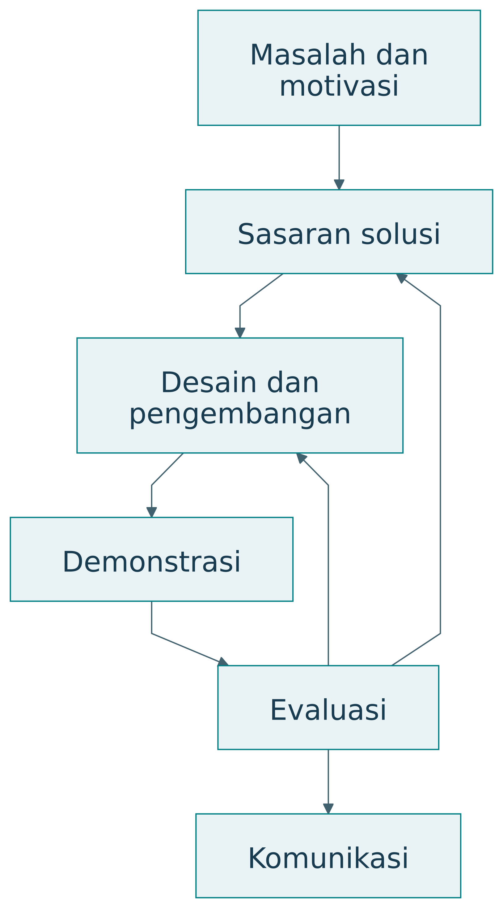{#fig-dsrm}

Pada contoh pangan, demonstrasi dapat menunjukkan rekomendasi produksi untuk satu skenario. Evaluasi perlu menjelaskan seberapa baik rekomendasi memenuhi sasaran, dengan pembanding dan kondisi yang dinyatakan. Keduanya dapat memakai data yang berkaitan, tetapi pertanyaan buktinya berbeda.

### PICOC sebagai kerangka pertanyaan

PICOC membantu memperjelas Population, Intervention, Comparison, Outcome, dan Context. Pedoman Kitchenham dan Charters membahas penggunaannya untuk pertanyaan kajian sistematis di rekayasa perangkat lunak, dengan merujuk Petticrew dan Roberts [@kitchenham2007].

| Unsur | Pertanyaan | Contoh pangan kampus |
|---|---|---|
| P, Population | Siapa atau apa? | Pedagang kantin kampus |
| I, Intervention | Pendekatan apa? | Prapesan dengan rekomendasi produksi |
| C, Comparison | Dibandingkan dengan apa? | Produksi berdasarkan perkiraan biasa |
| O, Outcome | Hasil apa? | Limbah dan cakupan permintaan |
| C, Context | Dalam kondisi apa? | Hari kuliah dan kapasitas dapur tertentu |

: PICOC sebagai kerangka pertanyaan — tabel 1 {#tbl-buku-28-1}

PICOC membantu menentukan ruang lingkup. Ia belum memilih ukuran sampel, desain eksperimen, atau teknik analisis. Unsur pembanding digunakan ketika sesuai dengan pertanyaan; penelitian eksploratif dapat menjelaskan bahwa pembanding belum ditetapkan. Pembanding yang dipakai perlu didefinisikan cukup jelas [@kitchenham2007].

## Sintesis Temuan Literatur

### Pemilihan berdasarkan pertanyaan

| Pertimbangan | DRM | DSRM |
|---|---|---|
| Penekanan | Pemahaman dan perbaikan desain | Artefak dan kegunaan solusi |
| Keadaan awal | Tahap DS-I tersendiri | Identifikasi masalah dan sasaran |
| Solusi | Dukungan desain | Artefak pemecahan masalah |
| Evaluasi | Penerapan serta perbaikan | Demonstrasi dan evaluasi |

: Pemilihan berdasarkan pertanyaan — tabel 1 {#tbl-buku-37-1}

Pemilihan bukan kompetisi nama metodologi. Peneliti perlu menunjukkan pekerjaan apa yang dilakukan, mengapa dibutuhkan, dan bukti apa yang dikumpulkan. Buku ini menggunakan perbandingan tersebut sebagai panduan penalaran; penyesuaian ke suatu tesis tetap harus mempertimbangkan pertanyaan dan sumber datanya.

### Integrasi dengan TISE

Salah satu pilihan integrasi adalah memakai DRM untuk memahami faktor perancangan ekosistem, lalu memakai DSRM untuk mengembangkan alat bantu tertentu. Pilihan lain adalah memakai DSRM sebagai kerangka keseluruhan, dengan studi keadaan awal yang mendalam. Q-Cycle dapat membantu menata kebutuhan, fungsi, arsitektur, dan bukti di dalam pekerjaan itu.

| Kerangka | Peran yang dapat diberikan | Batas integrasi |
|---|---|---|
| PICOC | Memperjelas pertanyaan | Belum menentukan seluruh metode |
| DRM atau DSRM | Menata logika penelitian | Perlu justifikasi pemilihan |
| Q-Cycle | Menelusuri keputusan rekayasa | Bukan pasangan satu-satu tahap metodologi |
| EASTF | Menyatakan lapisan kontribusi | Bukan urutan aktivitas wajib |

: Integrasi dengan TISE — tabel 1 {#tbl-buku-38-1}

Hubungan dalam tabel adalah sintesis buku ini. Sebuah laporan sebaiknya memilih kerangka utama dan menjelaskan fungsi kerangka pendukung. Penumpukan istilah tanpa peran yang jelas menyulitkan pembaca menilai metode.

### Dua sumbu keberhasilan

Kematangan produk dan kekuatan kontribusi ilmiah merupakan dua sumbu berbeda. Model yang belum menjadi produk dapat menghasilkan pengetahuan baru. Produk yang telah digunakan luas dapat merupakan penerapan pengetahuan yang sudah ada. Suatu disertasi perlu menjelaskan pengetahuan barunya, sedangkan suatu rilis perlu membuktikan kesiapan operasional sesuai cakupannya.

| Keadaan | Kesimpulan yang sah | Kesimpulan yang masih perlu bukti |
|---|---|---|
| Fungsi inti berhasil di lab | Prinsip bekerja pada kondisi uji | Kelayakan penggunaan luas |
| Artefak dipakai pengguna | Penggunaan telah terjadi | Manfaat disebabkan artefak |
| Model mengungguli baseline sintetik | Keunggulan pada skenario tersebut | Keunggulan pada populasi nyata |
| Hasil berulang pada beberapa konteks | Bukti lebih luas | Berlaku pada semua konteks |

: Dua sumbu keberhasilan — tabel 1 {#tbl-buku-24-1}

## Kesenjangan Penelitian

Kerangka konseptual menuntut bukti pada setiap lapisan. Literatur yang dirujuk memberi landasan metode dan representasi; demonstrasi sintetik belum menunjukkan manfaat pada pengguna maupun distribusi nilai antarpelaku.

### Bukti tidak naik otomatis

Misalkan model prediksi mengurangi galat. Sistem tetap dapat gagal karena data terlambat. Aplikasi tetap dapat kurang bermanfaat karena pedagang tidak dapat mengubah pesanan bahan. Ekosistem tetap dapat menghadapi ketidakadilan ketika biaya perubahan ditanggung satu pihak. Pertanyaan pada tiap lapisan mengidentifikasi penjelasan yang belum diuji.

| Klaim awal | Langkah bukti berikutnya | Kondisi yang perlu dijaga |
|---|---|---|
| Prediksi lebih akurat | Uji dampak pada keputusan | Data dan aturan keputusan |
| Keputusan produksi membaik | Uji layanan nyata | Kapasitas serta kemampuan pelaku |
| Layanan lebih efisien | Uji manfaat pengguna | Akses, biaya, mutu |
| Pengguna memperoleh manfaat | Uji kelayakan ekosistem | Distribusi, waktu, lingkungan |

: Bukti tidak naik otomatis — tabel 1 {#tbl-buku-65-1}

## Posisi dan Kebaruan Penelitian

Posisi naskah adalah sintesis konseptual dan demonstrasi terhitung ulang. Integrasi kerangka disajikan sebagai rumusan penulis; kebaruan empiris dan efektivitas lapangan belum diuji.

### Menentukan kontribusi utama

Setiap proyek tidak harus menciptakan pengetahuan baru di semua lapisan. Pilih kontribusi utama, lalu jelaskan ketergantungan terhadap lapisan lain. Misalnya, tesis teknologi dapat menggunakan kebutuhan aplikasi sebagai motivasi dan prinsip yang sudah diketahui sebagai landasan. Disertasi ekosistem dapat memakai perangkat lunak yang tersedia untuk menguji suatu mekanisme tata kelola.

Keluasan lapisan juga tidak identik dengan jenjang akademik. TA, tesis, dan disertasi dibedakan melalui kedalaman, kemandirian, serta kontribusi sesuai aturan program, bukan kewajiban memilih F untuk doktor dan A untuk sarjana.

### Empat dimensi dalam satu proyek

| Dimensi | Contoh posisi | Bukti yang diperiksa |
|---|---|---|
| EASTF | S, sistem koordinasi | Kontribusi integrasi |
| Q-Cycle | Q3 dan Q4 | Alasan arsitektur dan hasil uji |
| Tahap inovasi | Prototipe digital twin | Perilaku virtual dengan asumsi |
| Kematangan | Lab demo | Fungsi pada kondisi terkendali |

: Empat dimensi dalam satu proyek — tabel 1 {#tbl-buku-73-1}

Kematangan tidak selalu meningkat bersama kuatnya pengetahuan ilmiah. Rancangan model dapat menghasilkan bukti teoretis yang kuat, sementara prototipe masih terbatas. Produk matang dapat memakai prinsip yang sudah dikenal. Laporan perlu menyatakan kedua jenis pencapaian.

### Status sumber dan klaim

TISE mengikuti dokumen konseptual penulis bertanggal 23 Agustus 2026 [@langi2026tise; @langi2026transcript]. Perluasan ASTF menjadi EASTF, tahapan inovasi, dan rekayasawan paripurna disusun mengikuti rumusan percakapan 1 Oktober 2026 [@percakapan2026]. Penjelasan metodologi eksternal menggunakan sumber primer. Contoh pangan, tutor AI, target, dan perhitungan di buku ini merupakan rancangan pembelajaran.

| Jenis isi | Status | Cara membacanya |
|---|---|---|
| DRM, DSRM, PICOC | Kerangka dari literatur yang dirujuk | Pelajari definisi dan batasnya |
| TISE 1.0–3.0 | Rumusan konseptual penulis | Nilai koherensi dan bukti implementasinya |
| EASTF dan integrasi kerangka | Rumusan serta sintesis pedagogis | Gunakan sebagai cara menata pertanyaan |
| Angka dan kurva contoh | Ilustrasi sintetik | Jangan mengutip sebagai temuan empiris |

: Status sumber dan klaim — tabel 1 {#tbl-buku-124-1}
