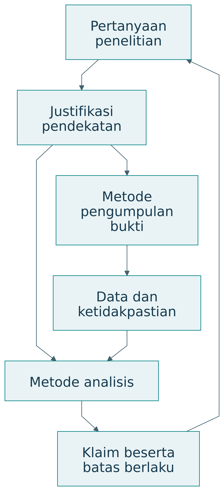
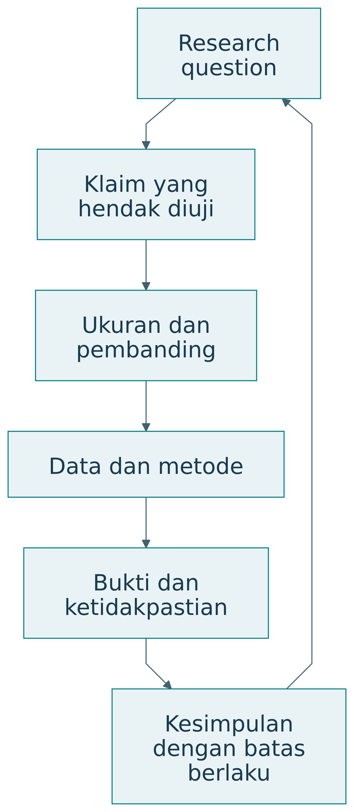
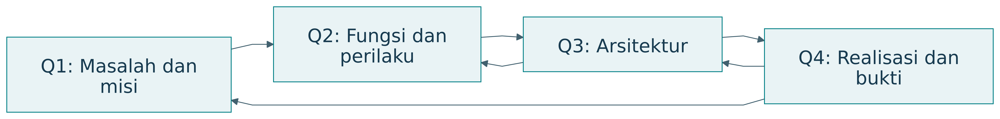
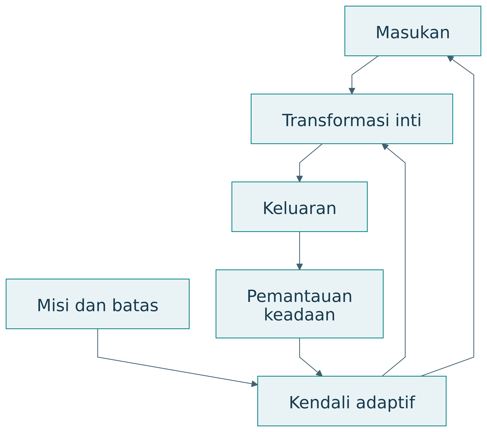
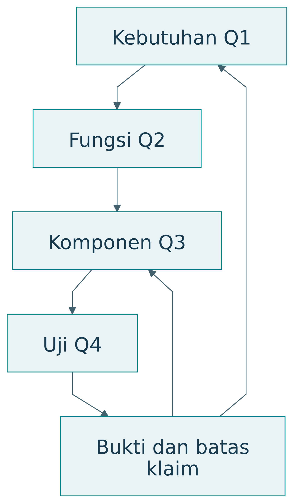
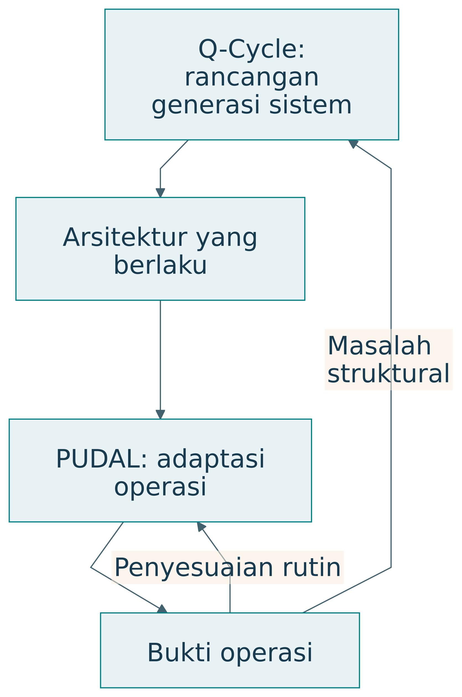
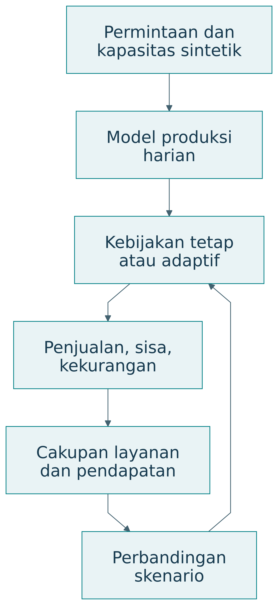

# Metodologi

## Desain Penelitian

Pendekatan yang tersedia dalam sumber adalah sintesis konseptual disertai demonstrasi simulasi. DRM dan DSRM dibahas sebagai pilihan logika penelitian; tahapan pilot yang diusulkan belum dilaksanakan.

### Metode menjalankan kegiatan, metodologi menjelaskan logikanya

Metode adalah prosedur untuk kegiatan tertentu, seperti observasi, wawancara, eksperimen, simulasi, atau analisis data. Metodologi menghubungkan pertanyaan penelitian dengan pemilihan metode, asumsi, urutan pekerjaan, dan cara menjaga validitas. Menyebut daftar metode saja belum menjelaskan mengapa bukti yang dihasilkan dapat menjawab pertanyaan.

{#fig-methodology}

| Aspek | Metode | Metodologi |
|---|---|---|
| Fungsi | Melaksanakan kegiatan | Menjustifikasi keseluruhan pendekatan |
| Pertanyaan | Bagaimana data diperoleh atau dianalisis? | Mengapa pendekatan ini memadai? |
| Cakupan | Prosedur tertentu | Hubungan masalah, bukti, dan kesimpulan |
| Contoh | Wawancara, uji beban, simulasi | DRM dan DSRM |
| Penjelasan minimum | Langkah dan parameter | Alasan pilihan, asumsi, validitas |

: Metode menjalankan kegiatan, metodologi menjelaskan logikanya — tabel 1 {#tbl-buku-27-1}

Pada penelitian layanan pangan, wawancara dapat menjelaskan pengalaman pedagang. Catatan transaksi menunjukkan pola penggunaan. Eksperimen atau rancangan kuasieksperimen dapat membantu menilai perubahan akibat intervensi. Metodologi menjelaskan bagaimana ketiga jenis bukti itu digabungkan dan bagaimana peneliti menangani kemungkinan penjelasan lain.

### Justifikasi yang dapat ditelaah

Contoh kalimat metodologi: penelitian menggunakan DSRM untuk mengembangkan artefak rekomendasi produksi, PICOC untuk memperjelas pertanyaan evaluasi, simulasi untuk membandingkan kebijakan pada kondisi terkendali, dan pilot untuk menilai penggunaan nyata. Kalimat berikutnya perlu menjelaskan asumsi simulator, pemilihan pilot, serta batas kesimpulan.

Justifikasi yang baik dapat ditelusuri. Jika sasaran penelitian adalah kemampuan manusia, data waktu proses saja tidak memadai. Jika pertanyaannya menyangkut kestabilan sistem, survei kepuasan saja belum menguji perilaku saat gangguan. Pemilihan metode mengikuti apa yang hendak diketahui.

### Pertanyaan, kontribusi, dan kondisi berlaku

Rancangan penelitian menghubungkan apa yang hendak diketahui dengan kegiatan yang menghasilkan bukti. Posisi EASTF, tahap inovasi, dan kematangan membantu menentukan cakupan. Metodologi menjustifikasi cara pekerjaan disusun, sementara Q-Cycle membantu menjaga ketertelusuran keputusan rekayasa.

{#fig-claim}

| Elemen | Isi contoh | Pemeriksaan |
|---|---|---|
| Masalah | Ketidakpastian produksi dan keterbatasan pengetahuan | Ada bukti keadaan awal |
| RQ | Apakah dukungan keputusan meningkatkan hasil dan kemampuan? | Objek serta outcome jelas |
| Kontribusi | Prinsip interaksi rekomendasi–koreksi | Menghasilkan pengetahuan yang dapat digunakan |
| Lapisan | A dan S, dengan konteks E | Batas antarlapisan disebutkan |
| Tahap | Model, virtual, pilot | Jenis bukti dibedakan |
| Metodologi | DSRM atau DRM sesuai penekanan | Alasan pilihan tersedia |

: Pertanyaan, kontribusi, dan kondisi berlaku — tabel 1 {#tbl-buku-107-1}

## Pengumpulan Data

Data yang digunakan pada hasil berasal dari generator sintetik dalam kode contoh. Tidak ada pengumpulan data peserta atau observasi lapangan dalam sumber.

### PICOC dalam pencarian dan pengujian

Untuk kajian literatur, unsur pertanyaan membantu menurunkan kata kunci serta kriteria pemilihan studi. Strategi pencarian perlu diuji terhadap artikel relevan yang sudah diketahui. Semua unsur PICOC tidak selalu harus digabungkan dengan AND karena pencarian yang terlalu sempit dapat kehilangan studi penting. Rencana pencarian, seleksi, penilaian kualitas, ekstraksi, dan sintesis tetap perlu dijelaskan [@kitchenham2007].

Sebagai rancangan pedagogis, tabel berikut menghubungkan PICOC dengan keputusan pengujian. Hubungan ini membantu peneliti mengubah pertanyaan menjadi rencana kerja.

| Unsur | Keputusan operasional | Risiko jika diabaikan |
|---|---|---|
| Population | Unit analisis dan cara memilih peserta | Klaim untuk populasi yang tidak diteliti |
| Intervention | Perlakuan dan intensitas penggunaan | Intervensi tidak dapat direplikasi |
| Comparison | Baseline dengan kesempatan setara | Pengaruh pelatihan tercampur |
| Outcome | Ukuran, waktu, dan instrumen | Hasil dipilih sesudah melihat data |
| Context | Beban, fasilitas, aturan, dan kondisi | Temuan dipindahkan ke konteks yang berbeda |

: PICOC dalam pencarian dan pengujian — tabel 1 {#tbl-buku-30-1}

## Populasi dan Sampel

Unit analisis demonstrasi adalah 30 hari sintetik dan dua kebijakan produksi pada rangkaian permintaan serta kapasitas yang sama. Hari sintetik tidak diperlakukan sebagai sampel populasi pedagang. Rancangan studi manusia pada bagian evaluasi merupakan pekerjaan selanjutnya.

## Variabel dan Ukuran

### Model produksi harian

Permintaan hari ke-t adalah D_t, produksi Q_t, dan kapasitas K_t. Penjualan Y_t dibatasi oleh permintaan serta produksi. Sisa W_t dan permintaan yang belum terpenuhi U_t dihitung sebagai berikut:

$$
Y_t=\min(D_t,Q_t),\quad W_t=\max(Q_t-D_t,0),\quad U_t=\max(D_t-Q_t,0).
$$

Pendapatan kotor dari penjualan dihitung dengan harga per porsi p. Biaya produksi per porsi c dan biaya penanganan sisa w memberikan margin operasi sederhana:

$$
\Pi_t=pY_t-cQ_t-wW_t.
$$

Margin ini belum mencakup seluruh biaya usaha. Ia digunakan agar konsekuensi produksi dapat diperiksa dalam contoh. Cakupan permintaan adalah total penjualan dibagi total permintaan. Rasio sisa adalah total sisa dibagi total produksi.

| Parameter ilustratif | Nilai | Makna |
|---|---|---|
| Harga p | Rp20.000 per porsi | Asumsi penjualan |
| Biaya produksi c | Rp14.000 per porsi | Asumsi biaya variabel |
| Biaya sisa w | Rp1.000 per porsi | Asumsi penanganan |
| Produksi tetap | 550 porsi per hari | Baseline sederhana |
| Horizon | 30 hari sintetik | Bukan kalender lapangan |

: Model produksi harian — tabel 1 {#tbl-buku-100-1}

### Ukuran sepanjang waktu

Menilai “semakin digunakan” memerlukan bukti longitudinal. Pengukuran sebelum penggunaan, selama penggunaan, dan setelahnya dapat menunjukkan perkembangan. Tugas transfer membantu memeriksa apakah kemampuan dapat digunakan pada situasi yang berbeda. Pengukuran perlu mempertimbangkan pengalaman awal serta kesempatan belajar.

| Outcome | Instrumen contoh | Batas penafsiran |
|---|---|---|
| Pencapaian misi | Ketepatan atau cakupan layanan | Dapat meningkat karena bantuan sistem |
| Pemahaman | Penjelasan mekanisme | Instrumen perlu valid untuk tujuan |
| Transfer | Tugas baru dengan bantuan yang dinyatakan | Konteks tugas menentukan klaim |
| Kendali | Koreksi, alasan, pilihan | Banyak koreksi bisa juga menandakan sistem buruk |
| Kesempatan | Akses serta kemampuan bertindak | Dipengaruhi lingkungan dan sumber daya |

: Ukuran sepanjang waktu — tabel 1 {#tbl-buku-80-1}

{#fig-capability}

Plot tersebut hanya menjelaskan pertanyaan desain. Penelitian nyata perlu mengukur kapabilitas dengan instrumen yang memadai serta pembanding. Kurva yang meningkat tidak boleh diasumsikan berlaku karena suatu fitur telah ditambahkan.

## Prosedur Penelitian

### Empat ruang pertanyaan rekayasa

Q-Cycle dalam dokumen TISE menghubungkan Q1 masalah dan misi, Q2 fungsi dan perilaku, Q3 arsitektur, serta Q4 konstruksi dan bukti. Hasil realisasi kembali memperbaiki perumusan masalah. Q-Cycle merupakan siklus penalaran yang dapat diulang [@langi2026tise].

{#fig-qcycle}

| Ruang | Pertanyaan | Keluaran | Pemeriksaan |
|---|---|---|---|
| Q1 | Perubahan apa dibutuhkan? | Misi, kebutuhan, batas, ukuran | Tujuan belum terkunci pada teknologi |
| Q2 | Fungsi apa memungkinkan perubahan? | Aliran, perilaku, persyaratan | Fungsi terkait kebutuhan |
| Q3 | Bagaimana fungsi dialokasikan? | Komponen, antarmuka, peran | Pilihan dan kewenangan jelas |
| Q4 | Bagaimana diwujudkan dan dibuktikan? | Artefak, uji, operasi, bukti | Klaim kembali ke Q1 |

: Empat ruang pertanyaan rekayasa — tabel 1 {#tbl-buku-55-1}

### Q1: masalah sebagai perubahan keadaan

Rumusan “buat aplikasi pemesanan” telah memilih bentuk solusi. Rumusan kebutuhan dapat menyatakan bahwa mahasiswa kesulitan memperoleh makanan sehat tepat waktu, sementara pedagang menghadapi ketidakpastian produksi. Q1 menjelaskan keadaan awal, keadaan yang diinginkan, pihak yang terdampak, dan batas perubahan.

| Elemen Q1 | Isi contoh | Bukti awal yang dibutuhkan |
|---|---|---|
| Keadaan awal | Waktu tunggu dan sisa produksi | Observasi serta catatan |
| Keadaan tujuan | Akses membaik dengan limbah terkendali | Kriteria yang disepakati |
| Pihak | Mahasiswa, pedagang, pemasok, kampus | Pemetaan peran dan pengalaman |
| Batas | Kapasitas, biaya, mutu, kewenangan | Data dan aturan |
| Ukuran | Cakupan, limbah, pendapatan, kemampuan | Instrumen dan waktu pengukuran |

: Q1: masalah sebagai perubahan keadaan — tabel 1 {#tbl-buku-56-1}

Q1 yang baik memungkinkan beberapa solusi. Ia juga membatasi ambisi. Jika penelitian hanya dilakukan pada satu kantin, ruang klaim perlu menyatakan konteks tersebut dan menjelaskan alasan memperluas atau membatasi generalisasi.

### Q2: fungsi dan kendali

{#fig-function-control}

Fungsi menyatakan apa yang perlu dilakukan. Memperkirakan permintaan merupakan fungsi; model statistik tertentu merupakan pilihan implementasi. Memisahkan fungsi dari teknologi membantu menilai alternatif tanpa kehilangan kebutuhan awal.

| Kebutuhan | Fungsi inti | Fungsi kendali |
|---|---|---|
| Makanan tersedia | Produksi dan distribusi | Pantau permintaan serta kapasitas |
| Sisa terkendali | Alokasi jumlah produksi | Perbarui rencana dari hasil |
| Keputusan dapat dikoreksi | Sajikan rekomendasi | Catat alasan dan koreksi |
| Manusia semakin mampu | Berikan penjelasan | Nilai transfer dan sesuaikan bantuan |

: Q2: fungsi dan kendali — tabel 1 {#tbl-buku-57-1}

Analisis fungsional juga menjelaskan keadaan dan kondisi transisi. Sistem dapat berada pada keadaan normal, beban puncak, pasokan terbatas, atau operasi darurat. Fungsi yang diperlukan saat gangguan dapat berbeda dari fungsi pada demonstrasi normal.

### Q3: arsitektur dan alasan alokasi

Arsitektur mengalokasikan fungsi kepada manusia, organisasi, perangkat, perangkat lunak, AI, dan aturan. Pemilihan perlu mempertimbangkan kemampuan, risiko, ketergantungan, serta kewenangan. Sebuah fungsi tidak selalu tepat ditempatkan pada AI hanya karena dapat diotomasi.

| Fungsi | Alokasi contoh | Alasan | Antarmuka |
|---|---|---|---|
| Perkiraan permintaan | Modul analitik | Mengolah data berulang | Data transaksi dan keluaran prediksi |
| Penilaian kelayakan produksi | Pedagang | Mengetahui kondisi dapur | Rekomendasi dan koreksi |
| Aturan layanan | Kampus dan perwakilan pelaku | Legitimasi bersama | Standar serta persetujuan |
| Catatan perubahan | Operator | Ketertelusuran | Log keputusan dan hasil |

: Q3: arsitektur dan alasan alokasi — tabel 1 {#tbl-buku-58-1}

### Q4: realisasi dan bukti

Q4 mencakup konstruksi, integrasi, pengujian, operasi, pemeliharaan, dan evaluasi sesuai lingkup pekerjaan. Dalam pengembangan virtual, Q4 dapat menghasilkan prototipe digital twin. Dalam pilot, Q4 menghasilkan artefak yang berinteraksi dengan pengguna nyata. Keduanya menghasilkan jenis bukti berbeda.

{#fig-trace}

| ID kebutuhan | Fungsi | Elemen arsitektur | Uji | Batas bukti |
|---|---|---|---|---|
| N1 akses pangan | Sesuaikan produksi | Modul dan pedagang | Cakupan permintaan | Kondisi serta periode uji |
| N2 limbah | Kendali jumlah | Kebijakan produksi | Rasio sisa | Definisi sisa dan pengukuran |
| N3 kemampuan | Jelaskan rekomendasi | Antarmuka dan aktivitas refleksi | Uji transfer | Peserta serta tugas baru |

: Q4: realisasi dan bukti — tabel 1 {#tbl-buku-59-1}

### Q-Cycle dan PUDAL

{#fig-loops}

Perbedaan skala waktu membantu tim memilih tindakan. Penyesuaian jumlah produksi dapat dilakukan di dalam arsitektur yang ada. Perubahan model kewenangan atau pembagian peran memerlukan keputusan desain yang lebih mendasar. Catatan operasi perlu menunjukkan alasan perubahan agar adaptasi dapat ditelaah.

### EASTF dan Q-Cycle sebagai dua dimensi

EASTF menyatakan lapisan objek. Q-Cycle menyatakan ruang penalaran. Semua lapisan dapat mengalami perumusan masalah, analisis, rancangan, dan pengujian. Dengan demikian, E tidak identik dengan Q1, dan F tidak identik dengan Q4.

| Lapisan | Q1 | Q2 | Q3 | Q4 |
|---|---|---|---|---|
| E | Misi dan ketegangan | Aliran antarpihak | Tata kelola dan pembagian peran | Pilot dan bukti dampak |
| A | Kebutuhan pekerjaan | Fungsi layanan | Rancangan interaksi | Uji penggunaan |
| S | Persyaratan sistem | Perilaku dan kendali | Arsitektur komponen | Integrasi dan validasi |
| T | Gap kemampuan | Mekanisme komponen | Rancangan implementasi | Uji teknis |
| F | Gap pengetahuan | Hubungan atau hipotesis | Model atau rancangan eksperimen | Pembuktian atau uji prinsip |

: EASTF dan Q-Cycle sebagai dua dimensi — tabel 1 {#tbl-buku-66-1}

Baris F menggunakan Q-Cycle sebagai alat penalaran dalam sintesis ini. Pilihan metodologi ilmiah tetap mengikuti jenis pertanyaan. Penelitian fundamental tidak wajib menghasilkan produk operasional.

### Q-Cycle pada kasus

| Q | Keputusan rancangan | Bukti yang direncanakan |
|---|---|---|
| Q1 | Akses pangan dan sisa sebagai perhatian awal | Baseline layanan serta pengalaman |
| Q2 | Perkiraan, produksi, distribusi, koreksi | Model aliran dan keadaan |
| Q3 | Rekomendasi AI dengan penilaian pedagang | Pembagian fungsi dan otoritas |
| Q4 | Simulasi, pilot, evaluasi | Hasil virtual lalu pengamatan nyata |

: Q-Cycle pada kasus — tabel 1 {#tbl-buku-99-1}

Pertanyaan utama contoh adalah apakah rekomendasi produksi yang dapat dijelaskan dan dikoreksi membantu layanan sekaligus meningkatkan kemampuan pedagang mengambil keputusan. Pertanyaan tersebut mencakup outcome misi dan kapabilitas. Simulasi pada bab ini baru menguji bagian produksi.

## Teknik Analisis Data

Analisis membandingkan total penjualan, sisa, kekurangan, margin sederhana, cakupan permintaan, dan rasio sisa untuk kedua kebijakan. Tidak dilakukan inferensi statistik atas populasi nyata.

### Kebijakan dan skenario

Kebijakan tetap menghasilkan 550 porsi sepanjang kapasitas memungkinkan. Kebijakan adaptif menggunakan permintaan kemarin dan nilai 550 sebagai jangkar. Produksi dibatasi kapasitas hari ini. Permintaan mengalami variasi dan lonjakan, sementara kapasitas turun pada beberapa hari.

{#fig-food-twin}

| Kebijakan | Aturan | Asumsi |
|---|---|---|
| Tetap | Q_t=min(550,K_t) | Rencana dasar tidak mengikuti data |
| Adaptif | $Q_t=\min(K_t,\widehat{D}_t)$ | Informasi permintaan kemarin tersedia |

: Kebijakan dan skenario — tabel 1 {#tbl-buku-101-1}

Estimasi adaptif adalah $\widehat{D}_t=\operatorname{round}(0{,}7D_{t-1}+0{,}3\times550)$.

Contoh ini menunjukkan bagaimana keterlambatan informasi dapat berpengaruh. Saat permintaan melonjak, kebijakan berdasarkan hari sebelumnya dapat tertinggal. Produksi yang meningkat kemudian dapat menghasilkan sisa ketika permintaan turun. Keunggulan tidak boleh diasumsikan dari nama kebijakannya.

## Validasi dan Evaluasi

### Gerbang yang dapat ditelaah

Sebelum maju ke tahap berikutnya, tim meninjau klaim, bukti, ketidakpastian, serta biaya pembelajaran yang masih diperlukan. Kriteria gerbang sebaiknya dirumuskan sebelum pengujian. “Tidak ada masalah yang terlihat” kurang jelas dibandingkan persyaratan tertentu pada beban dan kondisi yang dinyatakan.

| Gerbang contoh | Bukti minimum rancangan | Jika belum terpenuhi |
|---|---|---|
| Model ke pengujian virtual | Asumsi, parameter, aturan, pemeriksaan konsistensi | Perbaiki representasi |
| Virtual ke pilot | Skenario, sensitivitas, batas, rencana validasi | Tambah data atau revisi |
| Pilot ke calon rilis | Penerimaan pengguna dan uji operasional | Perbaiki integrasi atau lingkup |
| Rilis ke perluasan | Kinerja, kapabilitas, kelayakan pelaku | Sesuaikan konteks dan kapasitas |

: Gerbang yang dapat ditelaah — tabel 1 {#tbl-buku-74-1}

### Protokol evaluasi yang terarah

Outcome misi, kapabilitas, dan keberlanjutan dapat memerlukan pengukuran berbeda. Tetapkan definisi, instrumen, waktu, serta pembanding sebelum melihat hasil. Ukuran sampel mengikuti ketelitian atau kekuatan inferensi yang dibutuhkan serta keterbatasan praktis. Jumlah tertentu tidak dapat ditetapkan hanya dari nama metodologi.

| Pertanyaan | Data | Analisis contoh | Batas |
|---|---|---|---|
| Apakah produksi membaik? | Penjualan, sisa, kekurangan | Perbandingan dengan ketidakpastian | Musim dan kapasitas |
| Apakah pengguna memahami? | Penjelasan beralasan | Rubrik dan pemeriksaan penilai | Instrumen serta pengalaman |
| Apakah kemampuan berpindah? | Tugas transfer | Perubahan dan kelompok pembanding | Kemiripan tugas |
| Apakah pelaku tetap layak? | Biaya, pendapatan, beban | Distribusi dan tren waktu | Horizon serta biaya lengkap |

: Protokol evaluasi yang terarah — tabel 1 {#tbl-buku-108-1}

Bukti kualitatif membantu menjelaskan mekanisme dan pengalaman. Bukti kuantitatif membantu menilai besaran serta variasi. Penggabungannya perlu direncanakan. Perbedaan hasil antarjenis data dapat menjadi temuan penting, bukan sesuatu yang dihapus dari laporan.

### Validitas dan penjelasan alternatif

| Risiko | Contoh | Penanganan rancangan |
|---|---|---|
| Pengaruh pelatihan | Kelompok intervensi menerima pelatihan tambahan | Jelaskan dan samakan kesempatan yang relevan |
| Perubahan konteks | Jadwal kuliah berubah | Catat konteks dan periode |
| Seleksi | Peserta lebih termotivasi | Laporkan cara pemilihan |
| Ukuran proksi | Kepuasan dianggap kemampuan | Ukur outcome yang dituju |
| Bias model | Parameter sintetik terlalu menguntungkan | Sensitivitas dan skenario beragam |
| Klaim terlalu luas | Pilot disebut berlaku universal | Nyatakan populasi dan kondisi |

: Validitas dan penjelasan alternatif — tabel 1 {#tbl-buku-109-1}

Penanganan risiko mengikuti kebutuhan bukti. Pengujian acak dapat membantu pada pertanyaan tertentu, sedangkan studi kasus mendalam dapat sesuai untuk mekanisme organisasi yang kompleks. Metodologi tidak menggantikan alasan pemilihan desain penelitian.
