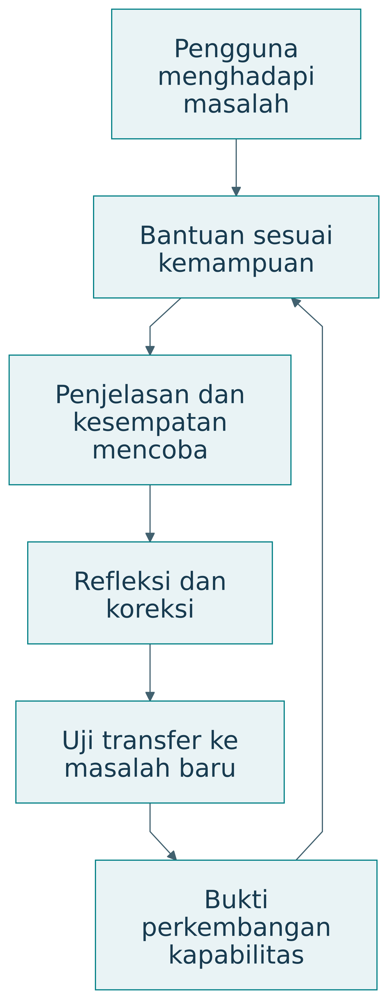
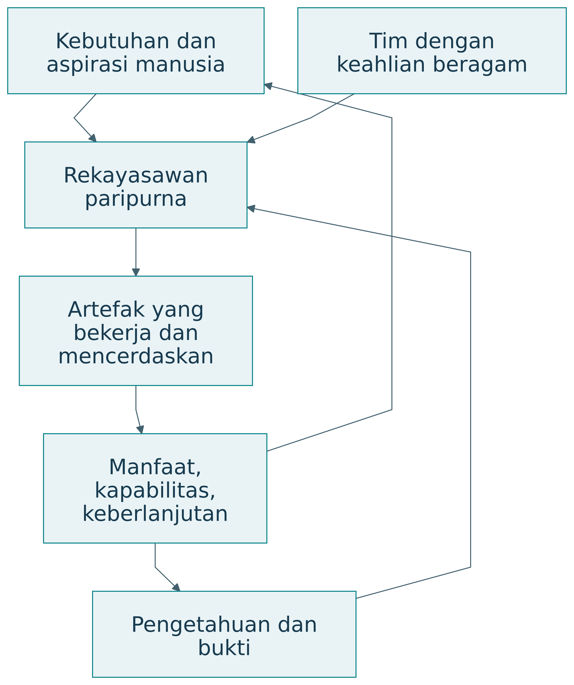

# Pembahasan

## Interpretasi Hasil

Ketergantungan pada permintaan hari sebelumnya dapat membuat kebijakan tertinggal ketika permintaan berubah. Hasil menunjukkan pertukaran antara pelayanan dan sisa produksi pada parameter yang digunakan.

### Menambahkan bukti manusia dan ekosistem

| Lapisan | Bukti virtual | Bukti realisasi yang dibutuhkan |
|---|---|---|
| T | Perhitungan dan aturan | Kualitas data serta prediksi |
| S | Perilaku kebijakan | Integrasi dan gangguan nyata |
| A | Dugaan manfaat | Penggunaan dan pengalaman |
| E | Dugaan distribusi | Kelayakan serta dampak pelaku |
| Kapabilitas | Fitur penjelasan yang dirancang | Pemahaman dan transfer keputusan |

: Menambahkan bukti manusia dan ekosistem — tabel 1 {#tbl-buku-103-1}

Pilot dapat meminta pedagang menjelaskan rekomendasi, memberi koreksi, dan menyusun rencana pada skenario baru. Pengujian perlu memperhatikan perubahan musiman serta pengalaman awal. Data kemampuan dihubungkan dengan data operasional untuk menilai prinsip cerdas dan mencerdaskan.

## Keterkaitan dengan Pertanyaan Penelitian

| Pertanyaan | Bukti | Status jawaban |
|---|---|---|
| PP1 | Pemetaan kerangka dan keputusan Q-Cycle | Dijawab secara konseptual |
| PP2 | Tabel dan grafik simulasi | Dijawab untuk satu skenario sintetik |
| PP3 | Rancangan ukuran dan evaluasi | Kebutuhan bukti dirumuskan; dampak belum diuji |

: Hubungan pertanyaan penelitian dengan status bukti {#tbl-jawaban-pp}

### Buku besar klaim dan bukti

| ID | Klaim | Bukti tersedia | Status | Tindakan berikutnya |
|---|---|---|---|---|
| K1 | Aturan produksi memenuhi kapasitas | Pemeriksaan kode dan output | Didukung pada contoh | Uji implementasi |
| K2 | Kebijakan meningkatkan outcome | Simulasi sintetik | Terbatas pada skenario | Kalibrasi dan pilot |
| K3 | Pedagang semakin mampu | Belum diukur | Hipotesis | Uji pemahaman dan transfer |
| K4 | Ekosistem berkelanjutan | Model parsial | Belum cukup | Ukur biaya serta distribusi |

: Buku besar klaim dan bukti — tabel 1 {#tbl-buku-110-1}

Status dapat berupa hipotesis, didukung pada kondisi tertentu, atau belum terjawab. Kata “tervalidasi” perlu selalu diikuti apa yang divalidasi, terhadap apa, dan dalam kondisi apa. Pemeriksaan kode menunjukkan implementasi mengikuti aturan; ia belum membuktikan aturan menggambarkan kenyataan.

## Perbandingan dengan Penelitian Terdahulu

DRM dan DSRM memberi logika untuk menghubungkan rancangan dengan evaluasi. Demonstrasi ini menggunakan prinsip pembanding dan batas klaim, tetapi belum menyelesaikan evaluasi dukungan desain pada pengguna nyata. Perbedaan keluaran kebijakan sintetik tidak dapat digunakan sebagai bukti mengungguli penelitian lapangan.

## Kontribusi Penelitian

Kontribusi materi adalah pemetaan konseptual empat dimensi penelitian—EASTF, Q-Cycle, tahap inovasi, dan kematangan—serta contoh simulasi yang menunjukkan cara menghubungkan aturan, ukuran, dan batas klaim. Bukti efektivitas operasional dan pemberdayaan manusia masih memerlukan penelitian lanjutan.

## Implikasi

### Desain bantuan yang menumbuhkan kemampuan

{#fig-learning-design}

| Fitur | Mekanisme yang diharapkan | Cara menilainya |
|---|---|---|
| Penjelasan alasan | Pengguna memahami hubungan | Uji menjelaskan kembali |
| Petunjuk bertahap | Pengguna aktif mencoba | Catatan strategi dan tugas |
| Koreksi serta veto | Pengguna menjaga kendali | Kejadian koreksi yang beralasan |
| Refleksi hasil | Pengalaman menjadi pengetahuan | Perubahan alasan keputusan |
| Adaptasi bantuan | Dukungan sesuai kemampuan | Beban, keberhasilan, transfer |
| Akses sumber daya | Kemampuan dapat digunakan | Kesempatan bertindak nyata |

: Desain bantuan yang menumbuhkan kemampuan — tabel 1 {#tbl-buku-79-1}

Mekanisme dalam tabel merupakan hipotesis desain. Efeknya perlu diuji. Pengurangan bantuan tidak selalu menjadi tujuan bagi setiap pengguna. Pengguna dengan kebutuhan aksesibilitas dapat memerlukan bantuan terus-menerus. Pertumbuhan kapabilitas berarti bertambahnya kemampuan dan pilihan yang bermakna, termasuk kemampuan memakai bantuan secara sadar.

### PUDAL sebagai pembelajaran timbal balik

Learn mencakup perubahan model dan praktik manusia. Artefak belajar dari pengalaman pengguna, sementara pengguna memperoleh pemahaman serta kesempatan baru. Catatan PUDAL perlu menunjukkan perubahan apa yang terjadi dan mengapa. Perubahan struktural dapat memicu Q-Cycle baru.

### Integrasi pengetahuan dan tanggung jawab

Rekayasawan paripurna dalam percakapan ini adalah profesional yang menghubungkan kebutuhan manusia, pengetahuan, rancangan, realisasi, dan bukti untuk menghasilkan manfaat berkelanjutan serta menumbuhkan kapabilitas [@percakapan2026]. Keparipurnaan diwujudkan melalui kedalaman keahlian, keluasan integrasi, dan tanggung jawab sepanjang siklus hidup.

{#fig-profession}

| Kemampuan profesi | Pekerjaan yang terlihat | Bukti dalam portofolio |
|---|---|---|
| Memahami kebutuhan | Berinteraksi dengan pihak terdampak | Rumusan masalah dan alasan |
| Menyelidiki | Menguji asumsi dan penjelasan | Data serta hasil analisis |
| Merancang | Membandingkan alternatif | Keputusan dan trade-off |
| Merealisasikan | Mengintegrasikan artefak | Hasil uji serta operasi |
| Membuktikan | Menilai klaim secara tepat | Ketertelusuran dan batas |
| Memelihara | Menjaga kelayakan | Catatan gangguan dan perbaikan |
| Memampukan | Mendukung perkembangan manusia | Bukti pembelajaran dan kesempatan |

: Integrasi pengetahuan dan tanggung jawab — tabel 1 {#tbl-buku-91-1}

### Keahlian individu dan kemampuan tim

Satu orang dapat memiliki spesialisasi utama, misalnya kendali, arsitektur perangkat lunak, ergonomi, atau tata kelola. Keparipurnaan tidak menuntut penguasaan tertinggi setiap disiplin. Ia menuntut kemampuan mengenali batas keahlian, menghubungkan kontribusi ahli, serta mempertanggungjawabkan keputusan dalam perannya.

| Peran dalam tim | Kedalaman keahlian | Tanggung jawab integrasi |
|---|---|---|
| Peneliti | Metode dan bukti | Menghubungkan klaim dengan kebutuhan |
| Perancang sistem | Fungsi dan arsitektur | Menghubungkan komponen serta pelaku |
| Pengembang | Implementasi | Menjaga persyaratan dan antarmuka |
| Operator | Kondisi penggunaan | Mengembalikan bukti operasi |
| Pengguna dan regulator | Kebutuhan dan kewenangan | Menilai manfaat serta penerimaan |

: Keahlian individu dan kemampuan tim — tabel 1 {#tbl-buku-92-1}

Triune intelligence memperluas kolaborasi ini. AI membantu analisis serta penelusuran. Kecerdasan kolektif menyediakan pengetahuan tersebar dan koordinasi. Manusia tetap memegang penilaian dan tanggung jawab sesuai kewenangan. Profesional perlu memahami apa yang dapat diperiksa dan kapan meminta keahlian tambahan.

### Tanggung jawab siklus hidup

Realisasi mengubah kehidupan pengguna. Karena itu, tanggung jawab profesi meliputi pengenalan kebutuhan, pengujian, operasi, pemeliharaan, serta penghentian yang layak. Ketika artefak dihentikan, pengguna dapat kehilangan akses, pengetahuan, atau layanan yang telah menjadi bagian pekerjaannya. Rancangan perlu mempertimbangkan kontinuitas kemampuan.

| Fase | Pertanyaan tanggung jawab | Catatan yang dibutuhkan |
|---|---|---|
| Perumusan | Siapa yang dilayani dan didengar? | Keputusan ruang lingkup |
| Perancangan | Risiko serta trade-off apa dipilih? | Alternatif dan alasan |
| Pengujian | Klaim apa benar-benar didukung? | Kondisi, metode, hasil |
| Operasi | Bagaimana kegagalan ditangani? | Insiden dan pemulihan |
| Perubahan | Siapa terdampak pembaruan? | Evaluasi serta persetujuan |
| Penghentian | Bagaimana kemampuan dan akses dijaga? | Transisi serta dokumentasi |

: Tanggung jawab siklus hidup — tabel 1 {#tbl-buku-93-1}

### Nilai kerja yang dapat diperiksa

Kualitas, kepedulian, kejujuran, keselamatan, dan penyelesaian pekerjaan perlu diterjemahkan menjadi praktik. Kejujuran ilmiah terlihat pada status data dan batas klaim. Kepedulian terlihat pada cara kebutuhan dipahami dan kesempatan dijaga. Penyelesaian terlihat pada artefak, dokumentasi, dukungan, dan bukti sesuai lingkup.

| Nilai | Praktik operasional | Pertanyaan telaah |
|---|---|---|
| Kualitas | Persyaratan dan pengujian | Apakah hasil memenuhi kriteria? |
| Kepedulian | Pertimbangan keadaan pengguna | Siapa menghadapi hambatan? |
| Kejujuran | Asumsi dan batas terbuka | Apakah bukti dibedakan dari harapan? |
| Keselamatan | Risiko dan penanganan kegagalan | Apa konsekuensi saat gagal? |
| Deliver | Hasil sesuai komitmen | Apa yang siap digunakan atau ditelaah? |

: Nilai kerja yang dapat diperiksa — tabel 1 {#tbl-buku-94-1}

### Portofolio sebagai bukti kompetensi

Portofolio dapat berisi proyek yang berbeda tahap dan lapisan. Nilainya terletak pada keputusan, bukti, serta pembelajaran yang dapat ditelusuri. Catatan kegagalan yang dijelaskan dengan baik dapat menunjukkan kompetensi diagnosis dan revisi. Klaim keberhasilan tanpa kondisi uji justru sulit dinilai.

Sebuah entri portofolio yang padat menyebut misi, lapisan kontribusi, keputusan penting, tahap inovasi, kematangan, hasil uji, batas, dan perubahan yang dipelajari. Format ini memudahkan pembimbing atau reviewer menilai apa yang benar-benar dikerjakan.

## Keterbatasan Temuan dan Ancaman Validitas

Satu rangkaian sintetik tidak menentukan kinerja pada semua pola permintaan. Model mengabaikan menu, perilaku prapesan, harga dinamis, antrean, seluruh biaya usaha, dan pembelajaran manusia. Kurva kapabilitas merupakan ilustrasi konseptual. Kerangka integrasi belum divalidasi melalui implementasi lapangan.
