# Orientasi {.unnumbered}

> Rekayasa berorientasi kemanusiaan menghasilkan artefak yang cerdas dan mencerdaskan. Semakin digunakan, semakin memampukan manusia memenuhi kebutuhan dasar dan mencapai aspirasinya.

Buku ini menyatukan percakapan tentang penelitian, desain, engineering, TISE, dan pembentukan rekayasawan paripurna. Gagasan utamanya adalah bahwa keberhasilan teknis, pertumbuhan kemampuan manusia, dan keberlanjutan ekosistem perlu dipikirkan bersama. Artefak bekerja di dalam kehidupan manusia. Ia menggunakan sumber daya, memengaruhi keputusan, mengubah kebiasaan, dan dapat membuka atau menutup kesempatan.

## Peta penjelasan

{#fig-overview}

| Dimensi | Pertanyaan yang dibantu | Contoh posisi penelitian |
|---|---|---|
| EASTF | Di lapisan mana objek dan kontribusi berada? | Sistem koordinasi pangan |
| Q-Cycle | Bagaimana kebutuhan ditelusuri sampai bukti? | Q3 arsitektur, lalu Q4 evaluasi |
| Tahap inovasi | Dalam bentuk apa solusi telah diwujudkan? | Prototipe digital twin |
| Kematangan artefak | Pada kondisi apa artefak telah diuji? | Testbed, belum penggunaan luas |

Keempat dimensi tidak mempunyai pasangan satu-satu. Sebuah kontribusi teknologi dapat diuji melalui beberapa siklus Q, diwujudkan sebagai model, lalu diuji pada lab demo. Sebuah kontribusi ekosistem dapat berupa pengetahuan tentang tata kelola yang diperoleh dari pilot. Istilah lapisan menunjukkan objek, sementara tahap menunjukkan keadaan pekerjaan.

## Tujuan belajar

Setelah mempelajari buku, pembaca diharapkan mampu merumuskan pertanyaan penelitian yang terarah, menjelaskan pilihan metodologi, membedakan kontribusi ilmiah dari kesiapan produk, menyusun rantai kebutuhan–fungsi–arsitektur–bukti, dan menilai apakah artefak semakin memampukan penggunanya. Pembaca juga dapat menggunakan diagram dan tabel untuk menjelaskan mekanisme, perbandingan, serta batas klaim.

| Bagian | Isi | Keluaran belajar |
|---|---|---|
| Bahasa dan logika penelitian | Riset, desain, engineering, metode, PICOC, DRM, DSRM | Pertanyaan dan justifikasi penelitian |
| Kerangka TISE | Triune intelligence, misi, PSKVE, PUDAL, Q-Cycle | Model rekayasa ekosistem |
| Lapisan dan inovasi | EASTF, perwujudan, kematangan, pemberdayaan, versi TISE | Posisi dan tujuan pengembangan |
| Praktik profesi | Kompetensi, kasus pangan, rancangan riset, komunikasi visual | Paket bukti yang dapat ditelaah |

## Status sumber dan klaim

TISE mengikuti dokumen konseptual penulis bertanggal 23 Agustus 2026 [@langi2026tise; @langi2026transcript]. Perluasan ASTF menjadi EASTF, tahapan inovasi, dan rekayasawan paripurna disusun mengikuti rumusan percakapan 1 Oktober 2026 [@percakapan2026]. Penjelasan metodologi eksternal menggunakan sumber primer. Contoh pangan, tutor AI, target, dan perhitungan di buku ini merupakan rancangan pembelajaran.

| Jenis isi | Status | Cara membacanya |
|---|---|---|
| DRM, DSRM, PICOC | Kerangka dari literatur yang dirujuk | Pelajari definisi dan batasnya |
| TISE 1.0–3.0 | Rumusan konseptual penulis | Nilai koherensi dan bukti implementasinya |
| EASTF dan integrasi kerangka | Rumusan serta sintesis pedagogis | Gunakan sebagai cara menata pertanyaan |
| Angka dan kurva contoh | Ilustrasi sintetik | Jangan mengutip sebagai temuan empiris |

## Cara menggunakan visuals

Setiap gambar menjelaskan satu hubungan utama. Baca judul dan caption terlebih dahulu, identifikasi objek serta arah hubungan, kemudian gunakan tabel di dekatnya untuk memeriksa definisi dan kriteria. Diagram menunjukkan mekanisme atau urutan. Tabel menjaga ketepatan pemetaan. Plot menunjukkan perubahan atau hubungan angka, dengan status data yang selalu disebutkan.

Buku dapat dipakai untuk belajar mandiri atau enam pertemuan kuliah. Deck Reveal.js menyajikan materi dengan catatan pengajar. Lampiran menyediakan lembar kerja dan contoh jawaban. Studi kasus pangan kampus digunakan berulang agar perhatian pembaca tertuju pada perubahan sudut pandang, bukan pada pengenalan kasus baru setiap bab.

# Riset, desain, dan engineering

## Tiga kegiatan yang saling menghidupi

Riset berusaha menghasilkan atau menguji pengetahuan yang dapat dipertanggungjawabkan. Desain merumuskan solusi untuk keadaan yang diinginkan. Engineering merealisasikan dan menjaga solusi agar memenuhi persyaratan pada kondisi operasi yang ditetapkan. Ketiganya saling memberi masukan. Pengujian dapat memunculkan pertanyaan baru, dan temuan riset dapat mengubah rancangan.

{#fig-research-design}

| Aspek | Riset | Desain | Engineering |
|---|---|---|---|
| Pertanyaan utama | Apa yang belum diketahui? | Solusi seperti apa yang diperlukan? | Bagaimana solusi bekerja secara andal? |
| Objek perhatian | Klaim dan pengetahuan | Alternatif serta keputusan rancangan | Realisasi dan operasi |
| Hasil | Temuan, model, prinsip | Spesifikasi, konsep, arsitektur | Artefak atau layanan yang bekerja |
| Kriteria | Validitas dan kontribusi | Kesesuaian kebutuhan | Kinerja, keselamatan, kelayakan |
| Tanggung jawab | Menjelaskan batas pengetahuan | Menjelaskan alasan pilihan | Menanggung konsekuensi implementasi |

Satu kegiatan dapat mempunyai beberapa tujuan sekaligus. Membangun simulator untuk membantu keputusan merupakan kegiatan desain dan engineering. Simulator menjadi bagian penelitian ketika pertanyaan, pembanding, data, dan analisisnya digunakan untuk menghasilkan pengetahuan. Artefak yang berfungsi belum menentukan apakah suatu klaim baru telah didukung.

## Engineering pada skala dan beban nyata

Engineering mensyaratkan perhatian terhadap kapasitas, gangguan, pengulangan kinerja, sumber daya, dan pemeliharaan. Mesin serta otomasi memperbesar kemampuan manusia dalam kekuatan, kecepatan, ketelitian, dan pengulangan. Ukuran fisik artefak sendiri tidak menentukan kualitas rekayasa. Perangkat kecil dapat menghadapi tuntutan keandalan yang berat.

| Tuntutan | Pertanyaan | Contoh ukuran |
|---|---|---|
| Kapasitas | Berapa banyak pekerjaan dapat dilayani? | Porsi per jam, transaksi per detik |
| Beban | Apa yang terjadi saat penggunaan meningkat? | Waktu tunggu, antrean, kegagalan |
| Keandalan | Apakah hasil dapat diulang? | Frekuensi kegagalan pada rentang waktu |
| Pemeliharaan | Bagaimana kemampuan dipulihkan? | Waktu perbaikan dan ketersediaan suku cadang |
| Keberlanjutan | Dapatkah operasi diteruskan? | Biaya, energi, tenaga kerja, kondisi lingkungan |

Keberlanjutan operasi perlu dihubungkan dengan kesejahteraan pelaku. Kapasitas dapat tampak tinggi karena pekerja menanggung jam kerja berlebihan. Efisiensi suatu unit dapat memindahkan biaya ke pemasok atau pengguna. Penilaian engineering berorientasi kemanusiaan perlu menjelaskan siapa yang memperoleh manfaat dan siapa yang menanggung beban.

## Satu kasus, tiga perhatian

Pada sistem pangan kampus, riset dapat menyelidiki hubungan ketidakpastian permintaan dengan limbah. Desain menentukan cara prapesan, alokasi produksi, dan tampilan informasi. Engineering mengintegrasikan pembayaran, kapasitas dapur, proses pengambilan, dan operasi ketika jaringan terputus. Setiap kegiatan memiliki keputusan serta bukti sendiri.

| Pernyataan | Kategori yang dominan | Bukti yang diperlukan |
|---|---|---|
| Kami menemukan pola permintaan menurut jadwal kuliah | Riset | Data, metode, ketidakpastian, replikasi |
| Kami memilih prapesan dengan jendela pengambilan | Desain | Kebutuhan, alternatif, alasan pilihan |
| Sistem melayani beban puncak yang ditetapkan | Engineering | Hasil uji beban dan kondisi uji |
| Pedagang dapat memperbaiki rencana produksinya | Pemberdayaan | Bukti perubahan kemampuan dan kesempatan |

Kategori tersebut bukan label eksklusif. Riset dapat menghasilkan prinsip desain, sedangkan engineering dapat mengungkap mekanisme kegagalan yang belum diketahui. Yang perlu dijaga adalah tujuan dan jenis klaimnya.

## Dua sumbu keberhasilan

Kematangan produk dan kekuatan kontribusi ilmiah merupakan dua sumbu berbeda. Model yang belum menjadi produk dapat menghasilkan pengetahuan baru. Produk yang telah digunakan luas dapat merupakan penerapan pengetahuan yang sudah ada. Suatu disertasi perlu menjelaskan pengetahuan barunya, sedangkan suatu rilis perlu membuktikan kesiapan operasional sesuai cakupannya.

| Keadaan | Kesimpulan yang sah | Kesimpulan yang masih perlu bukti |
|---|---|---|
| Fungsi inti berhasil di lab | Prinsip bekerja pada kondisi uji | Kelayakan penggunaan luas |
| Artefak dipakai pengguna | Penggunaan telah terjadi | Manfaat disebabkan artefak |
| Model mengungguli baseline sintetik | Keunggulan pada skenario tersebut | Keunggulan pada populasi nyata |
| Hasil berulang pada beberapa konteks | Bukti lebih luas | Berlaku pada semua konteks |

## Latihan

Klasifikasikan tiga tujuan penelitian Anda sebagai riset, desain, atau engineering. Sebutkan keluaran dan bukti untuk masing-masing. Kemudian pilih satu klaim yang terlalu luas dan tuliskan ulang sesuai kondisi yang benar-benar diuji. Contoh jawaban tersedia pada lampiran kunci latihan.

# Metode, metodologi, dan PICOC

## Metode menjalankan kegiatan, metodologi menjelaskan logikanya

Metode adalah prosedur untuk kegiatan tertentu, seperti observasi, wawancara, eksperimen, simulasi, atau analisis data. Metodologi menghubungkan pertanyaan penelitian dengan pemilihan metode, asumsi, urutan pekerjaan, dan cara menjaga validitas. Menyebut daftar metode saja belum menjelaskan mengapa bukti yang dihasilkan dapat menjawab pertanyaan.

{#fig-methodology}

| Aspek | Metode | Metodologi |
|---|---|---|
| Fungsi | Melaksanakan kegiatan | Menjustifikasi keseluruhan pendekatan |
| Pertanyaan | Bagaimana data diperoleh atau dianalisis? | Mengapa pendekatan ini memadai? |
| Cakupan | Prosedur tertentu | Hubungan masalah, bukti, dan kesimpulan |
| Contoh | Wawancara, uji beban, simulasi | DRM dan DSRM |
| Penjelasan minimum | Langkah dan parameter | Alasan pilihan, asumsi, validitas |

Pada penelitian layanan pangan, wawancara dapat menjelaskan pengalaman pedagang. Catatan transaksi menunjukkan pola penggunaan. Eksperimen atau rancangan kuasieksperimen dapat membantu menilai perubahan akibat intervensi. Metodologi menjelaskan bagaimana ketiga jenis bukti itu digabungkan dan bagaimana peneliti menangani kemungkinan penjelasan lain.

## PICOC sebagai kerangka pertanyaan

PICOC membantu memperjelas Population, Intervention, Comparison, Outcome, dan Context. Pedoman Kitchenham dan Charters membahas penggunaannya untuk pertanyaan kajian sistematis di rekayasa perangkat lunak, dengan merujuk Petticrew dan Roberts [@kitchenham2007].

| Unsur | Pertanyaan | Contoh pangan kampus |
|---|---|---|
| P, Population | Siapa atau apa? | Pedagang kantin kampus |
| I, Intervention | Pendekatan apa? | Prapesan dengan rekomendasi produksi |
| C, Comparison | Dibandingkan dengan apa? | Produksi berdasarkan perkiraan biasa |
| O, Outcome | Hasil apa? | Limbah dan cakupan permintaan |
| C, Context | Dalam kondisi apa? | Hari kuliah dan kapasitas dapur tertentu |

PICOC membantu menentukan ruang lingkup. Ia belum memilih ukuran sampel, desain eksperimen, atau teknik analisis. Unsur pembanding digunakan ketika sesuai dengan pertanyaan; penelitian eksploratif dapat menjelaskan bahwa pembanding belum ditetapkan. Pembanding yang dipakai perlu didefinisikan cukup jelas [@kitchenham2007].

## Dari topik menuju pertanyaan

Topik seperti “AI untuk kantin” belum menunjukkan hubungan yang hendak diteliti. Pertanyaan yang lebih terarah adalah: pada pedagang kantin kampus selama hari kuliah, apakah prapesan dengan rekomendasi produksi mengurangi limbah tanpa menurunkan cakupan permintaan dibandingkan perkiraan produksi biasa?

| Bentuk rumusan | Masalahnya | Perbaikan |
|---|---|---|
| Apakah AI bermanfaat? | Objek dan manfaat terlalu luas | Nyatakan pengguna, kegiatan, hasil |
| Apakah sistem akurat? | Ukuran serta pembanding belum jelas | Nyatakan galat, data, baseline |
| Bagaimana membuat aplikasi? | Tujuan pembangunan saja | Tambahkan gap dan pertanyaan pengetahuan |
| Apakah pengguna puas? | Belum menjelaskan kemampuan atau dampak | Hubungkan kepuasan dengan hasil yang relevan |

Pertanyaan tidak harus menjadi satu kalimat yang sangat panjang. Peneliti dapat menyatakan pertanyaan utama yang ringkas, lalu melengkapinya dengan tabel PICOC. Tabel menjaga agar konteks tidak hilang ketika pertanyaan dikutip di bagian metode dan hasil.

## PICOC dalam pencarian dan pengujian

Untuk kajian literatur, unsur pertanyaan membantu menurunkan kata kunci serta kriteria pemilihan studi. Strategi pencarian perlu diuji terhadap artikel relevan yang sudah diketahui. Semua unsur PICOC tidak selalu harus digabungkan dengan AND karena pencarian yang terlalu sempit dapat kehilangan studi penting. Rencana pencarian, seleksi, penilaian kualitas, ekstraksi, dan sintesis tetap perlu dijelaskan [@kitchenham2007].

Sebagai rancangan pedagogis, tabel berikut menghubungkan PICOC dengan keputusan pengujian. Hubungan ini membantu peneliti mengubah pertanyaan menjadi rencana kerja.

| Unsur | Keputusan operasional | Risiko jika diabaikan |
|---|---|---|
| Population | Unit analisis dan cara memilih peserta | Klaim untuk populasi yang tidak diteliti |
| Intervention | Perlakuan dan intensitas penggunaan | Intervensi tidak dapat direplikasi |
| Comparison | Baseline dengan kesempatan setara | Pengaruh pelatihan tercampur |
| Outcome | Ukuran, waktu, dan instrumen | Hasil dipilih sesudah melihat data |
| Context | Beban, fasilitas, aturan, dan kondisi | Temuan dipindahkan ke konteks yang berbeda |

## Justifikasi yang dapat ditelaah

Contoh kalimat metodologi: penelitian menggunakan DSRM untuk mengembangkan artefak rekomendasi produksi, PICOC untuk memperjelas pertanyaan evaluasi, simulasi untuk membandingkan kebijakan pada kondisi terkendali, dan pilot untuk menilai penggunaan nyata. Kalimat berikutnya perlu menjelaskan asumsi simulator, pemilihan pilot, serta batas kesimpulan.

Justifikasi yang baik dapat ditelusuri. Jika sasaran penelitian adalah kemampuan manusia, data waktu proses saja tidak memadai. Jika pertanyaannya menyangkut kestabilan sistem, survei kepuasan saja belum menguji perilaku saat gangguan. Pemilihan metode mengikuti apa yang hendak diketahui.

## Latihan

Susun tabel PICOC untuk tutor AI yang membantu mahasiswa memahami pemrograman. Nyatakan satu ukuran hasil misi dan satu ukuran pertumbuhan kemampuan. Pilih baseline yang memungkinkan kesempatan belajar dibandingkan secara adil. Jelaskan satu faktor konteks yang dapat mengubah hasil.

# DRM dan DSRM dalam penelitian rekayasa

## Dua penekanan dalam penelitian melalui desain

DRM dari Blessing dan Chakrabarti menata penelitian untuk memahami desain serta mengembangkan dukungan perbaikannya [@blessing2009]. DSRM dari Peffers dan rekan menata penciptaan, demonstrasi, evaluasi, dan komunikasi artefak pemecahan masalah dalam sistem informasi [@peffers2007]. Keduanya menghubungkan tindakan merancang dengan bukti ilmiah.

{#fig-comparison-method}

## Empat tahap DRM

| Tahap | Tujuan | Keluaran yang perlu terlihat |
|---|---|---|
| Research Clarification | Memperjelas fokus dan kriteria | Masalah, tujuan, ukuran keberhasilan |
| Descriptive Study I | Memahami proses dan faktor berpengaruh | Penjelasan keadaan awal |
| Prescriptive Study | Mengembangkan dukungan desain | Metode, pedoman, alat, atau konsep |
| Descriptive Study II | Mengevaluasi dukungan | Bukti penerapan dan perbaikan |

RC memperjelas penelitian yang layak secara akademik serta praktis [@blessingrc]. DS-I menyediakan pemahaman tentang faktor keberhasilan [@blessingds1]. PS dapat menghasilkan pengetahuan, checklist, metode, atau alat bantu [@blessingps]. DS-II mengevaluasi dukungan tersebut [@blessingds2]. Kedalaman setiap tahap dapat berbeda sesuai fokus proyek; DRM memungkinkan iterasi [@blessing2002].

{#fig-drm}

Contoh rancangan DRM pada pangan kampus: peneliti mengamati bagaimana pedagang merencanakan produksi, mengenali informasi yang hilang, mengembangkan metode perencanaan, lalu menilai apakah metode itu dapat diterapkan dan memperbaiki hasil. Fokus ilmiahnya dapat berada pada faktor yang menjelaskan keputusan produksi, bukan hanya pada aplikasi yang dibuat.

| Pertanyaan contoh | Tahap dominan | Bukti contoh |
|---|---|---|
| Apa ukuran keberhasilan perencanaan? | RC | Kebutuhan dan alasan kriteria |
| Mengapa perkiraan sering meleset? | DS-I | Observasi, data, wawancara |
| Dukungan apa yang mengatasi faktor tersebut? | PS | Logika dan rancangan metode |
| Apakah metode membantu keputusan nyata? | DS-II | Pengujian penerapan dan dampak |

## Enam kegiatan DSRM

| Kegiatan | Isi ringkas |
|---|---|
| Identifikasi masalah dan motivasi | Masalah serta pentingnya penyelesaian |
| Penentuan sasaran solusi | Kondisi keberhasilan yang diinginkan |
| Desain dan pengembangan | Penciptaan artefak |
| Demonstrasi | Penggunaan artefak untuk masalah |
| Evaluasi | Penilaian terhadap sasaran |
| Komunikasi | Penyampaian hasil dan kontribusi |

Enam kegiatan ini mengikuti model Peffers dan rekan [@peffers2007]. DSR adalah pendekatan penelitian yang lebih luas; DSRM Peffers merupakan metodologi tertentu. Dalam design science, pengetahuan tentang masalah dan solusi dapat diperoleh melalui pembangunan serta penggunaan artefak [@hevner2004].

{#fig-dsrm}

Pada contoh pangan, demonstrasi dapat menunjukkan rekomendasi produksi untuk satu skenario. Evaluasi perlu menjelaskan seberapa baik rekomendasi memenuhi sasaran, dengan pembanding dan kondisi yang dinyatakan. Keduanya dapat memakai data yang berkaitan, tetapi pertanyaan buktinya berbeda.

## Pemilihan berdasarkan pertanyaan

| Pertimbangan | DRM | DSRM |
|---|---|---|
| Penekanan | Pemahaman dan perbaikan desain | Artefak dan kegunaan solusi |
| Keadaan awal | Tahap DS-I tersendiri | Identifikasi masalah dan sasaran |
| Solusi | Dukungan desain | Artefak pemecahan masalah |
| Evaluasi | Penerapan serta perbaikan | Demonstrasi dan evaluasi |

Pemilihan bukan kompetisi nama metodologi. Peneliti perlu menunjukkan pekerjaan apa yang dilakukan, mengapa dibutuhkan, dan bukti apa yang dikumpulkan. Buku ini menggunakan perbandingan tersebut sebagai panduan penalaran; penyesuaian ke suatu tesis tetap harus mempertimbangkan pertanyaan dan sumber datanya.

## Integrasi dengan TISE

Salah satu pilihan integrasi adalah memakai DRM untuk memahami faktor perancangan ekosistem, lalu memakai DSRM untuk mengembangkan alat bantu tertentu. Pilihan lain adalah memakai DSRM sebagai kerangka keseluruhan, dengan studi keadaan awal yang mendalam. Q-Cycle dapat membantu menata kebutuhan, fungsi, arsitektur, dan bukti di dalam pekerjaan itu.

| Kerangka | Peran yang dapat diberikan | Batas integrasi |
|---|---|---|
| PICOC | Memperjelas pertanyaan | Belum menentukan seluruh metode |
| DRM atau DSRM | Menata logika penelitian | Perlu justifikasi pemilihan |
| Q-Cycle | Menelusuri keputusan rekayasa | Bukan pasangan satu-satu tahap metodologi |
| EASTF | Menyatakan lapisan kontribusi | Bukan urutan aktivitas wajib |

Hubungan dalam tabel adalah sintesis buku ini. Sebuah laporan sebaiknya memilih kerangka utama dan menjelaskan fungsi kerangka pendukung. Penumpukan istilah tanpa peran yang jelas menyulitkan pembaca menilai metode.

## Latihan

Untuk riset metode perencanaan produksi pedagang, tentukan penekanan DRM atau DSRM. Tuliskan tiga bukti yang akan dikumpulkan. Jelaskan kontribusi yang dapat tetap bernilai meskipun artefak belum siap dirilis, serta klaim operasional yang belum boleh dibuat.

# TISE dan tiga sumber kecerdasan

## Rekayasa ekosistem berorientasi misi

TISE berarti Triune-Intelligence Smart Engineering. Dalam dokumen penulis, TISE merekayasa ekosistem sosio-teknis agar manusia dan organisasi otonom dapat menjalankan misi yang melayani kebutuhan publik. Fondasinya memadukan kecerdasan manusia, kolektif, dan artifisial, dengan keberlanjutan sebagai batas kelayakan [@langi2026tise].

Ekosistem terdiri dari pihak yang saling bergantung tetapi tidak mempunyai tujuan yang identik. Mahasiswa ingin makanan terjangkau, pedagang ingin pendapatan layak, pemasok ingin kepastian pembelian, dan kampus ingin layanan yang aman. Rekayasa perlu membuat hubungan tersebut terlihat agar optimasi satu pihak dapat dinilai bersama dampaknya pada pihak lain.

## Arsitektur triune intelligence

{#fig-triune}

| Sumber | Kemampuan utama | Alokasi tanggung jawab |
|---|---|---|
| Manusia atau alamiah | Tujuan, pengalaman, penilaian, kreativitas | Menilai keadaan dan memegang tanggung jawab sesuai peran |
| Kolektif atau kultural | Pengetahuan tersebar, norma, koordinasi, legitimasi | Menetapkan proses bersama dan mekanisme koreksi |
| Artifisial | Analitik, prediksi, simulasi, pencarian alternatif | Memberikan dukungan yang dapat diperiksa |

Tiga sumber itu diwujudkan sebagai pembagian kerja. Sebuah rekomendasi produksi dari AI perlu dapat dijelaskan kepada pedagang, dikoreksi berdasarkan keadaan dapur, dan diterapkan sesuai aturan layanan. Proses kolektif menentukan standar, pembagian kewenangan, dan penyelesaian konflik. Manusia mempertanggungjawabkan keputusan sesuai otoritasnya [@langi2026transcript].

## Tujuan, kemampuan, dan otoritas

Kecerdasan tidak sama dengan kewenangan. Sistem dapat sangat baik memprediksi permintaan tetapi tidak mempunyai legitimasi untuk mengubah harga sepihak. Arsitektur keputusan perlu memisahkan masukan, rekomendasi, persetujuan, tindakan, dan audit. Pemisahan tersebut membantu pelaku memahami apa yang dapat mereka ubah.

| Keputusan contoh | Masukan AI | Penilaian manusia | Proses kolektif |
|---|---|---|---|
| Jumlah produksi | Perkiraan dan rentang galat | Ketersediaan bahan dan tenaga | Aturan kapasitas serta layanan |
| Harga dan subsidi | Simulasi biaya dan akses | Pengalaman pengguna dan pedagang | Kesepakatan kewenangan |
| Perubahan layanan | Perbandingan skenario | Risiko penggunaan nyata | Persetujuan dan pengawasan |
| Peluncuran ekosistem baru | Hasil uji virtual | Kesiapan pelaku | Tata kelola dan penerimaan |

AI dapat memperbesar kecepatan penelusuran alternatif. Kecerdasan kolektif memperluas basis pengetahuan. Kecerdasan manusia memberi penilaian yang terkait pengalaman hidup serta tanggung jawab. Mutu keseluruhan bergantung pada hubungan ketiganya dan kemampuan saling mengoreksi.

## Keberlanjutan sebagai batas kelayakan

{#fig-sustainability}

| Batas | Pertanyaan untuk rancangan | Contoh bukti |
|---|---|---|
| Finansial | Dapatkah pelaku melanjutkan operasi? | Arus kas dan biaya |
| Operasional | Apakah kapasitas dan tenaga cukup? | Uji beban, jadwal, ketersediaan |
| Sosial | Siapa kehilangan akses atau menanggung beban? | Data distribusi dan pengalaman |
| Lingkungan | Apa konsekuensi sumber daya dan limbah? | Pengukuran penggunaan dan sisa |
| Kapabilitas manusia | Apakah pengguna masih dapat memahami dan mengoreksi? | Uji penjelasan, koreksi, transfer |

Dalam TISE, batas tersebut menentukan tindakan yang layak. Keberhasilan perlu dinilai sepanjang waktu. Solusi yang meningkatkan keluaran hari ini tetapi mengurangi kemampuan melayani misi berikutnya menghadapi masalah keberlanjutan.

## Pertanyaan penelitian tentang triune intelligence

Peneliti dapat menanyakan pembagian fungsi apa yang memberi hasil terbaik pada suatu konteks, bagaimana pengguna menilai rekomendasi, atau bagaimana mekanisme koreksi memengaruhi keputusan. Setiap pertanyaan perlu menyebut unit analisis dan outcome. Jumlah pengguna AI tidak dengan sendirinya mengukur pemberdayaan. Kecepatan keputusan tidak dengan sendirinya menunjukkan legitimasi.

Sebagai contoh rancangan, bandingkan rekomendasi otomatis dengan rekomendasi yang dapat dijelaskan dan dikoreksi. Ukur hasil misi, kemampuan pengguna menjelaskan alasan, serta kejadian koreksi. Hipotesis tentang manfaat pembagian peran harus diuji; dokumen konseptual tidak menggantikan pengukuran.

## Latihan

Pilih satu keputusan dalam layanan publik. Tentukan kontribusi manusia, kolektif, dan AI, termasuk siapa yang menyetujui tindakan. Gambarkan jalur koreksi ketika rekomendasi salah. Jelaskan bagaimana bukti akan menunjukkan bahwa pengguna tetap mempunyai kendali.

# Misi, PSKVE, RMOV, dan PUDAL

## Rantai sumber daya dan nilai

RMOV menghubungkan Resource, Mission, Output, dan Value. Sumber daya digunakan untuk menjalankan misi, misi menghasilkan keluaran, dan keluaran memperoleh nilai dalam kehidupan para pihak. Nilai dapat berupa uang, akses, kesehatan, pengetahuan, kepercayaan, atau kondisi lingkungan [@langi2026tise].

{#fig-rmov}

| Unsur | Pangan kampus | Kesalahan penafsiran |
|---|---|---|
| Resource | Bahan, kapasitas dapur, tenaga, informasi | Menghitung uang saja |
| Mission | Menyediakan makanan sehat dan terjangkau | Menyebut fitur sebagai misi |
| Output | Porsi makanan serta layanan pengambilan | Menganggap keluaran pasti bermanfaat |
| Value | Akses pangan, pendapatan, pengetahuan | Menyamakan nilai dengan harga |

Keluaran dan nilai perlu dibedakan. Seratus porsi merupakan keluaran. Manfaatnya bergantung pada siapa yang dapat mengaksesnya, mutu makanan, waktu tersedia, biaya, dan dampaknya pada pelaku lain. Pengukuran nilai mengikuti misi yang dinyatakan.

## Empat peran fungsional

{#fig-roles}

| Peran | Kontribusi | Pertanyaan kendali |
|---|---|---|
| SOURCE | Sumber daya, talenta, keluaran | Apakah pasokan dan kapasitas cukup? |
| USER | Penggunaan dan penerimaan hasil | Apakah manfaat mencapai pihak sasaran? |
| OPERATOR | Koordinasi serta pelaksanaan | Apakah proses dapat dijalankan? |
| REGULATOR | Batas, aturan, kewenangan | Apakah keputusan memenuhi syarat? |

Satu pihak dapat memegang beberapa peran. Pembagian fungsi tetap perlu terlihat agar konflik kepentingan serta kewenangan dapat diperiksa. Identifikasi peran juga membantu menentukan data: sumber memberi data kapasitas, pengguna memberi pengalaman, operator memberi catatan proses, dan regulator memberi kriteria penerimaan.

## Lima dimensi PSKVE

{#fig-pskve}

| Dimensi | Makna dalam dokumen TISE | Contoh perhatian |
|---|---|---|
| Products | Produk fisik atau digital | Mutu serta ketersediaan |
| Services | Layanan yang menyertai penggunaan | Akses, ketepatan, keandalan |
| Knowledge | Aliran pengetahuan dan pembelajaran | Pemahaman, transfer, koreksi |
| Values | Nilai, komitmen, kepercayaan | Martabat, keadilan, tanggung jawab |
| Environment | Lingkungan fisik, digital, sosial, kelembagaan | Sumber daya dan kondisi interaksi |

PSKVE membuat pertukaran nonfinansial terlihat. Sebuah sistem dapat menghasilkan pendapatan sambil menghambat aliran pengetahuan atau mengurangi kepercayaan. Karena itu, evaluasi perlu memilih indikator yang relevan untuk tiap dimensi, dengan alasan yang jelas. Tidak semua dimensi harus diringkas menjadi satu skor.

## Kendali dan pembelajaran PUDAL

PUDAL adalah Perceive, Understand, Decide, Act, Learn. Siklus ini mengamati kondisi, memahami perubahan, menyusun keputusan, melakukan tindakan yang disetujui, dan mempelajari hasil. Dalam dokumen TISE, PUDAL menjaga adaptasi operasi [@langi2026transcript].

{#fig-pudal}

| Langkah | Pertanyaan | Keluaran yang dapat dicatat |
|---|---|---|
| Perceive | Apa yang berubah? | Data dan kejadian |
| Understand | Apa artinya terhadap misi? | Diagnosis beserta ketidakpastian |
| Decide | Pilihan apa yang layak? | Alternatif dan alasan |
| Act | Siapa melakukan apa? | Tindakan serta persetujuan |
| Learn | Apa yang berhasil dan perlu diperbaiki? | Pembaruan model atau praktik |

## Dua bagian arsitektur

{#fig-dual-engine}

Proses inti PSKVE mengubah sumber daya menjadi keluaran dan nilai. PUDAL mengamati keadaan dan membantu penyesuaian. Pengguna berpartisipasi dengan memberi koreksi serta pengalaman. Arsitektur perlu menyatakan informasi yang menghubungkan kedua bagian dan kewenangan untuk melakukan perubahan.

Dalam pangan kampus, proses inti meliputi pasokan, produksi, penjualan, dan pengelolaan sisa. Kendali meliputi perkiraan permintaan, pemeriksaan kapasitas, keputusan produksi, serta evaluasi hasil. Model yang hanya menggambarkan pembayaran belum menjelaskan keseluruhan mekanisme.

## Latihan

Pilih layanan yang Anda kenal. Isi RMOV untuk dua pelaku, identifikasi empat peran, dan tuliskan satu ukuran untuk tiap dimensi PSKVE. Kemudian susun catatan PUDAL untuk satu gangguan: data apa yang diamati, diagnosis apa yang dibuat, siapa menyetujui tindakan, dan apa yang dipelajari?

# Q-Cycle dan ketertelusuran bukti

## Empat ruang pertanyaan rekayasa

Q-Cycle dalam dokumen TISE menghubungkan Q1 masalah dan misi, Q2 fungsi dan perilaku, Q3 arsitektur, serta Q4 konstruksi dan bukti. Hasil realisasi kembali memperbaiki perumusan masalah. Q-Cycle merupakan siklus penalaran yang dapat diulang [@langi2026tise].

{#fig-qcycle}

| Ruang | Pertanyaan | Keluaran | Pemeriksaan |
|---|---|---|---|
| Q1 | Perubahan apa dibutuhkan? | Misi, kebutuhan, batas, ukuran | Tujuan belum terkunci pada teknologi |
| Q2 | Fungsi apa memungkinkan perubahan? | Aliran, perilaku, persyaratan | Fungsi terkait kebutuhan |
| Q3 | Bagaimana fungsi dialokasikan? | Komponen, antarmuka, peran | Pilihan dan kewenangan jelas |
| Q4 | Bagaimana diwujudkan dan dibuktikan? | Artefak, uji, operasi, bukti | Klaim kembali ke Q1 |

## Q1: masalah sebagai perubahan keadaan

Rumusan “buat aplikasi pemesanan” telah memilih bentuk solusi. Rumusan kebutuhan dapat menyatakan bahwa mahasiswa kesulitan memperoleh makanan sehat tepat waktu, sementara pedagang menghadapi ketidakpastian produksi. Q1 menjelaskan keadaan awal, keadaan yang diinginkan, pihak yang terdampak, dan batas perubahan.

| Elemen Q1 | Isi contoh | Bukti awal yang dibutuhkan |
|---|---|---|
| Keadaan awal | Waktu tunggu dan sisa produksi | Observasi serta catatan |
| Keadaan tujuan | Akses membaik dengan limbah terkendali | Kriteria yang disepakati |
| Pihak | Mahasiswa, pedagang, pemasok, kampus | Pemetaan peran dan pengalaman |
| Batas | Kapasitas, biaya, mutu, kewenangan | Data dan aturan |
| Ukuran | Cakupan, limbah, pendapatan, kemampuan | Instrumen dan waktu pengukuran |

Q1 yang baik memungkinkan beberapa solusi. Ia juga membatasi ambisi. Jika penelitian hanya dilakukan pada satu kantin, ruang klaim perlu menyatakan konteks tersebut dan menjelaskan alasan memperluas atau membatasi generalisasi.

## Q2: fungsi dan kendali

{#fig-function-control}

Fungsi menyatakan apa yang perlu dilakukan. Memperkirakan permintaan merupakan fungsi; model statistik tertentu merupakan pilihan implementasi. Memisahkan fungsi dari teknologi membantu menilai alternatif tanpa kehilangan kebutuhan awal.

| Kebutuhan | Fungsi inti | Fungsi kendali |
|---|---|---|
| Makanan tersedia | Produksi dan distribusi | Pantau permintaan serta kapasitas |
| Sisa terkendali | Alokasi jumlah produksi | Perbarui rencana dari hasil |
| Keputusan dapat dikoreksi | Sajikan rekomendasi | Catat alasan dan koreksi |
| Manusia semakin mampu | Berikan penjelasan | Nilai transfer dan sesuaikan bantuan |

Analisis fungsional juga menjelaskan keadaan dan kondisi transisi. Sistem dapat berada pada keadaan normal, beban puncak, pasokan terbatas, atau operasi darurat. Fungsi yang diperlukan saat gangguan dapat berbeda dari fungsi pada demonstrasi normal.

## Q3: arsitektur dan alasan alokasi

Arsitektur mengalokasikan fungsi kepada manusia, organisasi, perangkat, perangkat lunak, AI, dan aturan. Pemilihan perlu mempertimbangkan kemampuan, risiko, ketergantungan, serta kewenangan. Sebuah fungsi tidak selalu tepat ditempatkan pada AI hanya karena dapat diotomasi.

| Fungsi | Alokasi contoh | Alasan | Antarmuka |
|---|---|---|---|
| Perkiraan permintaan | Modul analitik | Mengolah data berulang | Data transaksi dan keluaran prediksi |
| Penilaian kelayakan produksi | Pedagang | Mengetahui kondisi dapur | Rekomendasi dan koreksi |
| Aturan layanan | Kampus dan perwakilan pelaku | Legitimasi bersama | Standar serta persetujuan |
| Catatan perubahan | Operator | Ketertelusuran | Log keputusan dan hasil |

## Q4: realisasi dan bukti

Q4 mencakup konstruksi, integrasi, pengujian, operasi, pemeliharaan, dan evaluasi sesuai lingkup pekerjaan. Dalam pengembangan virtual, Q4 dapat menghasilkan prototipe digital twin. Dalam pilot, Q4 menghasilkan artefak yang berinteraksi dengan pengguna nyata. Keduanya menghasilkan jenis bukti berbeda.

{#fig-trace}

| ID kebutuhan | Fungsi | Elemen arsitektur | Uji | Batas bukti |
|---|---|---|---|---|
| N1 akses pangan | Sesuaikan produksi | Modul dan pedagang | Cakupan permintaan | Kondisi serta periode uji |
| N2 limbah | Kendali jumlah | Kebijakan produksi | Rasio sisa | Definisi sisa dan pengukuran |
| N3 kemampuan | Jelaskan rekomendasi | Antarmuka dan aktivitas refleksi | Uji transfer | Peserta serta tugas baru |

## Q-Cycle dan PUDAL

{#fig-loops}

Perbedaan skala waktu membantu tim memilih tindakan. Penyesuaian jumlah produksi dapat dilakukan di dalam arsitektur yang ada. Perubahan model kewenangan atau pembagian peran memerlukan keputusan desain yang lebih mendasar. Catatan operasi perlu menunjukkan alasan perubahan agar adaptasi dapat ditelaah.

## Latihan

Buat matriks ketertelusuran untuk tiga kebutuhan. Pastikan satu kebutuhan menyangkut kemampuan manusia. Tentukan satu gangguan yang dapat ditangani PUDAL dan satu masalah yang memerlukan Q-Cycle baru. Jelaskan bukti yang membedakan keduanya.

# EASTF sebagai lapisan research question

## Objek dan kontribusi pada lima lapisan

EASTF mengikuti susunan yang dirumuskan dalam percakapan: Ecosystem, Application, System, Technology, Fundamental Research [@percakapan2026]. Penjelasan di bab ini merupakan sintesis pedagogis. EASTF membantu menjawab di mana pertanyaan dan kontribusi berada serta bagaimana bukti dihubungkan antarlapisan.

{#fig-eastf}

| Lapisan | Unit perhatian | Research question khas | Kontribusi yang mungkin |
|---|---|---|---|
| E, Ekosistem | Hubungan pelaku, misi, sumber daya, aturan | Bagaimana misi saling mendukung secara berkelanjutan? | Pengetahuan tentang koordinasi, tata kelola, distribusi |
| A, Aplikasi | Penggunaan pada pekerjaan tertentu | Apakah intervensi membantu pengguna? | Bukti manfaat dan kondisi penerapan |
| S, Sistem | Kesatuan fungsi dan komponen | Arsitektur apa menghasilkan perilaku yang diperlukan? | Pengetahuan integrasi dan kendali |
| T, Teknologi | Mekanisme atau komponen | Bagaimana kemampuan teknis ditingkatkan? | Metode, perangkat, algoritma yang diuji |
| F, Fundamental | Prinsip, hubungan, mekanisme, batas | Mengapa bekerja dan apa batasnya? | Pengetahuan teoretis atau empiris mendasar |

Aplikasi berarti penerapan pada pekerjaan, termasuk layanan atau praktik organisasi. Sistem dapat berupa kesatuan sosio-teknis, dengan manusia dan aturan sebagai bagian arsitektur. Teknologi mencakup mekanisme yang memungkinkan fungsi diwujudkan. Fundamental research tidak terbatas pada pembuktian matematis; mekanisme dasar dapat diselidiki melalui eksperimen yang tepat.

## Pertanyaan pada satu kasus

| Lapisan | Pangan kampus | Outcome contoh |
|---|---|---|
| E | Bagaimana koordinasi menjaga akses dan kelayakan pelaku? | Distribusi manfaat, kapasitas berkelanjutan |
| A | Apakah prapesan memperbaiki layanan? | Waktu tunggu, sisa, akses |
| S | Bagaimana layanan bertahan saat gangguan pasokan? | Degradasi kinerja dan pemulihan |
| T | Metode prediksi mana memberi galat lebih kecil? | Galat pada data serta baseline |
| F | Bagaimana delay informasi memengaruhi kestabilan kendali? | Hubungan teoretis dan batas kestabilan |

Outcome tersebut memerlukan alat ukur berbeda. Penelitian tidak cukup berpindah kata dari “akurasi” menjadi “manfaat”. Ia perlu menjelaskan mekanisme yang menghubungkan kemampuan teknis dengan keputusan, layanan, dan dampak. Hubungan itu dapat gagal ketika pengguna tidak mempunyai sumber daya atau kewenangan untuk bertindak.

## Bukti tidak naik otomatis

Misalkan model prediksi mengurangi galat. Sistem tetap dapat gagal karena data terlambat. Aplikasi tetap dapat kurang bermanfaat karena pedagang tidak dapat mengubah pesanan bahan. Ekosistem tetap dapat menghadapi ketidakadilan ketika biaya perubahan ditanggung satu pihak. Pertanyaan pada tiap lapisan mengidentifikasi penjelasan yang belum diuji.

| Klaim awal | Langkah bukti berikutnya | Kondisi yang perlu dijaga |
|---|---|---|
| Prediksi lebih akurat | Uji dampak pada keputusan | Data dan aturan keputusan |
| Keputusan produksi membaik | Uji layanan nyata | Kapasitas serta kemampuan pelaku |
| Layanan lebih efisien | Uji manfaat pengguna | Akses, biaya, mutu |
| Pengguna memperoleh manfaat | Uji kelayakan ekosistem | Distribusi, waktu, lingkungan |

## EASTF dan Q-Cycle sebagai dua dimensi

EASTF menyatakan lapisan objek. Q-Cycle menyatakan ruang penalaran. Semua lapisan dapat mengalami perumusan masalah, analisis, rancangan, dan pengujian. Dengan demikian, E tidak identik dengan Q1, dan F tidak identik dengan Q4.

| Lapisan | Q1 | Q2 | Q3 | Q4 |
|---|---|---|---|---|
| E | Misi dan ketegangan | Aliran antarpihak | Tata kelola dan pembagian peran | Pilot dan bukti dampak |
| A | Kebutuhan pekerjaan | Fungsi layanan | Rancangan interaksi | Uji penggunaan |
| S | Persyaratan sistem | Perilaku dan kendali | Arsitektur komponen | Integrasi dan validasi |
| T | Gap kemampuan | Mekanisme komponen | Rancangan implementasi | Uji teknis |
| F | Gap pengetahuan | Hubungan atau hipotesis | Model atau rancangan eksperimen | Pembuktian atau uji prinsip |

Baris F menggunakan Q-Cycle sebagai alat penalaran dalam sintesis ini. Pilihan metodologi ilmiah tetap mengikuti jenis pertanyaan. Penelitian fundamental tidak wajib menghasilkan produk operasional.

## Menentukan kontribusi utama

Setiap proyek tidak harus menciptakan pengetahuan baru di semua lapisan. Pilih kontribusi utama, lalu jelaskan ketergantungan terhadap lapisan lain. Misalnya, tesis teknologi dapat menggunakan kebutuhan aplikasi sebagai motivasi dan prinsip yang sudah diketahui sebagai landasan. Disertasi ekosistem dapat memakai perangkat lunak yang tersedia untuk menguji suatu mekanisme tata kelola.

Keluasan lapisan juga tidak identik dengan jenjang akademik. TA, tesis, dan disertasi dibedakan melalui kedalaman, kemandirian, serta kontribusi sesuai aturan program, bukan kewajiban memilih F untuk doktor dan A untuk sarjana.

## Latihan

Tuliskan lima pertanyaan untuk satu topik, masing-masing pada E, A, S, T, dan F. Pilih satu sebagai kontribusi utama. Nyatakan bukti yang sudah tersedia dan jembatan antarlapisan yang belum terbukti. Beri alasan mengapa cakupan penelitian realistis.

# Tahapan inovasi dan kematangan artefak

## Gagasan, model, digital twin, realisasi

Tahapan inovasi yang dirumuskan dalam percakapan adalah gagasan, model, digital twin, dan realisasi [@percakapan2026]. Tahapan ini menjelaskan bentuk perwujudan dan bertambahnya bukti. Proses dapat kembali ke tahap sebelumnya ketika pengalaman menunjukkan asumsi yang perlu diperbaiki.

{#fig-innovation}

| Tahap | Pekerjaan utama | Hasil | Gerbang keputusan |
|---|---|---|---|
| Gagasan | Mengusulkan perubahan | Konsep dan dugaan manfaat | Masalah serta mekanisme cukup jelas |
| Model | Menyatakan hubungan dan asumsi | Representasi konseptual, logis, matematis | Model konsisten dan sesuai tujuan |
| Prototipe digital twin | Menjalankan representasi virtual | Uji skenario dan interaksi | Batas model serta hasil uji dipahami |
| Realisasi | Mewujudkan pada lingkungan nyata | Artefak, layanan, ekosistem | Bukti memenuhi cakupan penggunaan |

Model bisa bersifat statis atau dinamis. Ia dapat menampilkan struktur, hubungan sebab-akibat yang dihipotesiskan, state, atau aturan keputusan. Kejelasan model membantu menemukan apa yang belum diketahui sebelum biaya realisasi meningkat.

## Digital twin dan hubungan dengan sasaran

Digital twin mendukung representasi, diagnosis, prediksi, optimasi, dan pengendalian sasaran sepanjang siklus hidup [@lin2023]. Keterhubungan serta sinkronisasi dengan sasaran nyata merupakan perhatian penting [@nistdt]. Pada prarealisasi, istilah prototipe digital twin atau model virtual digunakan untuk memperjelas status bukti dan hubungan data.

{#fig-digital-twin}

| Unsur yang perlu dinyatakan | Pertanyaan | Contoh |
|---|---|---|
| Sasaran | Entitas apa direpresentasikan? | Kantin, pelaku, aliran produksi |
| Fidelity | Detail apa cukup untuk tujuan? | Produksi harian atau antrean per menit |
| Data | Dari mana parameter berasal? | Sintetik, historis, pengukuran |
| Validasi | Apa yang dibandingkan? | Prediksi dengan pengamatan |
| Sinkronisasi | Bagaimana keadaan diperbarui? | Batch harian sesuai keputusan |
| Ketidakpastian | Di mana model lemah? | Perubahan perilaku pelaku |

Representasi visual tiga dimensi tidak selalu diperlukan. Model perilaku sederhana dapat lebih berguna untuk pertanyaan tertentu. Sebaliknya, grafik yang menarik belum menunjukkan bahwa model menghasilkan prediksi yang dapat dipercaya.

## Kematangan industri

Konsep, lab demo, testbed, release candidate, dan full release menunjukkan kesiapan penggunaan. Istilah serta gerbangnya bervariasi antarindustri. Tabel berikut adalah kerangka pedagogis dari percakapan, bukan standar sertifikasi universal.

{#fig-maturity}

| Tahap | Cakupan bukti | Keputusan berikutnya |
|---|---|---|
| Konsep | Alasan dan kelayakan awal | Investasi pengembangan |
| Lab demo | Fungsi inti pada kondisi terkendali | Uji integrasi |
| Testbed | Skenario yang mewakili penggunaan | Uji penerimaan |
| Release candidate | Versi calon rilis sesuai kriteria | Rilis pada lingkup ditetapkan |
| Full release | Kesiapan operasi dan dukungan | Pemantauan serta pemeliharaan |

Testbed secara tepat adalah lingkungan atau fasilitas uji. Istilah “tahap testbed” menyatakan bahwa artefak telah diuji di sana. Rilis juga tidak berarti pekerjaan selesai. Pengalaman operasi dapat mengubah persyaratan, model, atau arsitektur.

## Empat dimensi dalam satu proyek

| Dimensi | Contoh posisi | Bukti yang diperiksa |
|---|---|---|
| EASTF | S, sistem koordinasi | Kontribusi integrasi |
| Q-Cycle | Q3 dan Q4 | Alasan arsitektur dan hasil uji |
| Tahap inovasi | Prototipe digital twin | Perilaku virtual dengan asumsi |
| Kematangan | Lab demo | Fungsi pada kondisi terkendali |

Kematangan tidak selalu meningkat bersama kuatnya pengetahuan ilmiah. Rancangan model dapat menghasilkan bukti teoretis yang kuat, sementara prototipe masih terbatas. Produk matang dapat memakai prinsip yang sudah dikenal. Laporan perlu menyatakan kedua jenis pencapaian.

## Gerbang yang dapat ditelaah

Sebelum maju ke tahap berikutnya, tim meninjau klaim, bukti, ketidakpastian, serta biaya pembelajaran yang masih diperlukan. Kriteria gerbang sebaiknya dirumuskan sebelum pengujian. “Tidak ada masalah yang terlihat” kurang jelas dibandingkan persyaratan tertentu pada beban dan kondisi yang dinyatakan.

| Gerbang contoh | Bukti minimum rancangan | Jika belum terpenuhi |
|---|---|---|
| Model ke pengujian virtual | Asumsi, parameter, aturan, pemeriksaan konsistensi | Perbaiki representasi |
| Virtual ke pilot | Skenario, sensitivitas, batas, rencana validasi | Tambah data atau revisi |
| Pilot ke calon rilis | Penerimaan pengguna dan uji operasional | Perbaiki integrasi atau lingkup |
| Rilis ke perluasan | Kinerja, kapabilitas, kelayakan pelaku | Sesuaikan konteks dan kapasitas |

## Latihan

Nyatakan posisi proyek Anda pada empat dimensi. Tentukan gerbang berikutnya, bukti yang diperlukan, dan satu klaim yang belum boleh dibuat. Jelaskan bagaimana data realisasi akan memperbarui model virtual.

# Artefak cerdas, mencerdaskan, dan memampukan

## Prinsip rekayasa berorientasi kemanusiaan

Percakapan merumuskan tuntutan bahwa artefak harus cerdas dan mencerdaskan: semakin digunakan, semakin memampukan manusia memenuhi kebutuhan dasarnya serta mencapai aspirasinya [@percakapan2026]. Prinsip ini menjadikan perkembangan manusia sebagai tujuan desain dan objek evaluasi.

| Sifat | Makna operasional | Pertanyaan evaluasi |
|---|---|---|
| Cerdas | Memahami keadaan dan membantu tindakan | Apakah pekerjaan berhasil pada kondisi tertentu? |
| Mencerdaskan | Mendukung pemahaman, penilaian, koreksi, penciptaan | Apakah kemampuan pengguna berkembang? |
| Memampukan | Memperluas kesempatan serta kemampuan bertindak | Apakah manusia dapat memenuhi kebutuhan dan mengejar aspirasi? |

Pengetahuan saja tidak cukup untuk bertindak. Seseorang juga memerlukan sumber daya, akses, waktu, dukungan sosial, dan kewenangan. Karena itu, pengukuran kapabilitas perlu menilai kondisi yang memungkinkan kemampuan digunakan. TISE menghubungkan pertumbuhan kemampuan dengan lingkungan ekosistem.

## Dua keluaran dari interaksi

{#fig-empower}

Contoh tutor AI: sistem dapat membantu mahasiswa menyelesaikan soal sambil meningkatkan kemampuan mengenali masalah, memilih strategi, menjelaskan langkah, dan menilai jawaban. Dua hasil itu tidak selalu meningkat bersama. Desain perlu menyediakan kesempatan mencoba, penjelasan yang sesuai, koreksi, dan refleksi.

| Interaksi | Hasil misi | Hasil belajar yang dicari |
|---|---|---|
| Rekomendasi produksi | Rencana harian tersusun | Pedagang memahami dasar perkiraan |
| Tutor pemrograman | Tugas selesai | Mahasiswa mentransfer strategi |
| Layanan kesehatan digital | Informasi dapat diakses | Pengguna memahami pilihan dan pertanyaan |
| Sistem koordinasi | Tindakan terselaraskan | Pelaku memahami peran dan konsekuensi |

## Desain bantuan yang menumbuhkan kemampuan

{#fig-learning-design}

| Fitur | Mekanisme yang diharapkan | Cara menilainya |
|---|---|---|
| Penjelasan alasan | Pengguna memahami hubungan | Uji menjelaskan kembali |
| Petunjuk bertahap | Pengguna aktif mencoba | Catatan strategi dan tugas |
| Koreksi serta veto | Pengguna menjaga kendali | Kejadian koreksi yang beralasan |
| Refleksi hasil | Pengalaman menjadi pengetahuan | Perubahan alasan keputusan |
| Adaptasi bantuan | Dukungan sesuai kemampuan | Beban, keberhasilan, transfer |
| Akses sumber daya | Kemampuan dapat digunakan | Kesempatan bertindak nyata |

Mekanisme dalam tabel merupakan hipotesis desain. Efeknya perlu diuji. Pengurangan bantuan tidak selalu menjadi tujuan bagi setiap pengguna. Pengguna dengan kebutuhan aksesibilitas dapat memerlukan bantuan terus-menerus. Pertumbuhan kapabilitas berarti bertambahnya kemampuan dan pilihan yang bermakna, termasuk kemampuan memakai bantuan secara sadar.

## Ukuran sepanjang waktu

Menilai “semakin digunakan” memerlukan bukti longitudinal. Pengukuran sebelum penggunaan, selama penggunaan, dan setelahnya dapat menunjukkan perkembangan. Tugas transfer membantu memeriksa apakah kemampuan dapat digunakan pada situasi yang berbeda. Pengukuran perlu mempertimbangkan pengalaman awal serta kesempatan belajar.

| Outcome | Instrumen contoh | Batas penafsiran |
|---|---|---|
| Pencapaian misi | Ketepatan atau cakupan layanan | Dapat meningkat karena bantuan sistem |
| Pemahaman | Penjelasan mekanisme | Instrumen perlu valid untuk tujuan |
| Transfer | Tugas baru dengan bantuan yang dinyatakan | Konteks tugas menentukan klaim |
| Kendali | Koreksi, alasan, pilihan | Banyak koreksi bisa juga menandakan sistem buruk |
| Kesempatan | Akses serta kemampuan bertindak | Dipengaruhi lingkungan dan sumber daya |

{#fig-capability}

Plot tersebut hanya menjelaskan pertanyaan desain. Penelitian nyata perlu mengukur kapabilitas dengan instrumen yang memadai serta pembanding. Kurva yang meningkat tidak boleh diasumsikan berlaku karena suatu fitur telah ditambahkan.

## PUDAL sebagai pembelajaran timbal balik

Learn mencakup perubahan model dan praktik manusia. Artefak belajar dari pengalaman pengguna, sementara pengguna memperoleh pemahaman serta kesempatan baru. Catatan PUDAL perlu menunjukkan perubahan apa yang terjadi dan mengapa. Perubahan struktural dapat memicu Q-Cycle baru.

## Latihan

Rancang satu fitur yang mencerdaskan pada sistem pilihan Anda. Nyatakan mekanisme, ukuran, pembanding, dan waktu pengujian. Jelaskan satu kemungkinan hasil yang menunjukkan peningkatan kinerja tanpa pertumbuhan kapabilitas, serta perubahan desain yang akan Anda pertimbangkan.

# TISE 1.0, 2.0, dan 3.0

## Tiga lapisan perkembangan

Dokumen TISE penulis menjelaskan tiga versi sebagai tumpukan kemampuan. TISE 1.0 menjaga operasi misi tetap layak. TISE 2.0 menambahkan pembelajaran timbal balik. TISE 3.0 menambahkan kemampuan menciptakan serta mengelola ekosistem baru [@langi2026tise; @langi2026transcript].

{#fig-versions}

| Versi | Pertanyaan | Kemampuan tambahan | Bukti yang dicari |
|---|---|---|---|
| 1.0 | Dapatkah misi terus dijalankan? | Adaptasi dan kelayakan operasi | Hasil misi serta batas keberlanjutan |
| 2.0 | Apakah penggunaan meningkatkan kemampuan? | Pembelajaran manusia dan sistem | Perkembangan kapabilitas sepanjang waktu |
| 3.0 | Dapatkah ekosistem baru diciptakan? | Penciptaan dan tata kelola portofolio | Validasi konteks baru dan kelayakan pelaku |

Nomor versi dalam buku ini menunjukkan perkembangan konseptual. Tabel tersebut tidak menyatakan bahwa seluruh kemampuan telah terimplementasi atau tervalidasi pada setiap contoh. Status konkret perlu dilaporkan per artefak dan kasus.

## TISE 1.0: menjaga kelayakan misi

Pada pangan kampus, perhatian utamanya mencakup akses pangan, kapasitas pedagang, sumber pasokan, biaya, serta limbah. PUDAL membantu adaptasi ketika kondisi berubah. Ekosistem dipandang layak ketika misi dapat dilanjutkan tanpa merusak prasyarat operasi berikutnya.

Pertanyaan penelitian dapat menilai kebijakan adaptasi atau distribusi risiko. Penilaian perlu menyebut horizon waktu. Kebijakan yang baik selama satu minggu belum membuktikan kelayakan selama satu tahun ketika biaya dan permintaan berubah.

## TISE 2.0: hasil misi dan hasil pembelajaran

Dalam versi 2.0, peningkatan kinerja disertai perkembangan kemampuan manusia, kelompok, organisasi, dan artefak. Pedagang belajar membaca data produksi. Mahasiswa belajar menilai informasi gizi. Operator belajar mengenali gangguan. Pengetahuan yang diperoleh kemudian digunakan untuk memperbaiki praktik.

| Pertanyaan | Outcome misi | Outcome kapabilitas |
|---|---|---|
| Apakah rekomendasi produksi membantu? | Cakupan dan sisa | Kemampuan menilai perkiraan |
| Apakah informasi pangan bermanfaat? | Pilihan sesuai kebutuhan | Pemahaman dan penilaian informasi |
| Apakah koordinasi membaik? | Pemulihan gangguan | Kemampuan mengambil peran |

Versi ini mempertegas prinsip artefak cerdas dan mencerdaskan. Bantuan perlu membuka kemampuan serta pilihan. Ukuran penggunaan atau kepuasan saja belum menguji prinsip tersebut.

## TISE 3.0: penciptaan ekosistem

TISE 3.0 menambahkan lapisan meta untuk menciptakan, menguji, meluncurkan, dan menghubungkan ekosistem baru. Ekosistem yang telah dipelajari menjadi sumber model, pengetahuan, dan praktik bagi konteks berikutnya. Adaptasi tetap diperlukan karena pelaku, sumber daya, aturan, serta kebutuhannya berbeda.

| Kegiatan penciptaan | Pertanyaan utama | Hasil yang perlu diperiksa |
|---|---|---|
| Identifikasi konteks | Misi apa dibutuhkan di lokasi baru? | Kebutuhan dan pelaku |
| Adaptasi model | Asumsi mana masih berlaku? | Parameter dan mekanisme |
| Pengujian virtual | Apa risiko dan batasnya? | Skenario serta sensitivitas |
| Pilot | Apakah pelaku dapat menjalankan? | Bukti penggunaan dan kelayakan |
| Penghubungan | Bagaimana keluaran saling mendukung? | Antarmuka, aturan, tanggung jawab |

Replikasi bukan penyalinan perangkat lunak saja. Ia mencakup penyesuaian misi, kemampuan, kewenangan, dan lingkungan. Bukti dari kampus pertama membantu perancangan kampus berikutnya, tetapi tidak menggantikan validasi pada konteks baru.

## Memilih cakupan penelitian

Satu proyek dapat menguji mekanisme dalam TISE 1.0 tanpa membangun seluruh versi. Proyek lain dapat menilai fitur pembelajaran 2.0 pada artefak yang sederhana. Penelitian 3.0 memerlukan perhatian terhadap mekanisme penciptaan dan batas transfer antarkonteks. Cakupan perlu mengikuti sumber daya dan pertanyaan yang dapat dijawab.

## Latihan

Untuk kasus Anda, tuliskan satu research question pada setiap versi. Pilih satu yang dapat diuji sekarang. Sebutkan prasyarat versi sebelumnya yang harus sudah memadai dan bukti yang belum tersedia untuk menyatakan kemampuan versi berikutnya.

# Profesi rekayasawan paripurna

## Integrasi pengetahuan dan tanggung jawab

Rekayasawan paripurna dalam percakapan ini adalah profesional yang menghubungkan kebutuhan manusia, pengetahuan, rancangan, realisasi, dan bukti untuk menghasilkan manfaat berkelanjutan serta menumbuhkan kapabilitas [@percakapan2026]. Keparipurnaan diwujudkan melalui kedalaman keahlian, keluasan integrasi, dan tanggung jawab sepanjang siklus hidup.

{#fig-profession}

| Kemampuan profesi | Pekerjaan yang terlihat | Bukti dalam portofolio |
|---|---|---|
| Memahami kebutuhan | Berinteraksi dengan pihak terdampak | Rumusan masalah dan alasan |
| Menyelidiki | Menguji asumsi dan penjelasan | Data serta hasil analisis |
| Merancang | Membandingkan alternatif | Keputusan dan trade-off |
| Merealisasikan | Mengintegrasikan artefak | Hasil uji serta operasi |
| Membuktikan | Menilai klaim secara tepat | Ketertelusuran dan batas |
| Memelihara | Menjaga kelayakan | Catatan gangguan dan perbaikan |
| Memampukan | Mendukung perkembangan manusia | Bukti pembelajaran dan kesempatan |

## Keahlian individu dan kemampuan tim

Satu orang dapat memiliki spesialisasi utama, misalnya kendali, arsitektur perangkat lunak, ergonomi, atau tata kelola. Keparipurnaan tidak menuntut penguasaan tertinggi setiap disiplin. Ia menuntut kemampuan mengenali batas keahlian, menghubungkan kontribusi ahli, serta mempertanggungjawabkan keputusan dalam perannya.

| Peran dalam tim | Kedalaman keahlian | Tanggung jawab integrasi |
|---|---|---|
| Peneliti | Metode dan bukti | Menghubungkan klaim dengan kebutuhan |
| Perancang sistem | Fungsi dan arsitektur | Menghubungkan komponen serta pelaku |
| Pengembang | Implementasi | Menjaga persyaratan dan antarmuka |
| Operator | Kondisi penggunaan | Mengembalikan bukti operasi |
| Pengguna dan regulator | Kebutuhan dan kewenangan | Menilai manfaat serta penerimaan |

Triune intelligence memperluas kolaborasi ini. AI membantu analisis serta penelusuran. Kecerdasan kolektif menyediakan pengetahuan tersebar dan koordinasi. Manusia tetap memegang penilaian dan tanggung jawab sesuai kewenangan. Profesional perlu memahami apa yang dapat diperiksa dan kapan meminta keahlian tambahan.

## Tanggung jawab siklus hidup

Realisasi mengubah kehidupan pengguna. Karena itu, tanggung jawab profesi meliputi pengenalan kebutuhan, pengujian, operasi, pemeliharaan, serta penghentian yang layak. Ketika artefak dihentikan, pengguna dapat kehilangan akses, pengetahuan, atau layanan yang telah menjadi bagian pekerjaannya. Rancangan perlu mempertimbangkan kontinuitas kemampuan.

| Fase | Pertanyaan tanggung jawab | Catatan yang dibutuhkan |
|---|---|---|
| Perumusan | Siapa yang dilayani dan didengar? | Keputusan ruang lingkup |
| Perancangan | Risiko serta trade-off apa dipilih? | Alternatif dan alasan |
| Pengujian | Klaim apa benar-benar didukung? | Kondisi, metode, hasil |
| Operasi | Bagaimana kegagalan ditangani? | Insiden dan pemulihan |
| Perubahan | Siapa terdampak pembaruan? | Evaluasi serta persetujuan |
| Penghentian | Bagaimana kemampuan dan akses dijaga? | Transisi serta dokumentasi |

## Nilai kerja yang dapat diperiksa

Kualitas, kepedulian, kejujuran, keselamatan, dan penyelesaian pekerjaan perlu diterjemahkan menjadi praktik. Kejujuran ilmiah terlihat pada status data dan batas klaim. Kepedulian terlihat pada cara kebutuhan dipahami dan kesempatan dijaga. Penyelesaian terlihat pada artefak, dokumentasi, dukungan, dan bukti sesuai lingkup.

| Nilai | Praktik operasional | Pertanyaan telaah |
|---|---|---|
| Kualitas | Persyaratan dan pengujian | Apakah hasil memenuhi kriteria? |
| Kepedulian | Pertimbangan keadaan pengguna | Siapa menghadapi hambatan? |
| Kejujuran | Asumsi dan batas terbuka | Apakah bukti dibedakan dari harapan? |
| Keselamatan | Risiko dan penanganan kegagalan | Apa konsekuensi saat gagal? |
| Deliver | Hasil sesuai komitmen | Apa yang siap digunakan atau ditelaah? |

## Portofolio sebagai bukti kompetensi

Portofolio dapat berisi proyek yang berbeda tahap dan lapisan. Nilainya terletak pada keputusan, bukti, serta pembelajaran yang dapat ditelusuri. Catatan kegagalan yang dijelaskan dengan baik dapat menunjukkan kompetensi diagnosis dan revisi. Klaim keberhasilan tanpa kondisi uji justru sulit dinilai.

Sebuah entri portofolio yang padat menyebut misi, lapisan kontribusi, keputusan penting, tahap inovasi, kematangan, hasil uji, batas, dan perubahan yang dipelajari. Format ini memudahkan pembimbing atau reviewer menilai apa yang benar-benar dikerjakan.

## Latihan

Susun satu entri portofolio proyek Anda. Identifikasi keahlian utama dan kebutuhan kolaborasi. Jelaskan tanggung jawab yang masih berlaku setelah prototipe diserahkan kepada pengguna serta bukti bahwa artefak semakin memampukan mereka.

# Studi terpadu: ekosistem pangan kampus

## Misi dan batas kasus

Kasus ini merupakan contoh rancangan pembelajaran. Misinya adalah meningkatkan akses makanan sehat dan terjangkau sambil menjaga kelayakan pedagang, pemasok, dan lingkungan. Angka pada simulasi dibuat secara sintetik. Model sederhana hanya menggambarkan produksi, penjualan, sisa, dan kekurangan. Mutu gizi, harga yang adil, antrean, atau pembelajaran manusia memerlukan model serta data tambahan.

{#fig-food}

| Pelaku | Misi | Sumber daya | Nilai yang diharapkan |
|---|---|---|---|
| Mahasiswa | Memperoleh pangan sesuai kebutuhan | Permintaan, waktu, informasi | Akses dan kesehatan |
| Pedagang | Menjalankan usaha layak | Tenaga, dapur, pengetahuan | Pendapatan dan kemampuan |
| Pemasok | Menyediakan bahan | Bahan dan logistik | Kepastian serta kelayakan |
| Kampus | Menjaga layanan | Aturan dan fasilitas | Mutu serta keberlanjutan |

## Q-Cycle pada kasus

| Q | Keputusan rancangan | Bukti yang direncanakan |
|---|---|---|
| Q1 | Akses pangan dan sisa sebagai perhatian awal | Baseline layanan serta pengalaman |
| Q2 | Perkiraan, produksi, distribusi, koreksi | Model aliran dan keadaan |
| Q3 | Rekomendasi AI dengan penilaian pedagang | Pembagian fungsi dan otoritas |
| Q4 | Simulasi, pilot, evaluasi | Hasil virtual lalu pengamatan nyata |

Pertanyaan utama contoh adalah apakah rekomendasi produksi yang dapat dijelaskan dan dikoreksi membantu layanan sekaligus meningkatkan kemampuan pedagang mengambil keputusan. Pertanyaan tersebut mencakup outcome misi dan kapabilitas. Simulasi pada bab ini baru menguji bagian produksi.

## Model produksi harian

Permintaan hari ke-t adalah D_t, produksi Q_t, dan kapasitas K_t. Penjualan Y_t dibatasi oleh permintaan serta produksi. Sisa W_t dan permintaan yang belum terpenuhi U_t dihitung sebagai berikut:

$$
Y_t=\min(D_t,Q_t),\quad W_t=\max(Q_t-D_t,0),\quad U_t=\max(D_t-Q_t,0).
$$

Pendapatan kotor dari penjualan dihitung dengan harga per porsi p. Biaya produksi per porsi c dan biaya penanganan sisa w memberikan margin operasi sederhana:

$$
\Pi_t=pY_t-cQ_t-wW_t.
$$

Margin ini belum mencakup seluruh biaya usaha. Ia digunakan agar konsekuensi produksi dapat diperiksa dalam contoh. Cakupan permintaan adalah total penjualan dibagi total permintaan. Rasio sisa adalah total sisa dibagi total produksi.

| Parameter ilustratif | Nilai | Makna |
|---|---|---|
| Harga p | Rp20.000 per porsi | Asumsi penjualan |
| Biaya produksi c | Rp14.000 per porsi | Asumsi biaya variabel |
| Biaya sisa w | Rp1.000 per porsi | Asumsi penanganan |
| Produksi tetap | 550 porsi per hari | Baseline sederhana |
| Horizon | 30 hari sintetik | Bukan kalender lapangan |

## Kebijakan dan skenario

Kebijakan tetap menghasilkan 550 porsi sepanjang kapasitas memungkinkan. Kebijakan adaptif menggunakan permintaan kemarin dan nilai 550 sebagai jangkar. Produksi dibatasi kapasitas hari ini. Permintaan mengalami variasi dan lonjakan, sementara kapasitas turun pada beberapa hari.

{#fig-food-twin}

| Kebijakan | Aturan | Asumsi |
|---|---|---|
| Tetap | Q_t=min(550,K_t) | Rencana dasar tidak mengikuti data |
| Adaptif | Q_t=min(K_t,round(0,7D_{t-1}+0,3×550)) | Informasi permintaan kemarin tersedia |

Contoh ini menunjukkan bagaimana keterlambatan informasi dapat berpengaruh. Saat permintaan melonjak, kebijakan berdasarkan hari sebelumnya dapat tertinggal. Produksi yang meningkat kemudian dapat menghasilkan sisa ketika permintaan turun. Keunggulan tidak boleh diasumsikan dari nama kebijakannya.

{#fig-food-timeseries}

## Hasil yang dapat dihitung ulang

| Ukuran, 30 hari sintetik | Tetap | Adaptif |
|---|---:|---:|
| Cakupan permintaan (%) | 91.51 | 94.28 |
| Sisa/produksi (%) | 2.15 | 2.61 |
| Penjualan (porsi) | 15.852 | 16.332 |
| Sisa (porsi) | 348 | 437 |
| Kekurangan (porsi) | 1.471 | 991 |
| Margin sederhana (Rp) | 89.892.000 | 91.437.000 |

Seluruh angka adalah keluaran simulasi sintetik dengan seed 1962.

Hasil tersebut hanya berlaku untuk rangkaian permintaan, kapasitas, dan parameter contoh. Model belum mencakup pilihan menu, perilaku prapesan, perubahan harga, proses antrean, atau kemampuan pedagang. Kesimpulan yang sah menyatakan perbedaan kebijakan dalam skenario ini. Keputusan lapangan memerlukan kalibrasi dan pengujian tambahan.

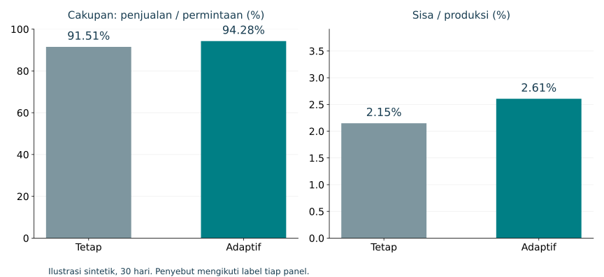{#fig-food-outcomes}

## Menambahkan bukti manusia dan ekosistem

| Lapisan | Bukti virtual | Bukti realisasi yang dibutuhkan |
|---|---|---|
| T | Perhitungan dan aturan | Kualitas data serta prediksi |
| S | Perilaku kebijakan | Integrasi dan gangguan nyata |
| A | Dugaan manfaat | Penggunaan dan pengalaman |
| E | Dugaan distribusi | Kelayakan serta dampak pelaku |
| Kapabilitas | Fitur penjelasan yang dirancang | Pemahaman dan transfer keputusan |

Pilot dapat meminta pedagang menjelaskan rekomendasi, memberi koreksi, dan menyusun rencana pada skenario baru. Pengujian perlu memperhatikan perubahan musiman serta pengalaman awal. Data kemampuan dihubungkan dengan data operasional untuk menilai prinsip cerdas dan mencerdaskan.

## Menjalankan contoh

Dari direktori proyek, jalankan `python scripts/simulate_food.py`. Script menulis CSV, ringkasan JSON, tabel untuk buku, dan plot jika Matplotlib tersedia. Data sintetik memakai seed tetap. Pengguna dapat mengubah parameter, membandingkan hasil, dan menjelaskan alasan perubahan.

## Latihan

Ubah panjang lonjakan permintaan atau kapasitas minimum. Tentukan kebijakan yang memberi cakupan lebih baik dan biaya sisa lebih rendah. Apakah peringkat kebijakan berubah? Kemudian tuliskan satu research question yang memerlukan data manusia dan belum dijawab oleh simulator.

# Rancangan penelitian dan paket bukti

## Pertanyaan, kontribusi, dan kondisi berlaku

Rancangan penelitian menghubungkan apa yang hendak diketahui dengan kegiatan yang menghasilkan bukti. Posisi EASTF, tahap inovasi, dan kematangan membantu menentukan cakupan. Metodologi menjustifikasi cara pekerjaan disusun, sementara Q-Cycle membantu menjaga ketertelusuran keputusan rekayasa.

{#fig-claim}

| Elemen | Isi contoh | Pemeriksaan |
|---|---|---|
| Masalah | Ketidakpastian produksi dan keterbatasan pengetahuan | Ada bukti keadaan awal |
| RQ | Apakah dukungan keputusan meningkatkan hasil dan kemampuan? | Objek serta outcome jelas |
| Kontribusi | Prinsip interaksi rekomendasi–koreksi | Menghasilkan pengetahuan yang dapat digunakan |
| Lapisan | A dan S, dengan konteks E | Batas antarlapisan disebutkan |
| Tahap | Model, virtual, pilot | Jenis bukti dibedakan |
| Metodologi | DSRM atau DRM sesuai penekanan | Alasan pilihan tersedia |

## Protokol evaluasi yang terarah

Outcome misi, kapabilitas, dan keberlanjutan dapat memerlukan pengukuran berbeda. Tetapkan definisi, instrumen, waktu, serta pembanding sebelum melihat hasil. Ukuran sampel mengikuti ketelitian atau kekuatan inferensi yang dibutuhkan serta keterbatasan praktis. Jumlah tertentu tidak dapat ditetapkan hanya dari nama metodologi.

| Pertanyaan | Data | Analisis contoh | Batas |
|---|---|---|---|
| Apakah produksi membaik? | Penjualan, sisa, kekurangan | Perbandingan dengan ketidakpastian | Musim dan kapasitas |
| Apakah pengguna memahami? | Penjelasan beralasan | Rubrik dan pemeriksaan penilai | Instrumen serta pengalaman |
| Apakah kemampuan berpindah? | Tugas transfer | Perubahan dan kelompok pembanding | Kemiripan tugas |
| Apakah pelaku tetap layak? | Biaya, pendapatan, beban | Distribusi dan tren waktu | Horizon serta biaya lengkap |

Bukti kualitatif membantu menjelaskan mekanisme dan pengalaman. Bukti kuantitatif membantu menilai besaran serta variasi. Penggabungannya perlu direncanakan. Perbedaan hasil antarjenis data dapat menjadi temuan penting, bukan sesuatu yang dihapus dari laporan.

## Validitas dan penjelasan alternatif

| Risiko | Contoh | Penanganan rancangan |
|---|---|---|
| Pengaruh pelatihan | Kelompok intervensi menerima pelatihan tambahan | Jelaskan dan samakan kesempatan yang relevan |
| Perubahan konteks | Jadwal kuliah berubah | Catat konteks dan periode |
| Seleksi | Peserta lebih termotivasi | Laporkan cara pemilihan |
| Ukuran proksi | Kepuasan dianggap kemampuan | Ukur outcome yang dituju |
| Bias model | Parameter sintetik terlalu menguntungkan | Sensitivitas dan skenario beragam |
| Klaim terlalu luas | Pilot disebut berlaku universal | Nyatakan populasi dan kondisi |

Penanganan risiko mengikuti kebutuhan bukti. Pengujian acak dapat membantu pada pertanyaan tertentu, sedangkan studi kasus mendalam dapat sesuai untuk mekanisme organisasi yang kompleks. Metodologi tidak menggantikan alasan pemilihan desain penelitian.

## Buku besar klaim dan bukti

| ID | Klaim | Bukti tersedia | Status | Tindakan berikutnya |
|---|---|---|---|---|
| K1 | Aturan produksi memenuhi kapasitas | Pemeriksaan kode dan output | Didukung pada contoh | Uji implementasi |
| K2 | Kebijakan meningkatkan outcome | Simulasi sintetik | Terbatas pada skenario | Kalibrasi dan pilot |
| K3 | Pedagang semakin mampu | Belum diukur | Hipotesis | Uji pemahaman dan transfer |
| K4 | Ekosistem berkelanjutan | Model parsial | Belum cukup | Ukur biaya serta distribusi |

Status dapat berupa hipotesis, didukung pada kondisi tertentu, atau belum terjawab. Kata “tervalidasi” perlu selalu diikuti apa yang divalidasi, terhadap apa, dan dalam kondisi apa. Pemeriksaan kode menunjukkan implementasi mengikuti aturan; ia belum membuktikan aturan menggambarkan kenyataan.

## Anatomi laporan

| Bagian laporan | Pertanyaan pembaca | Visual utama |
|---|---|---|
| Masalah | Mengapa perlu diteliti? | Baseline dan peta pelaku |
| Pengetahuan awal | Apa yang sudah diketahui? | Tabel literatur dan gap |
| RQ dan kontribusi | Apa yang akan dijawab? | PICOC dan EASTF |
| Metode | Bagaimana bukti dihasilkan? | Alur metodologi |
| Rancangan | Bagaimana solusi bekerja? | Fungsi dan arsitektur |
| Hasil | Apa yang diamati? | Tabel, plot, ketidakpastian |
| Diskusi | Apa artinya dan batasnya? | Buku besar klaim |
| Kesimpulan | Jawaban apa didukung? | RQ–jawaban–bukti |

Dalam penelitian rekayasa, artefak dan pengetahuan perlu dinyatakan bersama. Deskripsi fitur menjelaskan apa yang dibangun. Kontribusi menjelaskan apa yang dapat dipelajari tentang solusi atau masalah. Bukti menentukan batas penggunaan pengetahuan itu.

## Latihan

Susun paket satu halaman: PICOC, lapisan kontribusi, pilihan metodologi, empat keputusan Q-Cycle, tahap inovasi, dan tiga klaim beserta bukti. Minta rekan menilai satu lompatan inferensi yang belum didukung. Revisi rumusan agar dapat ditelaah.

# Visual dan tabel sebagai infrastruktur penjelasan

## Representasi yang membawa penalaran

Visual dan tabel dalam buku ini berfungsi sebagai infrastruktur penjelasan. Diagram menyatakan objek serta hubungan. Tabel menjaga pemetaan dan perbandingan. Plot memperlihatkan pola angka. Prosa menjelaskan alasan, asumsi, dan implikasi yang tidak cukup diwakili bentuk visual.

{#fig-visual}

| Kebutuhan penjelasan | Representasi | Yang harus terlihat |
|---|---|---|
| Urutan dan iterasi | Flowchart atau state diagram | Kondisi dan arah hubungan |
| Fungsi dan kendali | Diagram blok | Masukan, keluaran, umpan balik |
| Struktur dan peran | Diagram arsitektur | Komponen, antarmuka, kewenangan |
| Pemetaan yang tepat | Tabel | Baris, kolom, definisi |
| Perubahan angka | Plot | Sumbu, unit, data, ketidakpastian |
| Kondisi nyata | Foto atau gambar | Konteks dan sumber |

## Kosakata dan grammar visual

Sebuah diagram mempunyai kosakata berupa simpul, label, garis, dan simbol. Grammar-nya menentukan arti hubungan. Panah dapat berarti urutan, aliran data, pengaruh, atau ketergantungan; caption perlu menyatakan artinya. Panah dalam diagram konseptual tidak otomatis menunjukkan hubungan sebab-akibat yang sudah terbukti.

| Elemen | Arti yang dapat digunakan | Risiko |
|---|---|---|
| Kotak | Fungsi, komponen, atau keadaan | Jenis objek tercampur |
| Panah | Aliran atau hubungan tertentu | Pembaca menganggap kausalitas |
| Warna | Pengelompokan atau penekanan | Arti bergantung warna saja |
| Posisi | Lapisan atau kedekatan | Hierarki yang tidak dimaksudkan |
| Caption | Tujuan, sumber, batas | Gambar terlepas dari argumen |

Konsistensi lebih penting daripada banyaknya dekorasi. Label yang sama sebaiknya digunakan pada diagram, tabel, dan prosa. Ketika istilah berubah, pembaca perlu mengetahui apakah objeknya berubah atau hanya namanya.

## Tabel sebagai kontrak penjelasan

Tabel yang baik menetapkan dimensi perbandingan. Membandingkan DRM dan DSRM memerlukan baris yang sama, seperti fokus, kegiatan, keluaran, dan bukti. Membandingkan kebijakan produksi memerlukan definisi ukuran serta penyebut. Sel kosong perlu dijelaskan sebagai tidak berlaku, belum diketahui, atau belum diukur.

| Prinsip tabel | Pelaksanaan | Contoh |
|---|---|---|
| Satu tujuan | Kolom mengikuti pertanyaan | Tahap–bukti–gerbang |
| Kategori konsisten | Jenis isi sama pada kolom | Semua baris menyatakan outcome |
| Unit jelas | Unit pada judul atau label | Rupiah per periode |
| Status data | Bedakan sintetik dan lapangan | Caption simulasi |
| Batas klaim | Catatan dekat hasil | Skenario dan horizon |

## Visual dalam Q-Cycle dan EASTF

| Ruang | Visual yang membantu | Tabel pasangan |
|---|---|---|
| Q1 | Black box perubahan dan peta pelaku | Kebutuhan serta kriteria |
| Q2 | Fungsi, state, aliran, kurva | Fungsi dan persyaratan |
| Q3 | Arsitektur dan kendali | Alokasi serta trade-off |
| Q4 | Plot hasil dan jejak realisasi | Uji, bukti, batas |
| EASTF | Lapisan dan arah hubungan | RQ, kontribusi, outcome |

Diagram dapat membuka struktur argumen. Tabel dapat menguji konsistensinya. Jika kebutuhan tidak mempunyai fungsi atau uji, matriks ketertelusuran memperlihatkan kekosongan tersebut. Jika plot menunjukkan perbaikan satu outcome tetapi penurunan outcome lain, tabel membantu membandingkan trade-off secara tepat.

## Slide dan buku mempunyai kepadatan berbeda

Buku memungkinkan pembaca berhenti, memeriksa tabel, dan membaca penjelasan. Slide mendukung perhatian bersama dalam waktu terbatas. Deck memakai satu konsep utama per halaman, label pendek, serta catatan pengajar untuk detail. Tabel buku yang panjang dibagi menjadi beberapa slide sesuai tujuan penjelasan.

| Media | Isi utama | Tempat detail |
|---|---|---|
| Buku | Argumen lengkap dengan visual | Paragraf, tabel, lampiran |
| Slide | Hubungan atau perbandingan inti | Catatan pengajar dan buku |
| Lembar kerja | Keputusan yang harus dibuat | Jawaban peserta |
| Kode contoh | Mekanisme yang dapat diperiksa | Parameter dan keluaran |

## Pemeriksaan visual akademik

Periksa apakah visual menjawab pertanyaan, istilahnya konsisten, dan setiap hubungan mempunyai arti. Periksa keterbacaan pada ukuran penggunaan, bukan hanya pada editor. Untuk plot, cek sumbu dan unit. Untuk tabel, cek penyebut serta konteks. Untuk semua representasi, jaga sumber dan status klaim.

## Latihan

Ambil satu paragraf penjelasan dari proyek Anda. Ubah menjadi diagram dengan caption dan tabel pasangan. Tentukan hubungan yang sebelumnya tersembunyi. Sebutkan satu inferensi yang dapat disalahartikan dari visual tersebut, lalu perbaiki label atau caption.

# Lampiran A: Glosarium {.unnumbered}

| Istilah | Pengertian dalam buku |
|---|---|
| Artefak | Hasil rancangan yang dapat berupa perangkat, perangkat lunak, model, metode, layanan, atau pengaturan organisasi |
| Aspirasi | Keadaan atau pencapaian yang ingin diraih manusia |
| ASTF | Application, System, Technology, Fundamental Research |
| Baseline | Keadaan atau pendekatan pembanding yang dijelaskan |
| Black box | Representasi yang memusatkan perhatian pada masukan, keluaran, dan tujuan |
| Cerdas | Kemampuan membantu pemahaman, keputusan, tindakan, dan adaptasi |
| Mencerdaskan | Sifat interaksi yang mendukung pertumbuhan kemampuan manusia |
| Memampukan | Memperluas kemampuan serta kesempatan nyata untuk bertindak |
| Collective intelligence | Kecerdasan yang muncul melalui pengetahuan dan proses bersama |
| Contribution | Pengetahuan atau kemampuan baru yang didukung bukti sesuai ruang lingkup |
| Context | Lingkungan dan kondisi yang memengaruhi penerapan |
| Design | Perumusan alternatif serta keputusan untuk solusi yang diinginkan |
| Digital twin | Representasi digital sasaran yang mendukung hubungan data, analisis, serta penggunaan sepanjang siklus hidup |
| Prototipe digital twin | Representasi virtual pada tahap pengembangan dengan status serta batas yang dijelaskan |
| DRM | Design Research Methodology dari Blessing dan Chakrabarti |
| DSR | Design Science Research, pendekatan penelitian melalui penciptaan dan evaluasi artefak |
| DSRM | Design Science Research Methodology, dalam buku merujuk model Peffers dan rekan |
| EASTF | Ecosystem, Application, System, Technology, Fundamental Research, sesuai rumusan percakapan |
| Ekosistem | Jaringan pelaku, misi, sumber daya, teknologi, aturan, dan lingkungan yang saling bergantung |
| Engineering | Realisasi dan pengelolaan solusi agar memenuhi persyaratan pada kondisi nyata |
| Fidelity | Detail dan ketepatan representasi yang diperlukan untuk suatu tujuan |
| Full release | Versi yang resmi tersedia pada cakupan penggunaan yang ditetapkan |
| Fundamental research | Penyelidikan prinsip, hubungan, mekanisme, atau batas dasar |
| Gagasan | Usulan perubahan serta dugaan mekanisme dan manfaat |
| Intervention | Tindakan, metode, atau teknologi yang dikaji |
| Kapabilitas | Kemampuan dan kesempatan bermakna untuk bertindak |
| Kematangan | Kesiapan yang didukung bukti untuk suatu lingkup penggunaan |
| Lab demo | Demonstrasi fungsi inti dalam kondisi laboratorium terkendali |
| MA-DT | Multi-Agentic Digital Twin, representasi interaksi banyak agen |
| Metode | Prosedur menjalankan kegiatan penelitian |
| Metodologi | Logika yang menjustifikasi pilihan metode serta hubungan bukti dan kesimpulan |
| Misi | Tujuan tindakan yang menghasilkan keluaran dan manfaat |
| Model | Representasi struktur, hubungan, perilaku, atau asumsi |
| MOE | Dalam konteks ekosistem: Mission-Oriented Ecosystem |
| MoE | Dalam konteks ukuran: Measure of Effectiveness; buku membedakannya dari MOE |
| Outcome | Hasil atau perubahan yang dinilai |
| Output | Keluaran kegiatan atau misi |
| PICOC | Population, Intervention, Comparison, Outcome, Context |
| PSKVE | Products, Services, Knowledge, Values, Environment |
| PUDAL | Perceive, Understand, Decide, Act, Learn |
| Q-Cycle | Siklus masalah, fungsi, arsitektur, konstruksi dan bukti |
| Realisasi | Perwujudan rancangan pada lingkungan nyata |
| Release candidate | Versi calon rilis yang menunggu hasil penerimaan sesuai kriteria |
| Research question | Pertanyaan yang mengarahkan pencarian pengetahuan dan bukti |
| Riset | Kegiatan menghasilkan atau menguji pengetahuan yang dapat dipertanggungjawabkan |
| RMOV | Resource, Mission, Output, Value |
| Sustainability | Kelayakan melanjutkan misi dengan menjaga prasyarat masa depan |
| Testbed | Lingkungan atau fasilitas uji yang mewakili aspek penggunaan |
| Traceability | Ketertelusuran hubungan kebutuhan, keputusan, dan bukti |
| Transfer | Penggunaan kemampuan pada tugas atau keadaan baru |
| Triune intelligence | Integrasi kecerdasan manusia, kolektif, dan artifisial |
| Validasi | Penilaian terhadap sasaran atau kenyataan sesuai klaim yang dinyatakan |
| Verifikasi | Pemeriksaan bahwa implementasi mengikuti spesifikasi atau model |

Singkatan dapat mempunyai arti lain di bidang lain. Penulis perlu menyatakan kepanjangan pada penggunaan pertama dan menjaga konsistensi selanjutnya.

# Lampiran B: Lembar kerja penelitian dan rekayasa {.unnumbered}

Lembar ini merupakan template yang dapat diisi. Kolom kosong sengaja disediakan untuk keputusan proyek, bukan data yang belum dilengkapi pada materi buku. Gunakan satu topik yang sama untuk seluruh lembar agar ketertelusuran dapat diperiksa.

## Lembar 1: misi dan pihak

| Elemen | Isian proyek |
|---|---|
| Kebutuhan dasar atau aspirasi | |
| Keadaan awal dan buktinya | |
| Keadaan yang diinginkan | |
| USER, SOURCE, OPERATOR, REGULATOR | |
| Batas finansial, sosial, operasional, lingkungan | |
| Hasil misi yang akan diukur | |
| Pertumbuhan kapabilitas yang akan diukur | |

## Lembar 2: PICOC

| Unsur | Rumusan | Implikasi pengujian |
|---|---|---|
| Population | | |
| Intervention | | |
| Comparison | | |
| Outcome | | |
| Context | | |

Pertanyaan utama: ______________________________________________________

Alasan pilihan metodologi: _______________________________________________

## Lembar 3: EASTF

| Lapisan | Pertanyaan | Kontribusi | Bukti |
|---|---|---|---|
| E | | | |
| A | | | |
| S | | | |
| T | | | |
| F | | | |

Kontribusi utama berada pada: ____________________________________________

Jembatan antarlapisan yang belum terbukti: _________________________________

## Lembar 4: Q-Cycle

| Kebutuhan Q1 | Fungsi Q2 | Komponen/peran Q3 | Uji dan bukti Q4 |
|---|---|---|---|
| | | | |
| | | | |
| | | | |

Gangguan untuk PUDAL: __________________________________________________

Masalah struktural untuk Q-Cycle berikutnya: ________________________________

## Lembar 5: perwujudan dan kesiapan

| Dimensi | Posisi saat ini | Gerbang berikutnya | Bukti yang diperlukan |
|---|---|---|---|
| Tahap inovasi | | | |
| Kematangan artefak | | | |
| Kekuatan kontribusi ilmiah | | | |
| Pertumbuhan kapabilitas manusia | | | |

## Lembar 6: triune intelligence dan keputusan

| Keputusan | Masukan AI | Penilaian manusia | Otoritas/proses kolektif | Jalur koreksi |
|---|---|---|---|---|
| | | | | |
| | | | | |

## Lembar 7: klaim dan bukti

| Klaim | Data/metode | Status | Batas berlaku | Pekerjaan berikutnya |
|---|---|---|---|---|
| | | | | |
| | | | | |
| | | | | |

## Lembar 8: komunikasi visual

| Pertanyaan penjelasan | Diagram/tabel/plot | Sumber dan status data | Inferensi yang perlu dibatasi |
|---|---|---|---|
| | | | |
| | | | |

Periksa apakah semua istilah pada visual mempunyai definisi, setiap klaim mempunyai bukti, serta setiap kebutuhan mempunyai ukuran. Minta rekan menguji satu hubungan yang paling lemah.

# Lampiran C: Panduan kuliah {.unnumbered}

## Enam pertemuan

Rancangan berikut merupakan usulan pengajaran. Durasi dapat disesuaikan dengan pengalaman peserta. Setiap pertemuan 90 menit dapat terdiri dari penjelasan visual 25 menit, pembacaan kasus 20 menit, kerja kelompok 30 menit, dan diskusi bukti 15 menit. Deck utama berisi 64 slide termasuk sampul dan rujukan.

| Pertemuan | Bab | Slide | Tujuan | Aktivitas |
|---|---|---|---|---|
| 1 | 1–3 | 2–12 | Membedakan kegiatan dan metodologi | PICOC serta pemilihan DRM/DSRM |
| 2 | 4–6 | 13–26 | Memodelkan TISE dan Q-Cycle | Peta peran dan ketertelusuran |
| 3 | 7 | 27–33 | Menentukan lapisan kontribusi | Lima RQ untuk satu topik |
| 4 | 8 | 34–40 | Menyatakan tahap dan bukti | Gerbang dari virtual ke pilot |
| 5 | 9–11 | 41–50 | Menilai pemberdayaan serta profesi | Rancangan outcome kapabilitas |
| 6 | 12–14 | 51–64 | Menyusun paket penelitian | Simulasi dan presentasi visual |

## Capaian dan artefak belajar

| Capaian | Artefak mahasiswa | Kriteria penilaian |
|---|---|---|
| Pertanyaan terarah | Tabel PICOC | Objek, intervensi, hasil, konteks jelas |
| Justifikasi penelitian | Pilihan metodologi | Hubungan metode dan bukti |
| Penalaran rekayasa | Matriks Q-Cycle | Ketertelusuran kebutuhan sampai uji |
| Posisi kontribusi | Peta EASTF | Batas antarlapisan |
| Evaluasi manusia | Protokol kapabilitas | Outcome dan waktu sesuai tujuan |
| Komunikasi | Diagram, tabel, narasi | Ketepatan label serta klaim |

## Pertanyaan pembuka diskusi

1. Apakah artefak yang berhasil selalu merupakan hasil riset?
2. Bukti apa membedakan demonstrasi dari evaluasi?
3. Apakah teknologi yang lebih akurat selalu memperbaiki ekosistem?
4. Apa yang harus diketahui sebelum maju dari model ke pilot?
5. Bagaimana mengukur manusia semakin mampu menggunakan bantuan?
6. Apa tanggung jawab rekayasawan setelah rilis?

## Penggunaan deck

Buka `reading/kuliah.html` untuk presentasi. Panah berpindah slide, `O` menampilkan overview, dan `S` membuka catatan pengajar. Catatan berisi tujuan slide, cara membaca visual, pertanyaan diskusi, serta rujukan. Speaker view paling andal melalui server lokal. Semua gambar utama tersedia sebagai SVG dan sumber Mermaid.

## Penilaian tugas terpadu

Rubrik berikut merupakan contoh, bukan ketentuan program studi.

| Dimensi | Bobot contoh | Kriteria |
|---|---:|---|
| Masalah, misi, PICOC | 20% | Terarah dan didukung baseline |
| Kontribusi serta metodologi | 20% | Klaim dan alasan yang dapat ditelaah |
| Fungsi, arsitektur, ketertelusuran | 25% | Hubungan kebutuhan sampai bukti |
| Kapabilitas dan keberlanjutan | 20% | Outcome serta batas yang nyata |
| Visual dan komunikasi | 15% | Tepat, terbaca, sumber jelas |

## Proyek akhir contoh

Kelompok memilih satu layanan kampus. Mereka menyusun misi, lima pertanyaan EASTF, dan kontribusi utama. Mereka mengembangkan model serta rancangan pengujian, menilai tahap inovasi dan kematangan, kemudian mempresentasikan paket bukti. Realisasi penuh tidak diwajibkan pada tugas ini. Klaim disesuaikan dengan apa yang benar-benar dikerjakan.

# Lampiran D: Contoh jawaban dan umpan balik {.unnumbered}

Jawaban berikut menunjukkan arah penalaran. Topik serta kondisi berbeda dapat menghasilkan jawaban lain yang tepat. Nilai jawaban berdasarkan alasan dan ketertelusuran, bukan kesamaan kata.

| Bab | Contoh jawaban inti | Hal yang perlu diperiksa |
|---|---|---|
| 1 | Pola permintaan merupakan pertanyaan riset. Pemilihan prapesan merupakan desain. Uji kapasitas merupakan engineering. | Tujuan, keluaran, dan bukti dibedakan |
| 2 | P mahasiswa pemula, I tutor dengan petunjuk, C materi sama dengan bantuan yang dijelaskan, O hasil tugas serta transfer, C pembelajaran mandiri. | Kesempatan belajar dan pengalaman awal |
| 3 | DRM sesuai jika fokus memahami serta memperbaiki cara perencanaan. DSRM sesuai jika fokus artefak dukungan keputusan. | Pilihan dijustifikasi melalui RQ |
| 4 | AI menghitung alternatif, pedagang menilai kelayakan, proses kolektif mengatur kewenangan. | Jalur koreksi dan tanggung jawab |
| 5 | Permintaan naik diamati, kapasitas dianalisis, perubahan produksi disetujui, hasil dicatat, aturan diperbaiki. | Learn mempunyai perubahan yang jelas |
| 6 | Penyesuaian jadwal rutin masuk PUDAL. Hilangnya sumber pasokan tetap dapat memerlukan arsitektur baru melalui Q-Cycle. | Mengapa arsitektur lama tidak cukup |
| 7 | Lima RQ memiliki outcome berbeda. Kontribusi utama dapat berada pada S tanpa klaim E yang sudah terbukti. | Bukti antarlapisan belum naik otomatis |
| 8 | Posisi S/Q4/prototipe digital twin/lab demo memerlukan pilot sebelum klaim manfaat lapangan. | Keempat dimensi terpisah |
| 9 | Fitur penjelasan diuji melalui pemahaman serta transfer. Hasil tugas dapat naik tanpa kemampuan pengguna meningkat. | Waktu, instrumen, aksesibilitas |
| 10 | 1.0 menilai layanan, 2.0 menilai kemampuan, 3.0 menilai penciptaan ekosistem baru. | Prasyarat versi terdahulu |
| 11 | Portofolio menyebut misi, keputusan, tahap, bukti, batas, dan perbaikan. | Tanggung jawab setelah penyerahan |
| 12 | Ubah skenario dan hitung ulang. Peringkat kebijakan bergantung pada kondisi. | Data sintetik tidak menjadi klaim empiris |
| 13 | Klaim yang belum mempunyai data ditulis sebagai hipotesis. | Instrumen serta metode menjawab RQ |
| 14 | Diagram menjelaskan mekanisme, tabel memetakan definisi, caption membatasi inferensi. | Arti panah dan sumber data |

## Contoh paket satu halaman

Misi: meningkatkan akses pangan sambil membantu pedagang belajar menilai produksi. RQ: apakah rekomendasi yang dapat dijelaskan dan dikoreksi meningkatkan cakupan serta kemampuan keputusan dibandingkan praktik biasa? Lapisan utama: A dan S. Tahap: model dan pilot. Metodologi: DSRM untuk artefak, dengan studi baseline untuk memahami konteks. Ukuran: cakupan, sisa, pendapatan, pemahaman, dan transfer. Bukti: data operasi, penilaian tugas, dan wawancara. Batas: satu kantin, periode yang dinyatakan, serta kapasitas yang diukur.

## Contoh kritik yang membangun

| Pernyataan | Kritik | Revisi yang dapat dilakukan |
|---|---|---|
| AI meningkatkan kesejahteraan | Outcome dan mekanisme belum jelas | Tetapkan kebutuhan, aspirasi, dan ukuran |
| Model telah tervalidasi | Sasaran serta pembanding tidak disebut | Nyatakan data dan kondisi validasi |
| Digital twin membuktikan manfaat | Simulasi hanya sebagian mekanisme | Tambahkan bukti penggunaan nyata |
| Pengguna puas berarti semakin mampu | Kepuasan bukan ukuran kapabilitas langsung | Tambahkan pemahaman dan transfer |
| Sistem siap digunakan semua orang | Cakupan uji lebih sempit | Batasi lingkup rilis dan rencana perluasan |

Umpan balik sebaiknya menyebut celah yang spesifik dan tindakan yang dapat dilakukan. Kritik atas klaim bukan kritik atas nilai pribadi peneliti. Kejujuran tentang batas membantu menentukan langkah berikutnya.

# Rujukan {.unnumbered}

Literatur publik digunakan untuk definisi DRM, DSRM, design science, PICOC, dan digital twin. Dokumen TISE merupakan rumusan konseptual penulis. EASTF serta integrasi kerangka dalam buku ini mengikuti percakapan 1 Oktober 2026. Metadata edisi artikel Peffers mengikuti jurnal: 2007, volume 24 nomor 3, yang merupakan edisi musim dingin 2007–2008.

::: {#refs}
:::
