## Peta kuliah {#s02}

| Bagian | Pertanyaan |
| --- | --- |
| Penelitian | Pengetahuan dan bukti apa yang diperlukan? |
| TISE dan Q-Cycle | Bagaimana misi direkayasa? |
| EASTF dan inovasi | Di lapisan dan tahap mana kontribusi berada? |
| Manusia dan profesi | Apakah penggunaan semakin memampukan? |
| Kasus terpadu | Bagaimana semua kerangka digunakan? |

::: {.notes}
Tujuan kuliah adalah menghubungkan pertanyaan, keputusan, realisasi, dan bukti. Gunakan pangan kampus sebagai kasus yang sama sepanjang penjelasan. Tunjukkan bahwa tiap kerangka mempunyai peran. Enam sesi dapat memakai pembagian pada lampiran panduan kuliah. Materi TISE mengikuti dokumen Armein Z. R. Langi, 23 Agustus 2026. EASTF dan rekayasawan paripurna mengikuti percakapan 1 Oktober 2026.
:::

## Riset, desain, engineering {#s03}

| Kegiatan | Tujuan | Keluaran |
| --- | --- | --- |
| Riset | Menghasilkan pengetahuan | Temuan dan bukti |
| Desain | Merumuskan solusi | Konsep dan arsitektur |
| Engineering | Merealisasikan kinerja | Artefak dan operasi |

::: {.takeaway}
Pengetahuan, keputusan rancangan, dan kinerja memerlukan bukti masing-masing.
:::

::: {.notes}
Baca tiga baris sebagai perhatian yang saling beririsan. Satu pekerjaan membangun simulator dapat mendukung ketiganya. Minta peserta menjelaskan apa yang hendak dipelajari, keputusan apa yang dibuat, dan kinerja apa yang harus dipertahankan. Produk yang selesai belum otomatis menyatakan kontribusi ilmiah. Buku Bab 1 membahas perbedaan tujuan serta bukti.
:::

## Metode dan metodologi {#s04}

| Aspek | Metode | Metodologi |
| --- | --- | --- |
| Pertanyaan | Bagaimana kegiatan dilakukan? | Mengapa pendekatan memadai? |
| Cakupan | Prosedur tertentu | Logika penelitian |
| Contoh | Wawancara dan eksperimen | DRM atau DSRM |

::: {.notes}
Metodologi bukan sekadar daftar metode. Ia menjustifikasi hubungan masalah, pertanyaan, data, analisis, dan kesimpulan. Contohkan penelitian pangan yang memakai wawancara untuk pengalaman, log transaksi untuk pola, dan pilot untuk penggunaan. Minta peserta menunjukkan alasan pemilihan setiap metode. Rujukan pengembangan materi berada pada Buku Bab 2.
:::

## PICOC {#s05}

| Unsur | Pertanyaan |
| --- | --- |
| Population | Siapa atau apa yang diteliti? |
| Intervention | Pendekatan apa yang dikaji? |
| Comparison | Dibandingkan dengan apa? |
| Outcome | Hasil apa yang dinilai? |
| Context | Dalam kondisi apa? |

::: {.notes}
PICOC merupakan kerangka perumusan pertanyaan, terutama dalam kajian literatur sistematis. Dua C berarti pembanding dan konteks. Sebutkan bahwa unsur pembanding digunakan sesuai pertanyaan. Kerangka ini belum menentukan ukuran sampel atau analisis. Sumber: Kitchenham dan Charters, 2007, Guidelines for Performing Systematic Literature Reviews in Software Engineering, bagian 5.3.2. https://homepages.dcc.ufmg.br/~figueiredo/disciplinas/papers/guidelines-kitchenham.pdf
:::

## PICOC pada tutor AI {#s06}

| Unsur | Rumusan contoh |
| --- | --- |
| P | Mahasiswa pemula |
| I | Tutor dengan petunjuk bertahap |
| C | Materi sama, bantuan pembanding dijelaskan |
| O | Keberhasilan tugas dan transfer kemampuan |
| C | Pembelajaran mandiri daring |

::: {.notes}
Ini merupakan contoh rancangan pedagogis, bukan hasil empiris. Minta peserta merumuskan satu pertanyaan dari tabel. Tekankan bahwa kesempatan belajar, waktu, dan pengalaman awal perlu dipertimbangkan. Hasil tugas dan kemampuan melakukan tugas baru merupakan outcome berbeda. PICOC membantu memperjelas rancangan, sementara pemilihan metode memerlukan justifikasi tersendiri.
:::

## Empat tahap DRM {#s07}

{.diagram}

::: {.takeaway}
Pemahaman faktor desain menjadi dasar pengembangan dukungan.
:::

::: {.notes}
DRM menata klarifikasi riset, pemahaman desain, pengembangan dukungan, dan evaluasi. Panah kembali menunjukkan iterasi. Kedalaman tahap mengikuti fokus proyek. Tanyakan faktor apa yang perlu dipahami sebelum mengembangkan alat bantu. Sumber: Blessing dan Chakrabarti, DRM, a Design Research Methodology, 2009. https://link.springer.com/book/10.1007/978-1-84882-587-1
:::

## Bukti perbaikan dalam DRM {#s08}

| Pertanyaan | Contoh bukti |
| --- | --- |
| Mengapa rencana produksi meleset? | Observasi dan data keputusan |
| Apakah dukungan dapat digunakan? | Pengujian penerapan |
| Apakah hasil membaik? | Outcome sesuai kriteria |

::: {.notes}
Contoh pangan menunjukkan hubungan faktor masalah, dukungan, dan keberhasilan. Alat dapat mudah dipakai tanpa memperbaiki hasil. Sebaliknya, hasil dapat berubah karena kondisi lain. Minta peserta menjelaskan mekanisme perbaikan. Sumber untuk logika evaluasi: Blessing dan Chakrabarti, 2002, DRM: A Design Research Methodology. https://dm.iisc.ac.in/cpdm/ideaslab090320/paper_scans/UID_41.pdf
:::

## Enam kegiatan DSRM {#s09}

| Kegiatan | Tujuan |
| --- | --- |
| Masalah dan motivasi | Menetapkan masalah yang bernilai |
| Sasaran solusi | Merumuskan hasil yang diharapkan |
| Desain dan pengembangan | Membangun artefak |
| Demonstrasi | Menunjukkan penggunaan |
| Evaluasi | Menilai pencapaian sasaran |
| Komunikasi | Menyampaikan artefak dan pengetahuan |

::: {.notes}
DSRM Peffers menata masalah dan motivasi, sasaran, desain dan pengembangan, demonstrasi, evaluasi, serta komunikasi. Ini adalah metodologi tertentu dalam pendekatan DSR. Artefak dapat menjadi sarana menghasilkan pengetahuan. Sumber: Peffers et al., 2007, Journal of Management Information Systems, 24(3), 45–77. https://www.jmis-web.org/articles/765
:::

## Demonstrasi dan evaluasi {#s10}

| Perhatian | Demonstrasi | Evaluasi |
| --- | --- | --- |
| Tujuan | Menunjukkan penggunaan | Menilai pencapaian sasaran |
| Contoh | Rekomendasi pada satu kasus | Perbandingan outcome |
| Klaim | Artefak dapat digunakan | Manfaat pada kondisi uji |

::: {.notes}
Gunakan contoh rekomendasi produksi. Menampilkan keluaran belum menunjukkan seberapa baik hasilnya. Evaluasi memerlukan ukuran, pembanding, dan kondisi. Kegiatan bisa berbagi data tetapi mempunyai tujuan bukti berbeda. Sumber tahap: Peffers et al., 2007. https://www.jmis-web.org/articles/765
:::

## Penekanan DRM dan DSRM {#s11}

| Aspek | DRM | DSRM |
| --- | --- | --- |
| Fokus | Pemahaman dan perbaikan desain | Artefak pemecahan masalah |
| Keadaan awal | DS-I tersendiri | Masalah dan sasaran |
| Pengembangan | Dukungan desain | Desain artefak |
| Penilaian | Penerapan dan perbaikan | Demonstrasi dan evaluasi |

::: {.notes}
Tabel ini merupakan sintesis perbandingan. Keduanya tidak dibatasi secara mutlak pada satu jenis artefak. Pilih berdasarkan pertanyaan penelitian dan jelaskan fungsi kerangka pendukung. Sumber: Blessing dan Chakrabarti, 2009; Peffers et al., 2007. DOI 10.1007/978-1-84882-587-1 dan 10.2753/MIS0742-1222240302.
:::

## Peran kerangka penelitian {#s12}

| Kerangka | Peran |
| --- | --- |
| PICOC | Memperjelas pertanyaan |
| DRM atau DSRM | Menata logika penelitian |
| Q-Cycle | Menelusuri keputusan rekayasa |
| EASTF | Menentukan lapisan kontribusi |

::: {.notes}
Hubungan ini merupakan pilihan integrasi dalam materi, bukan pemetaan tahap resmi satu-satu. Minta peserta memilih kerangka utama lalu menjelaskan kebutuhan kerangka lain. Hindari penumpukan istilah tanpa pekerjaan yang dapat diperiksa. Rujukan TISE: Langi, Apa Itu TISE?, 23 Agustus 2026. EASTF: rumusan percakapan 1 Oktober 2026.
:::

## TISE {#s13}

> **Triune-Intelligence Smart Engineering**

Rekayasa ekosistem berorientasi misi untuk melayani kebutuhan publik secara berkelanjutan.

::: {.notes}
Definisi mengikuti dokumen konseptual Langi, 23 Agustus 2026. Mulai dari kebutuhan manusia serta organisasi yang otonom. Sebutkan tiga sumber kecerdasan, Q-Cycle, PUDAL, dan digital twin sebagai bagian yang akan dijelaskan. Dokumen menjelaskan kerangka konseptual, bukan bukti bahwa semua kemampuan sudah terimplementasi. Sumber: Apa Itu TISE? dan TISE: Transkrip Presentasi Akademik.
:::

## Tiga sumber kecerdasan {#s14}

{.diagram}

::: {.notes}
Baca masukan manusia, kolektif, dan AI sebagai pembagian kontribusi. Hasil tindakan kembali memperbarui ketiganya. Manusia membawa tujuan dan tanggung jawab. Kolektif membawa pengetahuan dan legitimasi. AI membawa analitik dan alternatif. Sumber: Langi, Apa Itu TISE?, halaman 2–3, dan Transkrip Presentasi Akademik, slide 5–6.
:::

## Kemampuan dan otoritas keputusan {#s15}

| Peran | Kontribusi pada produksi pangan |
| --- | --- |
| AI | Menghitung perkiraan dan alternatif |
| Pedagang | Menilai bahan, tenaga, serta kondisi dapur |
| Proses kolektif | Menetapkan aturan dan kewenangan |
| Operator | Mencatat keputusan dan hasil |

::: {.notes}
Sistem yang mampu menghitung belum memiliki kewenangan untuk menentukan semua tindakan. Tanyakan siapa menyetujui perubahan produksi dan harga. Jalur koreksi perlu terlihat. Contoh ini merupakan penerapan konseptual TISE pada pangan kampus, bukan hasil pengujian lapangan. Sumber: Langi, 2026, materi TISE tentang alokasi triune intelligence.
:::

## Resource, Mission, Output, Value {#s16}

{.diagram}

::: {.notes}
RMOV menyatakan hubungan sumber daya, misi, keluaran, dan nilai. Nilai mendukung siklus berikutnya. Porsi makanan merupakan output. Akses pangan, pendapatan, dan pengetahuan merupakan nilai yang perlu diukur sesuai misi. Sumber: Langi, Apa Itu TISE?, halaman 4. Berikan contoh sumber daya yang bukan uang, seperti waktu, pengalaman, dan kapasitas.
:::

## Empat peran ekosistem {#s17}

{.diagram}

::: {.notes}
SOURCE menyediakan sumber daya. OPERATOR mengoordinasikan. USER menerima atau menggunakan hasil. REGULATOR menjaga batas dan kewenangan. Satu organisasi dapat memegang beberapa peran dengan tanggung jawab yang tetap terlihat. Sumber: Langi, Apa Itu TISE?, halaman 4. Gunakan peta untuk menanyakan data apa yang diperlukan dari masing-masing pihak.
:::

## Lima dimensi PSKVE {#s18}

| Dimensi | Perhatian |
| --- | --- |
| Products | Mutu dan ketersediaan produk |
| Services | Akses serta keandalan layanan |
| Knowledge | Pengetahuan dan pembelajaran |
| Values | Komitmen, kepercayaan, martabat |
| Environment | Lingkungan fisik, digital, sosial, kelembagaan |

::: {.notes}
PSKVE mengikuti kepanjangan pada dokumen TISE utama. Nilai tidak dibatasi uang dan lingkungan tidak dibatasi alam fisik. Pilih indikator sesuai konteks. Dimensi tidak harus diringkas ke satu skor yang kehilangan makna. Sumber: Langi, Apa Itu TISE?, halaman 4, dan Transkrip Presentasi Akademik, slide 7.
:::

## Siklus PUDAL {#s19}

{.diagram}

::: {.notes}
Perceive, Understand, Decide, Act, Learn menghubungkan data dengan tindakan dan pembelajaran. Tanyakan keluaran apa yang dicatat pada setiap langkah. Perubahan harus mengikuti kewenangan yang disepakati. Sumber: Langi, Apa Itu TISE?, halaman 4, dan Transkrip Presentasi Akademik, slide 8.
:::

## Proses inti dan kendali adaptif {#s20}

{.diagram}

::: {.notes}
Proses inti menghasilkan keluaran dan nilai. PUDAL mengamati, memahami, dan membantu perubahan. Pembelajaran manusia menjadi masukan bagi adaptasi. Contohkan rekomendasi produksi yang dapat dikoreksi pedagang. Rujukan konseptual: Langi, 2026, TISE dan rumusan arsitektur PSKVE–PUDAL.
:::

## Ruang tindakan yang layak {#s21}

{.diagram}

::: {.notes}
Keberlanjutan menentukan batas finansial, sosial, ekologis, operasional, keselamatan, dan kapabilitas. Optimasi kemudian dilakukan di ruang yang memenuhi batas. Tanyakan apakah keuntungan lokal memindahkan beban ke pelaku lain. Sumber: Langi, Apa Itu TISE?, halaman 5.
:::

## Q-Cycle {#s22}

{.diagram}

::: {.notes}
Empat ruang pertanyaan: masalah dan misi, fungsi dan perilaku, arsitektur, realisasi dan bukti. Hasil kembali ke perumusan berikutnya. Semua keputusan perlu mengacu pada kebutuhan. Sumber: Langi, Apa Itu TISE?, halaman 5–8.
:::

## Q1 dan Q2 {#s23}

| Ruang | Pertanyaan | Contoh |
| --- | --- | --- |
| Q1 | Perubahan apa diperlukan? | Akses pangan dan limbah |
| Q2 | Fungsi apa diperlukan? | Perkiraan, produksi, distribusi |
| Hubungan | Apakah fungsi mendukung kebutuhan? | Kendali jumlah untuk mengurangi sisa |

::: {.notes}
Bedakan kebutuhan dengan fitur. Pernyataan membuat aplikasi sudah memilih bentuk solusi. Fungsi memperkirakan permintaan masih membuka beberapa pilihan teknologi. Minta peserta memberikan satu kebutuhan dan dua alternatif fungsi atau implementasi. Sumber: Langi, Apa Itu TISE?, halaman 7.
:::

## Q3 dan Q4 {#s24}

| Ruang | Pertanyaan | Contoh |
| --- | --- | --- |
| Q3 | Bagaimana fungsi dialokasikan? | AI, pedagang, aturan, antarmuka |
| Q4 | Bagaimana diwujudkan dan diuji? | Simulasi, integrasi, pilot |
| Hubungan | Apakah realisasi memenuhi kebutuhan? | Bukti outcome dan batas |

::: {.notes}
Arsitektur mencakup manusia dan kewenangan. Q4 dapat berupa realisasi virtual atau nyata dengan jenis bukti yang dinyatakan. Kehadiran implementasi belum menyelesaikan validasi. Sumber: Langi, Apa Itu TISE?, halaman 7–8.
:::

## Ketertelusuran kebutuhan sampai bukti {#s25}

{.diagram}

::: {.notes}
Setiap kebutuhan perlu fungsi, elemen arsitektur, dan pengujian. Gunakan satu ID kebutuhan untuk memeriksa semua hubungan. Klaim yang tidak mempunyai uji perlu ditulis sebagai hipotesis atau pekerjaan berikutnya. Sumber: Langi, Apa Itu TISE?, halaman 8. Buku menyediakan matriks yang dapat diisi.
:::

## Dua skala perubahan {#s26}

{.diagram}

::: {.notes}
PUDAL menangani adaptasi rutin dalam arsitektur yang masih layak. Masalah struktural kembali ke Q-Cycle. Tanyakan apakah gangguan pasokan sementara dan hilangnya pemasok permanen memerlukan tindakan yang sama. Sumber: Langi, Apa Itu TISE?, halaman 8, dan Transkrip, slide 8.
:::

## Lapisan EASTF {#s27}

{.diagram}

::: {.takeaway}
Kebutuhan menuju prinsip; kemampuan dan manfaat kembali ke ekosistem.
:::

::: {.notes}
EASTF mengikuti susunan pengguna: Ekosistem, Aplikasi, Sistem, Teknologi, Fundamental Research. Arah turun menelusuri kebutuhan dan gap. Arah naik menghubungkan prinsip, komponen, layanan, dan manfaat. Ini adalah sintesis pedagogis percakapan 1 Oktober 2026, bukan klaim kerangka universal dari literatur.
:::

## Research question pada tiap lapisan {#s28}

| Lapisan | Pertanyaan utama |
| --- | --- |
| E | Bagaimana misi antarpihak berkelanjutan? |
| A | Apakah penggunaan membantu pekerjaan? |
| S | Bagaimana integrasi menghasilkan perilaku? |
| T | Bagaimana kemampuan komponen meningkat? |
| F | Mengapa mekanisme bekerja dan apa batasnya? |

::: {.notes}
Baca tabel sebagai perubahan objek pertanyaan. Keluasan tidak menunjukkan tingkat prestise. Kontribusi utama dapat berada pada lapisan mana pun sesuai tujuan dan bukti. Sumber: rumusan EASTF serta penjelasan integrasinya dalam percakapan 1 Oktober 2026. Buku Bab 7 memberi contoh serta matriks Q-Cycle.
:::

## Ekosistem dan aplikasi {#s29}

| Lapisan | Unit perhatian | Outcome contoh |
| --- | --- | --- |
| E | Pelaku, misi, aturan, sumber daya | Distribusi dan kelayakan |
| A | Penggunaan pada pekerjaan | Manfaat bagi pengguna |

::: {.notes}
Aplikasi berarti penerapan pada suatu pekerjaan, bukan hanya perangkat lunak. Ekosistem menghubungkan pihak yang memiliki misi berbeda. Layanan lebih cepat belum menunjukkan distribusi manfaat yang adil atau usaha yang layak. Contoh pangan merupakan ilustrasi. Tanyakan data apa yang diperlukan untuk berpindah dari klaim A ke E.
:::

## Sistem, teknologi, fundamental {#s30}

| Lapisan | Unit perhatian | Outcome contoh |
| --- | --- | --- |
| S | Fungsi, komponen, kendali | Kinerja terintegrasi |
| T | Mekanisme atau komponen | Kemampuan teknis |
| F | Prinsip dan batas | Pengetahuan dasar |

::: {.notes}
Sistem dapat mencakup manusia dan aturan. Teknologi mewujudkan fungsi. Fundamental menyelidiki prinsip atau hubungan, melalui teori atau eksperimen yang tepat. F dapat menjadi landasan yang sudah diketahui ketika penelitian berfokus pada lapisan lain. Sintesis EASTF, percakapan 1 Oktober 2026.
:::

## Jembatan bukti antarlapisan {#s31}

| Lapisan klaim | Bukti yang perlu diperiksa |
| --- | --- |
| Teknologi | Keunggulan terhadap baseline |
| Sistem | Integrasi dan kinerja keseluruhan |
| Aplikasi | Manfaat pada pekerjaan pengguna |
| Ekosistem | Distribusi manfaat dan keberlanjutan |

::: {.takeaway}
Klaim pada suatu lapisan memerlukan bukti pada lapisan tersebut.
:::

::: {.notes}
Teknologi yang lebih akurat belum otomatis memperbaiki integrasi, penggunaan, atau ekosistem. Diagram menampilkan pertanyaan pada setiap jembatan. Minta peserta menyebut satu mekanisme yang membuat keunggulan teknis gagal menjadi manfaat. Diagram adalah alat inferensi pada Buku Bab 7.
:::

## EASTF dan Q-Cycle {#s32}

| Dimensi | Menjelaskan | Contoh |
| --- | --- | --- |
| EASTF | Objek serta lapisan kontribusi | Sistem koordinasi |
| Q-Cycle | Ruang penalaran rekayasa | Arsitektur dan bukti |
| Gabungan | Posisi pekerjaan | Lapisan S, Q3 dan Q4 |

::: {.notes}
Kedua dimensi tidak mempunyai pasangan satu-satu. Setiap lapisan dapat menjalani perumusan masalah, analisis, desain, dan pengujian. F tidak identik dengan Q4. Pada penelitian fundamental, penggunaan Q-Cycle merupakan alat penalaran, sementara metodologi ilmiah mengikuti pertanyaannya. Sumber: sintesis percakapan dan Buku Bab 7.
:::

## Kontribusi utama dan cakupan {#s33}

| Keputusan | Isi yang perlu dinyatakan |
| --- | --- |
| Lapisan utama | Di mana pengetahuan baru dihasilkan? |
| Ketergantungan | Pengetahuan atau komponen apa digunakan? |
| Jembatan | Hubungan mana belum diuji? |
| Batas | Pada populasi serta konteks apa? |

::: {.notes}
Satu proyek tidak wajib menghasilkan kontribusi di semua lapisan. Jenjang akademik tidak ditentukan semata oleh huruf EASTF. Nilai kontribusi melalui kedalaman, kemandirian, dan bukti sesuai program. Minta peserta merumuskan satu kontribusi utama dengan dua batas. Ini adalah panduan pedagogis, bukan aturan akreditasi.
:::

## Tahapan inovasi {#s34}

{.diagram}

::: {.takeaway}
Setiap tahap menambah kejelasan mekanisme dan bukti.
:::

::: {.notes}
Gagasan, model, prototipe digital twin, dan realisasi menunjukkan bentuk perwujudan. Pengujian dan pengalaman dapat memicu revisi. Istilah prototipe menjelaskan keadaan sebelum tersedia keterhubungan dengan sasaran nyata. Sumber kerangka inovasi: rumusan pengguna pada percakapan 1 Oktober 2026.
:::

## Model dan asumsi {#s35}

| Model | Apa yang dinyatakan |
| --- | --- |
| Konseptual | Objek serta hubungan |
| Logis | Aturan dan kondisi |
| Matematis | Besaran serta hubungan formal |
| Komputasional | Perilaku yang dapat dijalankan |

::: {.notes}
Model dipilih sesuai pertanyaan. Tingkat detail yang lebih tinggi tidak selalu memberi jawaban yang lebih berguna. Jelaskan parameter, asumsi, dan batas. Pada pangan, model harian dapat menjawab produksi tetapi belum menjawab antrean per menit. Buku Bab 8 dan 12 membahas contoh ini.
:::

## Digital twin sepanjang siklus hidup {#s36}

| Unsur | Pertanyaan |
| --- | --- |
| Sasaran | Entitas apa direpresentasikan? |
| Model dan data | Apa asumsi serta sumber parameter? |
| Validasi | Apa yang dibandingkan dengan kenyataan? |
| Pembaruan | Bagaimana keadaan sasaran diperbarui? |

::: {.notes}
Digital twin mendukung desain, konfigurasi, simulasi, operasi, dan pemeliharaan. Keterhubungan serta sinkronisasi merupakan perhatian penting. Prarealisasi dapat menggunakan prototipe digital twin. Jangan menyamakan seluruh simulator dengan twin operasional. Sumber: Lin et al., 2023, Digital Twin Core Conceptual Models and Services. https://www.nist.gov/publications/digital-twin-core-conceptual-models-and-services; NIST, Essential Elements. https://www.nist.gov/digital-twins/essential-elements
:::

## Hubungan virtual dan nyata {#s37}

{.diagram}

::: {.notes}
Skenario menguji representasi virtual. Setelah realisasi, data membantu kalibrasi serta pembaruan. Hasil simulasi perlu dinilai terhadap tujuan dan ketidakpastian. Diagram merupakan sintesis pengajaran berdasarkan TISE dan konsep digital twin. Sumber: Langi, 2026, halaman 5–7; Lin et al., 2023, laporan digital twin core.
:::

## Kematangan artefak {#s38}

{.diagram}

::: {.takeaway}
Kesiapan selalu terkait kondisi dan lingkup penggunaan.
:::

::: {.notes}
Konsep, lab demo, testbed, release candidate, dan full release menunjukkan kesiapan pada suatu cakupan. Istilah dan gerbang bervariasi antarindustri. Testbed adalah fasilitas atau lingkungan uji. Kerangka ini berasal dari percakapan sebagai peta pedagogis, bukan standar sertifikasi. Rilis memerlukan dukungan serta pemantauan.
:::

## Kesiapan produk dan kontribusi ilmiah {#s39}

| Keadaan | Pengetahuan | Kesiapan |
| --- | --- | --- |
| Model dengan temuan kuat | Kontribusi dapat bernilai | Belum produk |
| Lab demo | Bukti kondisi terkendali | Belum penggunaan luas |
| Produk yang dirilis | Bisa menerapkan pengetahuan lama | Siap pada cakupan tertentu |

::: {.notes}
Dua sumbu perlu dilaporkan terpisah. Suatu disertasi harus menyatakan pengetahuan baru; suatu rilis harus menyatakan kesiapan operasional. Bukti model yang kuat dapat berlaku pada asumsi tertentu tanpa klaim lapangan. Buku Bab 1 dan 8 memberi batas klaim.
:::

## Empat dimensi proyek {#s40}

| Dimensi | Contoh posisi |
| --- | --- |
| EASTF | Sistem koordinasi pangan |
| Q-Cycle | Q3 arsitektur, Q4 pengujian |
| Tahap inovasi | Prototipe digital twin |
| Kematangan | Lab demo pada skenario tertentu |

::: {.notes}
Contoh ini menunjukkan posisi yang dapat ditelaah. Minta peserta menuliskan proyeknya menggunakan empat baris yang sama. Tambahkan apa yang hendak diklaim dan bukti apa yang belum ada. Hubungan ini adalah sintesis buku, tidak memaksakan urutan universal.
:::

## Artefak cerdas dan mencerdaskan {#s41}

> Semakin digunakan, semakin memampukan manusia memenuhi kebutuhan dasar dan mencapai aspirasinya.

::: {.notes}
Prinsip mengikuti pernyataan pengguna pada percakapan 1 Oktober 2026. Jadikan tuntutan desain yang perlu diuji sepanjang penggunaan. Kemampuan meliputi pemahaman, penilaian, tindakan, serta kesempatan menggunakan sumber daya dan kewenangan. Ukuran kinerja sistem sendiri belum menguji keseluruhan prinsip.
:::

## Hasil misi dan pertumbuhan kapabilitas {#s42}

{.diagram}

::: {.notes}
Interaksi menghasilkan outcome misi dan perkembangan kemampuan. Pengalaman manusia memperbarui artefak. Tanyakan apakah pengguna dapat menjelaskan, mengoreksi, dan menggunakan hasil. Pertumbuhan kapabilitas perlu dinilai bersama kondisi ekosistem. Sumber: Langi, TISE 2.0 dalam dokumen 23 Agustus 2026, dan rumusan percakapan 1 Oktober 2026.
:::

## Fitur yang mendukung pembelajaran {#s43}

| Fitur | Mekanisme yang diharapkan |
| --- | --- |
| Penjelasan alasan | Memahami hubungan |
| Petunjuk bertahap | Mencoba strategi |
| Koreksi dan veto | Menjaga kendali |
| Refleksi serta transfer | Menggunakan kemampuan baru |

::: {.notes}
Tabel menyatakan hipotesis desain, bukan jaminan efek. Penjelasan dapat terlalu sulit, petunjuk dapat terlalu banyak, dan koreksi dapat menandakan sistem bermasalah. Tentukan pengukuran sesuai mekanisme. Aksesibilitas dapat memerlukan bantuan terus-menerus. Tujuannya menambah pilihan yang bermakna.
:::

## Ukuran kapabilitas manusia {#s44}

| Outcome | Bukti contoh |
| --- | --- |
| Pemahaman | Menjelaskan alasan dengan tepat |
| Transfer | Menyelesaikan situasi baru |
| Kendali | Mengoreksi keputusan secara beralasan |
| Kesempatan | Menggunakan kemampuan dalam keadaan nyata |

::: {.notes}
Pengukuran sebelum, selama, dan sesudah penggunaan diperlukan untuk klaim sepanjang waktu. Pertimbangkan pengalaman awal, kesempatan belajar, serta kondisi lingkungan. Kepuasan atau jumlah penggunaan dapat menjadi data tambahan tetapi bukan pengganti langsung kapabilitas. Rancangan ini mengikuti prinsip TISE 2.0 dan sintesis pengajaran.
:::

## Kapabilitas sepanjang penggunaan {#s45}

{.plot}

::: {.takeaway}
Ilustrasi sintetik. Perkembangan nyata harus diukur.
:::

::: {.notes}
Kurva ini dibuat secara sintetik untuk menjelaskan pertanyaan penelitian. Skor arbitrer bukan instrumen psikometrik. Jangan mengutipnya sebagai hasil empiris. Minta peserta merancang data nyata yang dapat membedakan dua skenario. Fokusnya apakah fitur menghasilkan pertumbuhan kemampuan, dengan kondisi bantuan yang dinyatakan.
:::

## Tiga versi TISE {#s46}

{.diagram}

::: {.notes}
Versi berkembang kumulatif. 1.0 menjaga operasi misi. 2.0 menambahkan pembelajaran timbal balik. 3.0 menambahkan penciptaan serta tata kelola ekosistem baru. Nomor versi merupakan perkembangan konseptual pada dokumen penulis, bukan bukti semua komponen telah tervalidasi. Sumber: Langi, Apa Itu TISE?, halaman 8–9.
:::

## Perhatian pada setiap versi {#s47}

| Versi | Pertanyaan | Outcome |
| --- | --- | --- |
| 1.0 | Apakah misi dapat dilanjutkan? | Kinerja dan kelayakan |
| 2.0 | Apakah kemampuan bertumbuh? | Pembelajaran dan pemberdayaan |
| 3.0 | Apakah ekosistem baru dapat diciptakan? | Transfer dan validasi konteks baru |

::: {.notes}
Gunakan kasus pangan untuk menunjukkan tambahan kemampuan. Operasi, pembelajaran, dan penciptaan tetap harus saling mendukung. Pilot di satu lokasi belum menunjukkan replikasi otomatis. Sumber: dokumen TISE Langi, 23 Agustus 2026.
:::

## Penciptaan ekosistem baru {#s48}

| Kegiatan | Bukti yang diperlukan |
| --- | --- |
| Memahami konteks baru | Misi, pelaku, sumber daya |
| Menyesuaikan model | Asumsi dan parameter |
| Menguji virtual serta pilot | Risiko dan kelayakan |
| Menghubungkan ekosistem | Antarmuka serta tata kelola |

::: {.notes}
TISE 3.0 memerlukan adaptasi, bukan sekadar menyalin aplikasi. Jelaskan siapa yang dapat menjalankan misi di konteks baru dan bagaimana pembelajaran ditransfer. Setiap peluncuran perlu status bukti yang jelas. Sumber: Langi, 2026, bagian perkembangan TISE 3.0. Tabel merupakan elaborasi pedagogis.
:::

## Rekayasawan paripurna {#s49}

{.diagram}

::: {.notes}
Keparipurnaan menghubungkan kebutuhan, pengetahuan, kerja tim, realisasi, serta bukti. Profesional dapat mempunyai spesialisasi sambil menjaga kemampuan integrasi. Manfaat dan kapabilitas kembali menjadi kebutuhan serta pengetahuan. Sumber definisi: rumusan percakapan 1 Oktober 2026.
:::

## Tanggung jawab sepanjang siklus hidup {#s50}

| Fase | Pertanyaan profesi |
| --- | --- |
| Perumusan dan desain | Siapa dilayani dan apa alasan pilihan? |
| Pengujian | Klaim apa didukung? |
| Operasi dan perubahan | Bagaimana kegagalan serta revisi ditangani? |
| Penghentian | Bagaimana akses dan kemampuan dijaga? |

::: {.notes}
Rekayasawan memikirkan konsekuensi setelah prototipe diserahkan. Keahlian dan kewenangan tim perlu terlihat. Pengetahuan tentang kegagalan juga merupakan bagian portofolio yang dapat bernilai. Minta peserta menyebut satu tanggung jawab yang masih berlaku setelah rilis. Buku Bab 11 menyajikan contoh nilai kerja dan bukti.
:::

## Kasus pangan kampus {#s51}

{.diagram}

::: {.notes}
Kasus ini merupakan rancangan pembelajaran. Pelaku memiliki misi yang berbeda dan saling bergantung. Diagram memperlihatkan arus bahan, pangan, informasi, dan koordinasi. Minta peserta menyebut sumber daya yang belum digambarkan. Semua angka berikut sintetik dan belum membuktikan manfaat lapangan. Buku Bab 12 menguraikan batas model.
:::

## Pertanyaan kasus terpadu {#s52}

| Unsur | Rumusan |
| --- | --- |
| P | Pedagang kantin kampus |
| I | Rekomendasi yang dapat dijelaskan dan dikoreksi |
| C | Perkiraan produksi biasa |
| O | Cakupan, sisa, kemampuan keputusan |
| C | Hari kuliah dan kapasitas tertentu |

::: {.notes}
PICOC ini merupakan rancangan hipotetis. RQ menilai hasil misi serta kemampuan manusia. Simulator berikut hanya menjawab sebagian outcome produksi. Pemahaman dan transfer memerlukan data pengguna. Bedakan konteks rancangan riset dari data sintetik contoh.
:::

## Model produksi harian {#s53}

$$Y_t=\min(D_t,Q_t)$$

$$W_t=\max(Q_t-D_t,0),\quad U_t=\max(D_t-Q_t,0)$$

| Besaran | Arti |
| --- | --- |
| D dan Q | Permintaan dan produksi |
| Y, W, U | Penjualan, sisa, kekurangan |

::: {.notes}
Persamaan merupakan model pedagogis. Semua besaran dihitung per hari dalam porsi. Penjualan dibatasi produksi dan permintaan. Model mengabaikan menu, antrean, mutu gizi, serta perilaku harga. Minta peserta menentukan apa yang berubah jika produk dapat disimpan. Buku Bab 12 dan scripts/simulate_food.py memuat rincian.
:::

## Dua kebijakan produksi {#s54}

| Kebijakan | Aturan contoh |
| --- | --- |
| Tetap | 550 porsi, dibatasi kapasitas |
| Adaptif | 0,7 permintaan kemarin + 0,3 × 550 |
| Kapasitas | 700 porsi, turun menjadi 450 pada tiga hari |
| Data | 30 hari sintetik, seed 1962 |

::: {.notes}
Parameter dan aturan dibuat untuk pembelajaran. Kebijakan adaptif memakai informasi terlambat sehingga belum tentu unggul di setiap skenario. Kedua kebijakan memakai rangkaian permintaan serta kapasitas yang sama. Jalankan kode untuk mengubah shock atau kapasitas. Tidak ada data produksi nyata dalam contoh ini.
:::

## Produksi ketika kondisi berubah {#s55}

{.plot}

::: {.takeaway}
Data sintetik. Kurva menunjukkan perilaku model pada skenario contoh.
:::

::: {.notes}
Kurva berasal dari simulator sintetik. Semua titik 30 hari ditampilkan. Permintaan mengalami lonjakan dan kapasitas turun. Kebijakan adaptif dapat tertinggal ketika kondisi cepat berubah. Ajak peserta membaca sumbu dan satu kejadian. Sumber data: data/food-synthetic.csv, dihasilkan scripts/simulate_food.py.
:::

## Hasil simulasi sintetik {#s56}

| Ukuran | Tetap | Adaptif |
| --- | --- | --- |
| Cakupan permintaan | 91.51% | 94.28% |
| Sisa / produksi | 2.15% | 2.61% |
| Kekurangan | 1471 porsi | 991 porsi |
| Margin sederhana | Rp89.89 juta | Rp91.44 juta |

::: {.takeaway}
Perbandingan menunjukkan trade-off pada skenario ini.
:::

::: {.notes}
Semua angka merupakan keluaran model pada 30 hari sintetik. Cakupan memakai total penjualan dibagi permintaan; sisa memakai total sisa dibagi produksi. Adaptif meningkatkan cakupan dalam skenario ini sekaligus menaikkan rasio sisa. Margin belum mencakup seluruh biaya usaha. Jangan menggeneralisasi ke lapangan. Periksa ulang dengan data/food-summary.json.
:::

## Batas model dan klaim {#s57}

| Yang dihitung | Yang belum dibuktikan |
| --- | --- |
| Produksi dan penjualan | Pengalaman pengguna |
| Sisa dan kekurangan | Mutu gizi serta keselamatan |
| Margin parsial | Kelayakan biaya lengkap |
| Perilaku kebijakan | Pertumbuhan kapabilitas manusia |

::: {.notes}
Pengetahuan yang diperoleh adalah perilaku aturan pada asumsi contoh. Klaim tentang kesejahteraan dan pembelajaran belum mempunyai data. Tanyakan model atau pengukuran apa yang perlu ditambahkan. Kejujuran tentang batas membantu menentukan pekerjaan berikutnya. Buku Bab 12 dan 13 membahas paket bukti.
:::

## Rancangan evaluasi lanjutan {#s58}

| Outcome | Bukti yang direncanakan |
| --- | --- |
| Hasil misi | Data produksi serta cakupan |
| Pemahaman | Penjelasan rekomendasi |
| Transfer | Rencana pada skenario baru |
| Kelayakan | Biaya, pendapatan, beban pelaku |

::: {.notes}
Ini rancangan hipotetis, bukan studi yang telah dilakukan. Ukur sebelum, selama, dan sesudah penggunaan sesuai pertanyaan. Pertimbangkan kesempatan belajar, kapasitas, serta perubahan kalender. Metode kualitatif membantu memahami mekanisme. Penentuan sampel memerlukan tujuan inferensi dan sumber daya.
:::

## Buku besar klaim {#s59}

| Klaim | Status contoh |
| --- | --- |
| Aturan memenuhi kapasitas | Diperiksa pada implementasi contoh |
| Outcome virtual membaik | Terbatas pada skenario |
| Pedagang semakin mampu | Hipotesis, belum diukur |
| Ekosistem berkelanjutan | Belum cukup bukti |

::: {.notes}
Status menunjukkan perbedaan verifikasi aturan, evaluasi model, dan validasi manfaat. Setiap klaim perlu data serta batas. Minta peserta membuat tiga entri untuk proyeknya. Jangan memakai satu kata tervalidasi tanpa sasaran, pembanding, dan kondisi. Buku Bab 13 menyediakan template.
:::

## Visual sebagai infrastruktur penjelasan {#s60}

| Hubungan | Representasi |
| --- | --- |
| Urutan, kendali, umpan balik | Diagram |
| Pemetaan serta perbandingan | Tabel |
| Perubahan dan hubungan angka | Plot |
| Kondisi atau bentuk nyata | Gambar dengan konteks |

::: {.notes}
Pilih visual berdasarkan pertanyaan penjelasan. Label, arti panah, sumbu, unit, sumber, dan status data harus jelas. Diagram konseptual tidak otomatis membuktikan kausalitas. Tabel menjaga ketepatan dimensi. Plot membantu melihat trade-off. Buku Bab 14 menjelaskan kosakata dan grammar visual.
:::

## Latihan paket satu halaman {#s61}

| Bagian | Isi peserta |
| --- | --- |
| Pertanyaan | PICOC dan lapisan EASTF |
| Rancangan | Metodologi serta Q-Cycle |
| Posisi | Tahap inovasi dan kematangan |
| Bukti | Hasil misi, kapabilitas, batas |

::: {.notes}
Berikan 15 sampai 30 menit sesuai sesi. Kelompok memilih layanan yang dikenal. Mereka menjelaskan satu kontribusi utama dan satu lompatan inferensi yang belum terbukti. Gunakan lembar kerja buku. Umpan balik menilai hubungan, bukan banyaknya istilah. Minta satu diagram dan satu tabel dengan caption.
:::

## Rekayasawan paripurna {#s62}

> Profesional yang menghubungkan kebutuhan dan misi dengan pengetahuan, desain, realisasi, serta bukti untuk menghasilkan manfaat berkelanjutan dan menumbuhkan kemampuan manusia.

::: {.notes}
Definisi merupakan sintesis rumusan percakapan 1 Oktober 2026. Tegaskan kedalaman spesialisasi, keluasan integrasi, dan tanggung jawab siklus hidup. Profesional bekerja dalam tim dan mengenali batas keahlian. Tutup dengan meminta peserta menyebut keputusan berikutnya serta bukti yang dibutuhkan, bukan sekadar nama teknologi.
:::

## Rujukan utama {#s63}

| Sumber | Peran |
| --- | --- |
| Blessing dan Chakrabarti, 2009 | DRM |
| Peffers dkk., 2007 | DSRM |
| Kitchenham dan Charters, 2007 | PICOC dan SLR |
| Lin dkk., 2023, serta NIST | Digital twin |

::: {.notes}
Rujukan lengkap tersedia pada references.bib dan bagian Rujukan buku. DOI DRM 10.1007/978-1-84882-587-1. DOI DSRM 10.2753/MIS0742-1222240302. Pedoman PICOC berada pada https://homepages.dcc.ufmg.br/~figueiredo/disciplinas/papers/guidelines-kitchenham.pdf. Digital twin core pada https://www.nist.gov/publications/digital-twin-core-conceptual-models-and-services.
:::

## Sumber TISE dan status materi {#s64}

| Isi | Status |
| --- | --- |
| TISE 1.0–3.0 | Dokumen konseptual penulis, 23 Agustus 2026 |
| EASTF dan rekayasawan paripurna | Rumusan serta sintesis percakapan, 1 Oktober 2026 |
| Angka, kurva, simulasi | Ilustrasi sintetik |
| Keunggulan dan kematangan | Perlu bukti per kasus |

::: {.notes}
Sumber TISE adalah Apa Itu TISE? dan TISE: Transkrip Presentasi Akademik oleh Armein Z. R. Langi. Paket menyusun sumber dan percakapan menjadi materi ajar. Semua data contoh diberi status sintetik. Jangan mempresentasikan nomor versi konseptual sebagai bukti produk sudah siap. Arah kerja berikutnya mengikuti kebutuhan dan protokol penelitian yang dipilih.
:::
